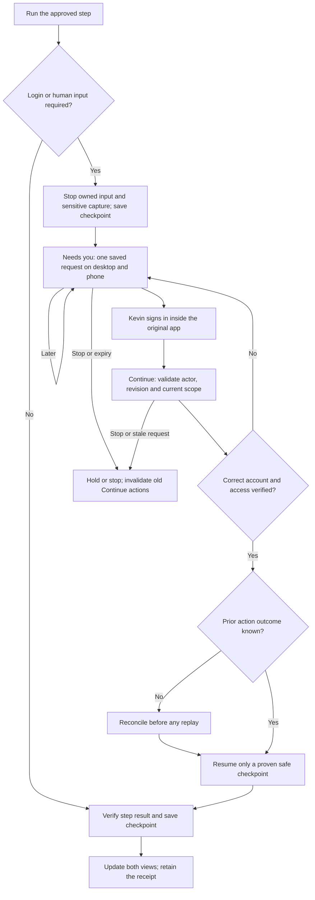

# Austin — sign in, verify and continue

10 September 2026 · Design decision DEC-14 · Implementation task U03

**Proposed behaviour, not an implemented or Windows-verified capability.** Deliver this as part of Austin's configured workflow pack. Kevin supplies consent, login and business decisions; RealBud's team builds the workflow, detectors, recovery rules and tests before handover.

## The experience

When the bank, Gmail or an agreed Windows app needs a person, show **Needs you** on the affected routine. This is a normal handover, distinct from a failed task or a request to approve a financial action.

> **Sign in to continue**
>
> Payment preparation · Bank download · Waiting for Kevin
>
> Your bank needs you to sign in and complete its security check. Bud has paused this step. Complete sign-in in the original bank window, then choose Continue. No new export has been verified yet.
>
> **Open bank window** · **I've signed in — Continue** · **Remind me later** · **Stop this run**

Use the actual saved checkpoint in this copy. Never show “nothing changed” when an earlier action may already have happened. The opening action focuses the verified, configured app/window; a phone instead says **Open this on the office computer** when host interaction is required. A phone notification cannot itself unlock Windows or complete a bank login on the PC.

Passwords, one-time codes and recovery codes stay in the original service's trusted sign-in interface. Bud does not request them in conversation or mobile approval messages. A user clicking Continue is a request to check readiness, not evidence that authentication succeeded.

While the person signs in, stop agent input and pause capture/streaming of the sensitive surface. Do not record credential entry in model context, screenshots, recordings, clipboard history, traces or notification payloads. Establish this privacy boundary before offering the handover; if the installed capture/control stack cannot enforce it, hold automation and use a verified manual route. Do not promise to erase third-party OS/provider logs we do not control.

## What we learned from the supplied repositories

Read-only source review, pinned on 10 September 2026. No code from either repository was installed or executed. These observations are not end-to-end bank-MFA or Windows proof.

| Source | Observed pattern | RealBud adaptation |
|---|---|---|
| [Grok request actions](https://github.com/b-nnett/grok-bot-0.18-reconstructed/blob/a9f633e09d49a85829b8236331b9e21f7e612634/frontend/src/recovered/features/conversation/cards/transcript-card/secret-request-actions.ts) | Separate pending, settled and provided states; scoped requests and a generation guard reject stale async results. | Separate Continue received, access verified and step resumed. A response from an old run/account cannot update the current card. |
| [Grok request card](https://github.com/b-nnett/grok-bot-0.18-reconstructed/blob/a9f633e09d49a85829b8236331b9e21f7e612634/frontend/src/recovered/features/conversation/cards/transcript-card/views/secret-request.tsx) | Targeted inline explanation and one clear action, with a confirmed completion state. | A contextual sign-in card with the task, reason, owner and next step. Use the bank's interface for passwords/MFA rather than adapting its secret-input field. |
| [Grok auth wait registry](https://github.com/b-nnett/grok-bot-0.18-reconstructed/blob/a9f633e09d49a85829b8236331b9e21f7e612634/source/host/mcp-auth/mcp-auth-wait-registry.ts) | Correlates connector authentication completion with a waiting agent, with expiry. Its registry is in memory. | Persist agency/account/run/step correlation and expiry. Connector auth and a bank browser session are different prerequisites. |
| [OpenMaus secret card](https://github.com/milind-soni/OpenMausBot/blob/ca61118787f687749eb1251bc3007e4d7d7bdd93/src/components/SecretRequestCard.tsx) | Separates saving a key from resuming the bot; exposes a resume retry and explains when the host computer is required. | Keep “sign-in appears complete, but resume failed” recoverable without asking Kevin to enter credentials again. Show host-only limitations before an action. This source concerns API keys, not bank MFA. |
| [OpenMaus credential contract](https://github.com/milind-soni/OpenMausBot/blob/ca61118787f687749eb1251bc3007e4d7d7bdd93/shared/credential-request.ts) | Service-owned target IDs determine labels and destinations; repeated pending requests can be reused. | Typed intervention kinds and trusted app bindings. Agent prose, page content and emails cannot choose credential destinations or grant permissions. |
| [OpenMaus resume recovery](https://github.com/milind-soni/OpenMausBot/blob/ca61118787f687749eb1251bc3007e4d7d7bdd93/server/resume-recovery.ts) | Replays only when protocol state proves the prompt was rejected before acceptance; unknown or accepted turns are not automatically replayed. | Reconcile effects before retrying. Reuse a completed export or verified import receipt; never restart the entire payment workflow blindly. |
| [OpenMaus notification QA](https://github.com/milind-soni/OpenMausBot/blob/ca61118787f687749eb1251bc3007e4d7d7bdd93/docs/notification-and-proactivity-qa.md) | Documents distinct needs-input/needs-hands events, exact task targeting, focused-app suppression and device-routing tests. | Alert once per intervention, open the correct run, keep a visible in-app card, and test the selected real phone route. The document's future push work is not proof of closed-app phone delivery. |

The [Grok repository](https://github.com/b-nnett/grok-bot-0.18-reconstructed/tree/a9f633e09d49a85829b8236331b9e21f7e612634) describes itself as an unofficial reconstruction with partial frontend recovery. Treat it as design/source evidence, not official upstream support. Learn the patterns; do not make either application a new RealBud dependency or change the agreed Hermes + Cua stack.

## RealBud owns the waiting step

Keep Hermes unmodified. Extend RealBud's existing scheduler, job store, attended-run fence, adapter and notification paths. Hermes performs one bounded step; Cua receives an authorised computer-control lease. RealBud persists the workflow truth outside the model session.

1. **Detect a prerequisite.** Prefer structured connector auth errors or agreed application probes. Browser/native detectors must identify the approved origin/process, sign-in state and relevant account; a generic error, network fault or expired AI-provider credential must not be labelled a bank login. Model observations may request a typed handover, but the broker validates the configured binding. Ambiguous detection becomes “I need help with this step”, without a fabricated diagnosis. Repeated blocked interaction also stops within bounded limits; do not assume every new login screen will be recognised.
2. **Quiesce control.** Revoke the old input/capture lease, stop the owned turn and wait for its outstanding tool calls to settle. Save the latest checkpoint and any unknown effect. Only claim the desktop is released when the broker confirms it. If control cannot be confirmed stopped, show that explicitly and block automatic continuation.
3. **Persist the wait and notification intent.** Save one intervention per current run/step/reason/binding revision. Use a transaction or recoverable journal for the record and outbox. Release active worker resources. Do not leave an LLM polling the login page while Kevin is away.
4. **Let the person act.** Open the original approved surface. Keep the run waiting through app minimisation/restart and the person's normal working time. Remind later changes notification timing only; it does not claim login success or re-enable computer control. Stopping this run is separate from pausing future occurrences of the routine.
5. **Validate Continue at the server.** Authenticate the actor, agency, device/channel and current request revision; check authority, expiry, workflow version, account binding and cancellation generation. Atomically claim one verification attempt. Concurrent taps return the existing verification/current state. A stale request cannot dispatch work.
6. **Verify access with a bounded read.** Reacquire a fresh lease only after the human explicitly hands control back and the desktop is available. Check the correct app, expected account and usable authenticated state without collecting credentials. A click, closed login dialog or successful OAuth callback alone is insufficient. If account identity cannot be verified by the supported route, hold for an agreed manual verification path rather than claim verified access.
7. **Resume the saved step.** Persist the successful prerequisite check and dispatch intent together. Recheck authority before each consequential tool call. Reconcile uncertain prior effects before dispatch; use a stable operation identity. If a new Hermes turn is necessary, pass only the current step, approved scope, verified evidence and checkpoint. Do not replay an old turn's side effects or depend on an old model session staying alive.
8. **Settle every view.** Persist the actual resumed/failed outcome and update desktop and supported phone cards using the same intervention ID. Keep a receipt. Failed view updates retry independently; stale buttons are rejected even if a banner cannot be removed. “Resolved” does not mean the payment workflow finished.

If Hermes's admitted adapter cannot cancel/drain calls, isolate tools or expose enough result state, that is a release gate. Address the gap in RealBud's adapter or upstream only after a precise compatibility test. A prompt telling the model to pause is not enforcement.

## Durable state and concurrency contract

Proposed fields for a typed intervention record, integrated into the existing persistence layer:

```text
interventionId, agencyId, routineId, runId, stepId
packVersion, configRevision, runRevision, cancellationGeneration
kind: sign_in | two_factor | unlock_device | grant_os_permission | needs_help
appBindingId, accountBindingId, allowedActorIds
checkpointId, operationId, priorEffect: none | verified | unknown
status: awaiting_user | verifying_access | ready_to_resume | resolved
        | expired | stopped | superseded | recovery_required
createdAt, expiresAt, nextReminderAt, resolvedAt
verificationAttemptId, controlLeaseGeneration, resumeDispatchId
sanitisedReasonCode, evidenceRef, deliveryReceiptIds
```

Identifiers reference server-owned records. No password, OTP, recovery code, login URL supplied by an agent, raw email or screenshot belongs in this record. Evidence references have access controls and a retention policy. Keep full identifiers out of lock-screen text. Request tokens are scoped, expiring and replay-resistant; they do not carry permission to pay or import.

Migration must preserve old JobRun records and use validated, backward-compatible defaults. An old version that cannot understand an outstanding intervention leaves it paused with a repair path, not “completed”. Tenant isolation and account bindings must survive engine replacement and module updates.

`ready_to_resume` means access was checked; `resolved` requires an acknowledged resume handoff or an explicit terminal disposition. If dispatch acceptance is uncertain after a crash, query/reconcile the operation before any resend. Claiming a request once is insufficient to guarantee exactly-once external effects when a bank or REI offers no idempotency API.

While the run waits, retain its logical account/range reservation but release the desktop lease. Coalesce overlapping due occurrences into pending coverage; do not start another export for the same blocked range. Unrelated work may continue only on independent resources. No other agent takes control of the human's sign-in surface. A later Continue queues visibly if the shared Windows desktop is busy.

Human waiting time is not an agent stall. Expiry/reminder deadlines still apply using persisted timestamps. Expiry leaves a visible recoverable case; late Continue must obtain a fresh request and revalidate scope. Stop revokes every active verification/dispatch generation. Late callbacks cannot revive stopped work. A stopped run requires a separate reviewed recovery action.

## State map



## What is already present, and what is missing

| RealBud source inspected | Existing foundation | Required extension |
|---|---|---|
| `shared/contracts.ts` — JobRun/JobRunStatus | Run identity, immutable job snapshot, attempt and evidence; awaiting-approval/interrupted statuses. | Typed durable human-intervention states and checkpoint references. An approval status does not describe sign-in readiness. |
| `server/attended-run.ts` | Approved-recipe/site fencing, busy checks, person-owned sign-in, Stop-related settlement. The inspected fence registry is in memory and copy is Mac/browser-specific. | Quiescent human handover, native Windows app bindings, read-verification and safe step dispatch after restart. |
| `server/turn-watchdog.ts` | Human-wait exemption from ordinary stall checks. Its turn map is in memory. | Persisted wait lifecycle independent of active turns, bounded verification and expiry/reminder handling. Current attended rechecking still consumes a tool budget. |
| `server/job-runs.ts`, `server/routine-persistence.ts` | Saved runs, restart recovery and occurrence ownership. | Durable wait/verify/dispatch recovery with backward-compatible decoding; hold unknown effects. |
| `server/remote-decisions.ts`, channel adapters and desktop notifications | Existing decision/notification paths described in the routines plan. | Share intervention delivery receipts and authoritative resolution. Keep authentication handover distinct from financial approval. |

**Execution update, 2026-09-11:** [The local rehearsal](AUSTIN-REHEARSAL-2026-09-11.md) now verifies the existing approval controls, Stop and restart interruption. It fixes the earlier wording assertion and two product issues. Durable login/Continue recovery remains unimplemented; real MFA, Cua and Windows acceptance remain open.

Historical design checkpoint: This was a source review, not a complete integration audit. No product runtime files were changed or product tests rerun for this design. The earlier routine-source check remains 98 passing / 1 wording assertion failing, as separately recorded; it does not verify this feature.

## Build and prove

U01 delivers the reusable workflow pack and Austin configuration; U02 delivers durable execution; **U03** adds human handover on that foundation; A03 supplies shared action/delivery settlement. Q01 joins them; Q02 verifies the packaged Windows result. Do not add another scheduler, engine or CRM dependency to solve this.

Each shipped pack defines input/output schemas, supported app bindings and versions, prerequisites, typed steps, detection and verification rules, side-effect class, retry limits, human handovers, evidence requirements and acceptance fixtures. Keep account references, schedule, mapping, reviewer, notification preferences and budget in agency configuration. Signed/versioned pack updates preserve the office's settings; material changes create a reviewable inactive revision. Start with first-party packs and existing dependencies; a general plugin marketplace or visual flow editor is not required for Austin.

| Acceptance case | Required result |
|---|---|
| Expired login, MFA or denied OS permission | Correct reason and app; one actionable card; agent control/capture stops before credential entry. |
| Continue before completion or on wrong account | Read check fails clearly; same checkpoint remains held; no download/import starts. |
| Correct login, then Continue | Fresh control lease; correct-account proof; exactly one logical step dispatch with result verification. |
| Duplicate / cross-device Continue | One verification claim; all callers see authoritative state; no duplicate external action. |
| Stop or takeover during verification | Stop wins at the broker; late callbacks cannot resume; unknown in-flight effects remain visible. |
| Restart/update while waiting or during dispatch | Restore the card and checkpoint; reconcile an uncertain dispatch; incompatible versions stay paused. |
| Failed detection / changed login layout | Bounded attempts then Needs help; no endless clicking or guessed authentication success. |
| Changed recipe/account/actor, expiry, stale phone card | Refuse old authority and show the current case; no silent permission expansion. |
| Desktop offline/locked/busy | Explain the needed host action; do not claim phone delivery or remote continuation succeeded. |
| Reminder or mirrored-card update fails | Retry delivery separately; no repeated execution or notification storm; current in-app case remains visible. |
| Due runs arrive while waiting | Retain coverage gap; coalesce overlaps; leave human sign-in undisturbed. |
| Unknown earlier import/download result | Inspect/reconcile the existing result before retry; never duplicate a payment or discard the original. |

Record source SHA, installer digest, Windows architecture, exact apps, detector/pack version, latency to pause, resume outcome, duplicate attempts prevented and sanitised failure reasons. Measure human waiting separately from processing time and attributable AI usage. Establish no active model polling while waiting. Test with Kevin on the named Windows apps and the selected actual phone, including privacy/capture checks and ordinary login/MFA failures. A static interactive preview only demonstrates the proposed UX.

Revisit the adapter design only when a recorded compatibility failure prevents this contract. Revisit detectors after a supported application's auth flow changes. Handover acceptance requires a working sign-in interruption and safe recovery, not merely a green installer build.

See [routines and approvals](AUSTIN-ROUTINES-AND-APPROVALS-2026-09-10.md), [delivery register](AUSTIN-DELIVERY-PLAN-2026-09-10.json) and [operating plan](AUSTIN-OPERATING-PLAN-2026-09-10.md).
