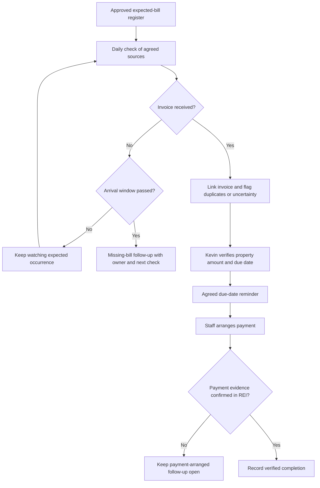
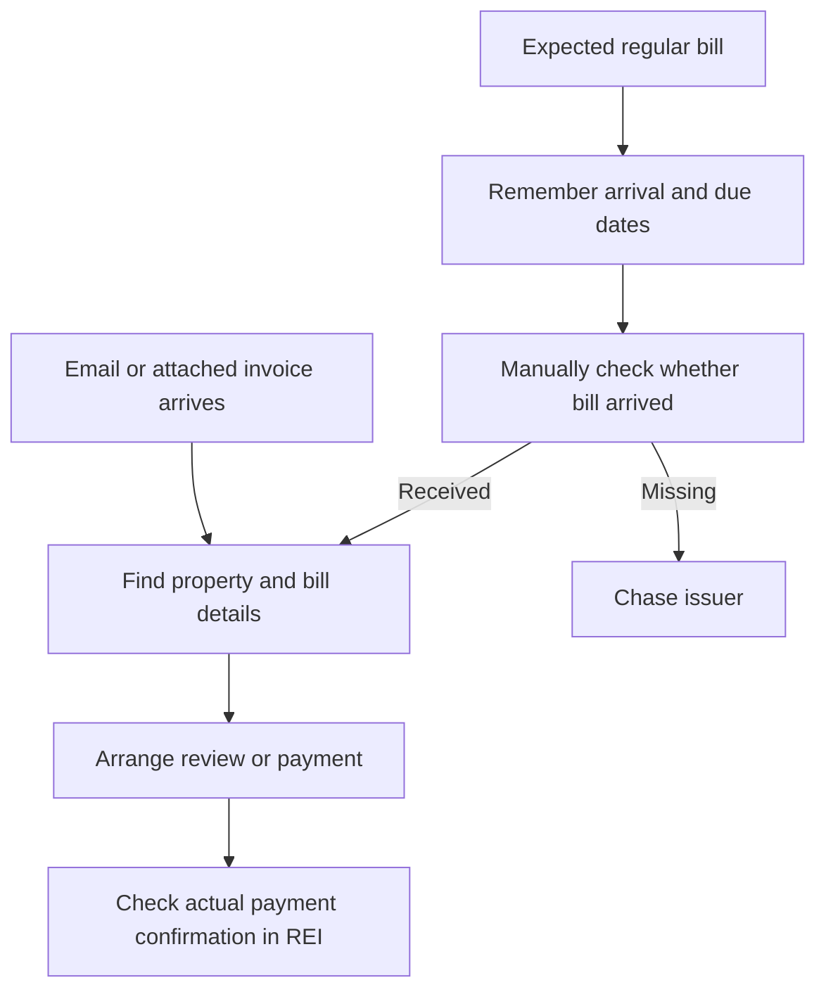
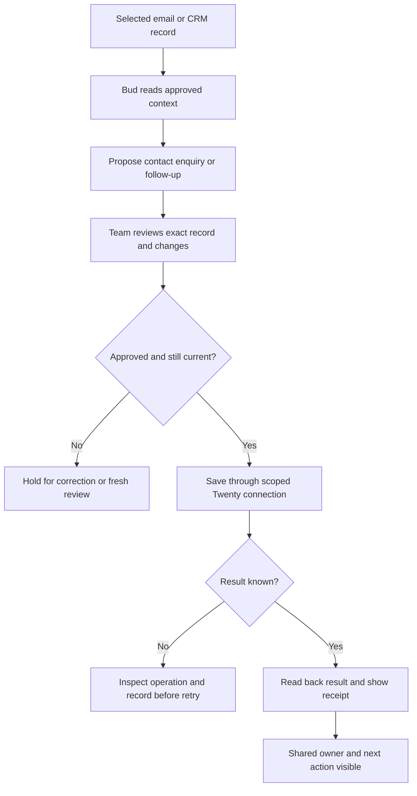
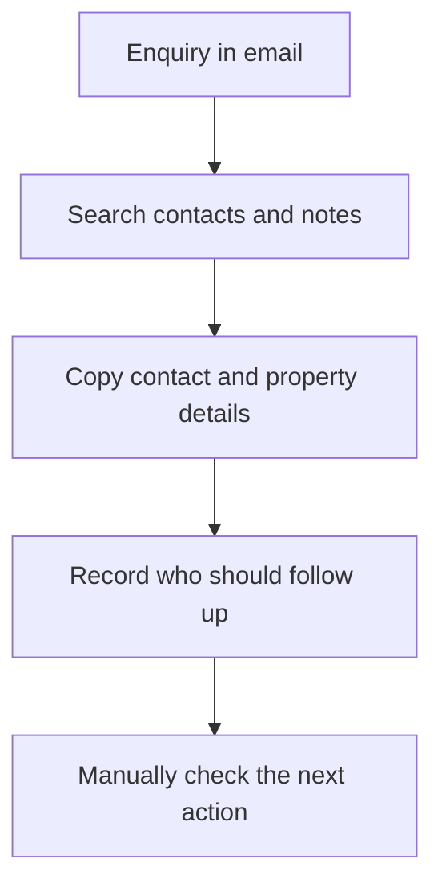
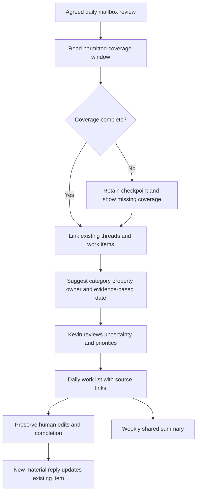
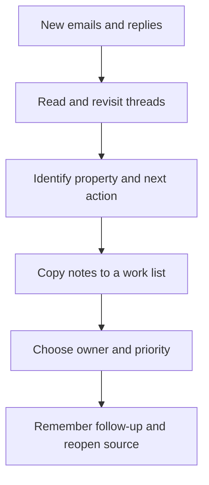
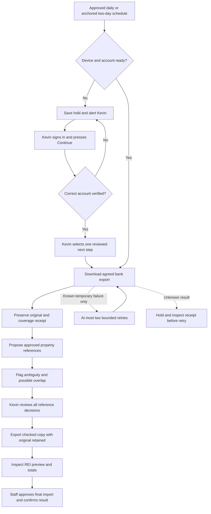
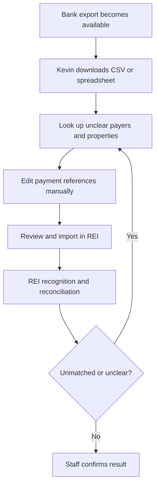
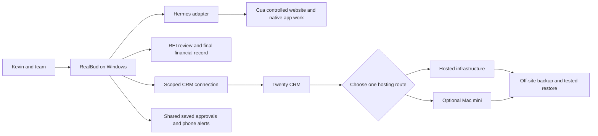

# Austin — before and after workflow pack

11 September 2026. Before maps summarize draft interview findings. After maps describe the proposed delivery; real-office acceptance remains open. REI owns the financial record. Kevin retains financial review and sign-in authority.

## Bills After

## Bills Before

## Crm After

## Crm Before

## Inbox After

## Inbox Before

## Payments After

## Payments Before

## Platform And Hardware

