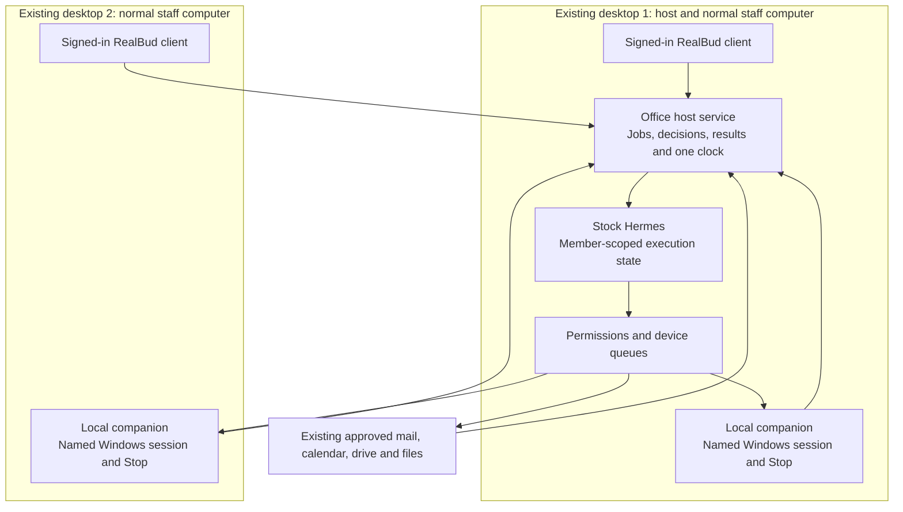

# Auston RealBud: one office host, two desktops

14 September 2026 · Post-meeting architecture recommendation and build plan

**Latest planning direction:** [RealBud company platform](REALBUD-COMPANY-PLATFORM-PLAN-2026-09-14.md) and its [61-task register](REALBUD-COMPANY-PLATFORM-TASKS-2026-09-14.json) extend this topology to all three proposal workflows per authorised member and repeatable Windows/macOS host/client setup. Keep one company service/Postgres authority, private stock-Hermes contexts and native companions. Use selected QM patterns/attributed code rather than a full-QM migration by default. The broader host, scope and cooperation target supersedes narrower planning deferrals below; neither plan changes the generated customer quote or establishes installed-device acceptance.

## Decision and commercial status

The user reports that Auston will proceed with the RealBud OS direction and now wants to plan two desktops, profiles and a main host. CRM remains undecided. RealBud care and any CRM care will be negotiated. This is a reported product choice, not evidence of a signed agreement, paid deposit, agreed additional-user fee or approved access to customer systems.

**Existing-desktop preference confirmed in the follow-up:** use one of the two current office desktops as the main host, while both remain usable by staff. Avoid making an extra computer or a paid cloud server a requirement. The particular host PC and its capacity/availability remain to be checked. Make adding a client, replacing the host and setting up another office explicit product journeys. The user identified QM as [yc-software/qm](https://github.com/yc-software/qm). Read [the QM assessment](AUSTIN-QM-HOST-ASSESSMENT-2026-09-14.md) before implementing a new team foundation: local Docker exists, but Hermes, Windows deployment and RealBud action/clock integration require proof.

Revision 32 remains the last generated proposal/agreement. Its amounts are quoted reference terms, not newly accepted retainers. Define the two-desktop scope and service responsibilities before revising those PDFs or fixing the implementation price. RealBud must deliver its accepted workflows without requiring CRM.

This plan takes precedence over the earlier **Kevin-only deferral for architecture planning**. It does not declare two staff, two-device control or remote access implemented or included in the old price. Preserve the existing product safeguards and historical test evidence.

Staff count remains unconfirmed: two desktops may belong to Kevin or to two different people. Design for two device identities and the ability to support two named members. Do not create a second member merely because there is a second computer. **QM is the yc-software shared-work agent system, not a VM.** Virtualisation below is an optional deployment technique. QM adoption is a candidate under evaluation, not a completed replacement for the current RealBud/Hermes runtime.

## Recommended arrangement

Use **one authoritative RealBud office service on an existing Windows desktop**, two authenticated clients and a small local companion on each computer that Bud is permitted to operate. Give the office a stable identity independent of its hostname so it can later move to a replacement PC without recreating staff identities or duplicating schedules. Start with the office LAN; remote internet access is a separately assessed requirement.

RealBud remains the product and Bud the assistant. "OS" describes the office work layer; it does not replace Windows. Hermes remains the unmodified execution dependency behind RealBud's supported adapter.

All components inside Desktop 1's box run on that existing PC; there is no third machine in this baseline. Desktop 2 must not launch another office scheduler. Installing a second independent copy and synchronising its private data directory is not this arrangement.

### Four identities to keep distinct

| Identity | Owns or selects |
|---|---|
| Office | Accepted workflows, shared operational records, source grants, schedules and audit receipts. The existing PMS, bank, mail and files keep their business-record authority. |
| Staff member | Private Ask, preferences, attachments, permitted source access and authorised decisions. Signing into another approved desktop resumes that person's work. |
| Device and interactive session | Where a file exists and where an app/browser action will occur. A staff sign-in does not grant control of every registered device. |
| Job and occurrence | The exact procedure revision, sources, requester, assigned reviewer, executing device, approval and verified result. |

If Kevin uses both computers, he needs one member identity and private working context across two approved clients. If there are two people, each needs separate private context; only authorised cases and reports are shared. Changing a display profile or adding a second Ask tab is insufficient.

### Normal use

Both people can open their own Ask and permitted office work. A job card identifies its requester, owner, source accounts and executing computer. Selecting a device means selecting a job target, not changing the user's identity. A person sees whether the computer is available, awaiting sign-in, busy with another job, paused by its user or offline.

For the first release, queue agent turns deliberately rather than promise unrestricted parallel execution. Protect each Hermes profile from overlapping Ask/Prepare writers. Computer work has a separate per-device queue. Different-device concurrency can be enabled after independent ownership and isolation are proven; two jobs must never compete for one foreground desktop.

Bud can prepare an approved mail/API brief on the host while staff clients are closed. A job requiring a Windows screen must wait for its specifically authorised interactive session. A sleeping, locked or disconnected desktop produces a visible blocked or delayed result. The host must not silently use another person's PC or credentials instead.

## Host choice

| Arrangement | When to use it | Cost and operational consequence |
|---|---|---|
| Existing Windows Desktop 1 hosts the service and its local companion; Desktop 2 is a client/companion | Recommended initial trial if Desktop 1 has enough capacity and accepted availability. It keeps Windows applications close to their existing files. | Lowest additional hardware requirement. Reboots, shutdown and staff use affect availability; overnight morning work needs the host actually available. |
| Dedicated Windows host, with both staff PCs as clients/companions | Prefer for dependable pre-arrival work if neither staff PC can remain available. It can also provide a dedicated automation desktop when the required applications/accounts are accepted there. | Extra hardware, provisioning, backup and support. Obtain an actual specification and quote after workload measurement. |
| Mac or Linux office host with Windows companions | Reasonable where a separate always-on host is already justified. Host runs the office service and approved background work; Windows companions operate Windows applications. | Requires tested remote routing and another operating-system support path. A Mac does not itself provide Windows desktop control. Optional CRM hosting is a separate decision. |
| Windows VM on a suitable host | Evaluate if dedicated GUI work must continue without interrupting staff and the named apps allow it. | Requires capacity, application/Windows licensing and interactive-session/recovery testing. On Apple silicon, Windows ARM is not proof for the customer's Windows x64 applications. |
| Independent full installations with copied/shared databases or Hermes homes | Do not use for one office service. | Creates conflicting schedules, credentials, memory writers and decisions. A shared folder does not provide synchronisation or access control. |

**Recommendation:** prove Desktop 1 as the host and Desktop 2 as an authenticated client first. Add control of each desktop as separate acceptance steps. If its availability cannot meet the requested ready-by time, agree a feasible schedule or operating-hours change first. A dedicated host remains an optional later decision, not the assumed fix or an added baseline purchase. Hosting topology does not depend on choosing CRM.

A VM is an optional execution device, not the staff login system or the office controller. A remote-desktop product can help a human view/take over a screen, but does not supply RealBud's job authority. QM's local Docker sandboxes are a separate execution environment from the staff Windows desktops.

### Keep the host useful as a staff computer

Approved API/mail processing and scoped file preparation should run as background work, with bounded worker concurrency and measured CPU, memory and disk use. Closing the RealBud window must not stop the host service. Screen-off, screen-lock, sleep, sign-out and reboot are different states and need separate acceptance results. Keep disk protection and human sign-in; do not disable them to hide a recovery gap.

Computer actions on the staff member's own screen require an explicit turn at that screen. Show where Bud is working and yield immediately to local Stop/takeover. If continuous GUI work while that person uses the same PC becomes an accepted requirement, evaluate a separate execution session or VM on that PC. Verify app compatibility, resources, licensing and recovery before adding it. Do not promise that hosting the service provides a second independent Windows desktop. [Windows interactive-driver requirements](https://cua.ai/docs/how-to-guides/driver/windows-ssh), [Microsoft virtualisation requirements](https://learn.microsoft.com/en-us/windows-server/virtualization/hyper-v/host-hardware-requirements).

The cost claim is **no additional host hardware or mandatory cloud-server subscription for this baseline**, subject to the current PC passing the workload check. Existing AI/connector usage, power, any necessary licences and agreed support/backup arrangements still have costs. Do not turn this architectural saving into an unapproved retainer or a zero-running-cost promise.

### One installer, three setup journeys

These are build targets, not existing installer features:

1. **Set up this office.** On the chosen host, verify the supported Windows/runtime requirements, create the office, register its initial member and install the managed background service plus local client/companion. Resolve the admitted stock Hermes runtime through the existing installer/update manager. Import the reusable pack, bind private sources and run its sample. Keep live routines paused until accepted.
2. **Join this office.** On another desktop, use a short-lived pairing code or QR and verify the host's identity. The trusted host enrols a revocable device key; the person then signs in under their own membership. Joining grants no source or approval rights by itself. Install the client and only the required local companion; avoid another model login, office database or scheduler merely for access. Show a clear reconnect/offline state without switching offices automatically.
3. **Move or restore this office.** Quiesce jobs and drain or hold unresolved commands. Create a consistent encrypted backup of office records, attachments/evidence, accepted pack versions, private configuration and protected native learning. Restore into a compatible supported version on the replacement PC, securely recover required keys and reauthorise machine-bound accounts/devices where necessary. Fence the old host before activating the replacement. Verify receipts, source grants and a sample job before resuming schedules. Clients retain office membership but re-verify the replacement host; merely reusing its name/IP does not establish trust.

The active host is the only writer. Keep a separate recoverable backup; the client PC must not edit or run against a second live copy of the database. A fresh installer and restore procedure should be tested from a clean Windows machine, with a written recovery path available if the original PC fails completely.

For a **different customer or a separate office**, use the same installer and sanitised workflow pack with new office identity, private settings and fresh source authorisation. An existing office's restore bundle is confidential and is never the distributable product template. Keep stock Hermes binaries/version selection separate from persistent office state so updates and machine replacement do not require an engine fork.

## What the current implementation needs

Source reviewed on 14 September at HEAD `058aceabe04aed77c285f2f52f7803fc19bc7ee9` plus the existing dirty working tree. This is current source evidence, not a newly packaged or installed Windows result.

| Gap confirmed in source | Required RealBud change |
|---|---|
| [Local API session](../server/session-auth.ts) authenticates one per-boot token; [server](../server/index.ts) listens on loopback and broadcasts events to every subscriber. | Add a dedicated encrypted staff entry point with named-member sessions, device enrolment, endpoint authorisation and private event/artifact delivery. Keep internal/admin APIs separate. Do not expose the current localhost API or share its boot token. |
| [Store](../server/store.ts), the shared Bud busy state and channel adapters assume one product operator. | Add member ownership and audience to conversations, attachments, continuations and cases. Make active conversation selection client/member scoped. Keep one Bud persona. |
| [Hermes ACP](../server/drivers/acp/hermes.ts) and [Prepare](../server/recipe-draft.ts) select the shared `property` profile. | Introduce a server-owned execution-context resolver and one lifecycle owner per profile across every launch path. Preserve native memory/skills separately for each member; publish only explicitly shared facts to office work. |
| [General Composio session](../server/composio.ts) uses one installation identity and does not pin exact connected accounts; [bounded Gmail](../server/composio-gmail.ts) has stricter account checks. | Bind accounts to stable office/member identities and exact connected-account IDs. Apply allowed operations and revocation at dispatch/resume. Reuse the bounded Gmail pattern; a model prompt cannot choose another member's account. |
| [Computer lease](../server/computer-lease.ts) is one in-process lease. [ACP](../server/drivers/acp/core.ts) can mount a local computer descriptor directly. | Use a named-device broker for every computer route, including Ask. Add durable device/run ownership, an enforced generation, command expiry and local Stop/takeover. Direct Cua access must not bypass it. |
| [Electron startup](../electron/main.mjs) owns the server child; its exit handler logs an exit, and closing all windows quits on Windows. | Extract a host service lifecycle that survives closing clients, restarts within bounded policy and reconciles durable jobs. Run GUI companions in the correct interactive session separately from that service. |
| [Routines](../server/routines.ts) and [workflow database](../server/workflow-database.ts) provide existing persistence and recovery. | Keep these foundations. One host owns the clock, occurrence dedupe and decisions. Add actor/source/device authority without creating a second scheduler or requiring a database rewrite. |
| [Pack importer](../server/workflow-packs.ts) installs plans; distribution/dependency/source/sample/approval journey has known gaps. | Finish a host-owned install journey. Reusable packs contain no private accounts, source files or staff memory. Installation, account grants, sample execution and live activation stay distinct. |

For an extension of the existing RealBud runtime, local storage can remain on the authoritative host while callers use the service API. Do not put SQLite, JSON state or Hermes homes on a network share. **If QM is adopted, its durable deployment requires Postgres independently of CRM.** The infrastructure choice must follow the selected runtime; CRM remains optional in both arrangements.

### Private state must survive broad agent capabilities

Hermes profiles organise memory, sessions and skills; they are not OS security sandboxes. For separate people, choose and test restricted worker execution identities/environments so a file tool, terminal, code execution, session search or learned skill cannot read another member's private state or the host's credentials. This is a prerequisite to claiming private staff profiles, not something a stronger system prompt solves.

Keep the RealBud controller's service keys outside worker-readable storage. Supply scoped capabilities through the broker. Keep browser sign-ins on the selected execution device, with the human completing login/MFA; do not copy browser cookie stores between PCs. A member's selected local file is a device-bound source reference or an explicitly authorised staged copy, with provenance, rather than a path assumed to exist on every machine.

Separate human identities, provider billing identity and mailbox identities. Do not clone OAuth refresh tokens to make profiles look connected. Use an upstream-supported provider credential arrangement and test refresh ownership; this may affect the eventual service/usage quote.

## Retain stock Hermes and a replaceable adapter

The official release API checked on 14 September reports **0.21.2 / `v2026.9.11`** as latest stable. RealBud's support list already includes it; the rollback baseline is separate. No runtime installation or promotion was performed in this planning pass. [Official release](https://github.com/NousResearch/hermes-agent/releases/tag/v2026.9.11), [local support declarations](../server/hermes-pin.ts).

Stock Hermes documents separate profiles and connections to local, remote, SSH and cloud backends. The multi-connection feature is part of Hermes Desktop; it does not automatically implement RealBud's staff clients or permission model. Reuse supported engine/profile/transport capabilities through the existing adapter. Keep Hermes source unmodified, native learning durable, and release upgrades independently tested. [Profiles](https://hermes-agent.nousresearch.com/docs/user-guide/profiles/), [multiple connections](https://hermes-agent.nousresearch.com/docs/user-guide/multi-connection-desktop/).

Preserve `HERMES_SAFE_MODE=1`, the supported approval route and explicitly mounted tools. RealBud continues to own the clock (`cron_mode: deny`), jobs, permissions, approvals and receipts. Another harness is a later adapter candidate only if measured reliability, compatibility or total cost justifies it; it is not necessary to add two desktops. Any candidate must pass the same file, approval, identity, recovery and device tests.

Windows GUI work requires a driver in an interactive Windows session. A background service or SSH session alone cannot see the staff desktop. Current Cua documentation describes a separate interactive daemon and protocol proxy; RealBud must validate that contract against its selected driver and packaged build before use. [Official Windows driver guide](https://cua.ai/docs/how-to-guides/driver/windows-ssh), [current dependency](../package.json).

## Build order and acceptance

This is a dependency order, not a promise that the extra scope fits the old quote. Retain the intended **2–3 weeks building/testing, one teaching/handover week and 30 days observation** as a planning target, subject to the two-desktop requirements, access and actual Windows results. Agree core acceptance and support responsibilities before giving a delivery commitment.

1. **Confirm the deployment worksheet and evaluate QM reuse.** QM is identified; run the [bounded feasibility plan](AUSTIN-QM-HOST-ASSESSMENT-2026-09-14.md) before choosing between its shared-work foundation and extending the existing host. Record who uses each PC, Windows edition/architecture, named apps, awake hours, file locations, approved accounts, reviewer and actual ready-by requirement. Confirm whether the second person needs review-only or their own workflow execution. Select a trial host without purchasing anything on an assumption.
2. **First executable milestone: two clients, one host, private work.** Introduce office/member/device records, authenticated staff routes, member-scoped conversations/events/artifacts and a host service independent of client windows. Use two disposable clients and synthetic members first. Import one pack once, create one job from a client and view only authorised results from the other. Both clients submitting the same occurrence must produce one run. A local single-user installation keeps working during migration.
3. **Bind execution state and accounts.** Apply the same member context to Ask and Prepare, profile lifecycle, native memory, learned skills, exact source grants and reviewer decisions. Start with deliberately queued workers and prove isolation before enabling real private accounts or parallel agent turns.
4. **Add one Windows companion, then the second.** Enrol the device with its own revocable key. Authenticate both ends of the connection. Use an outbound encrypted channel where practical; device connection is distinct from a logged-in person. Send only job-bound, expiring, revision-checked commands. Enforce the control generation on the device, not only in the host queue. Verify the source app/account, local Stop, human takeover and result before accepting a job.
5. **Rehearse Kevin's four preparation stages.** Morning priorities, invoice intake, expected-bill exceptions and ANZ reference preparation. Preserve originals, holds, source coverage and the distinction between payment arranged/confirmed. Compare against a human-reviewed synthetic set before approved office inputs. CRM is absent from this dependency chain.
6. **Prove the clock and recovery.** Closing clients, host restart, lost network, device sleep/lock, expired source login and a worker that times out but is still running must have visible outcomes. No duplicate commands or runs after reconnect. Unknown effects stay held for reconciliation. Never transfer device authority just because a lease timer expired.
7. **Package, teach and observe.** Build the intended Windows artifact, test both actual PCs, rehearse a restored host and one stock Hermes update/rollback, record agreed activation and teach Stop/recovery. Measure review effort, missed items, correction rate, lateness and support/usage cost throughout observation.

### Minimum release checks

| Check | Required result |
|---|---|
| Same Kevin, two desktops | Private history/preferences follow his authenticated membership; device targets remain explicit. |
| Two members, interleaved requests | No cross-member chat, event, artifact, memory, tool or account leakage; permitted office reports remain shared. |
| Wrong actor or account | Forged IDs, forwarded approval, stale source grants and a newly connected account cannot redirect or execute a job. |
| Two jobs for one screen | One waits; local Stop/takeover revokes control before another job starts. |
| Requests for different screens | Each command reaches only its enrolled device/session; concurrent operation requires separate successful ownership tests. |
| Disconnect after dispatch | Uncertain outcome is held, then reconciled with device receipt and source state; no blind replay of a possible mutation. |
| Host or companion restart | Previous control generations become invalid; no old process can keep issuing accepted commands. |
| One clock | Two clients, retries and reconnects create one accepted occurrence and one reviewed result. |
| Before-arrival brief | Source cutoff and coverage are honest; lateness, host outage and login failure cannot display "ready". |
| Pack import/export/update | Clean-office sample works; local bindings and corrections survive supported updates; exported reusable pack has no private content or credentials. |
| Runtime upgrade and restore | Private learning, source grants and existing records survive; unsupported runtime fails closed with a tested return path. |
| Actual Windows installation | Named app/browser, architecture, permissions, lock/reconnect and local Stop tested on each customer's agreed artifact/device. |
| Shared-use host capacity | The representative background run completes while staff perform normal office work, without unacceptable interaction delay; record measured resource use and agreed limits. |
| Add a client and replace the host | Clean installation joins only the intended office; a consistent restore preserves accepted work, revokes the old host and does not duplicate an occurrence. |

For host failure, use a documented restore/manual promotion procedure first. Preserve a separate backup and revoke/fence the old host before activating the replacement. Desktop 2 must not automatically elect itself or replay queued work against a second copy of state. Agree recovery time, tolerable data loss and maintenance hours in the retainer; do not infer a 24/7 service from a host being powered on.

## Evidence from this planning pass

- Current source paths above were inspected; official Hermes release/profile/connection and Windows driver documentation were checked.
- Node **24.19.0**, Vitest **4.1.10**: **5 files / 156 tests passed** for `server/session-auth.test.ts`, `server/computer-lease.test.ts`, `server/drivers/acp/hermes-env.test.ts`, `server/composio-gmail.test.ts` and `server/routines-recovery.test.ts`.
- Those tests cover existing local authentication, device-lease behaviour, Hermes environment guards, bounded Gmail and routine recovery. They do **not** prove the proposed shared host, multi-member permissions, remote companion or installed Windows delivery.
- This turn creates the plan and updates project direction/status. No customer account was accessed, no schedule activated, no network service exposed and no runtime changed.

Related: [prior team design](REALBUD-TEAM-USAGE-2026-09-13.md), [staff/account contract](REALBUD-STAFF-SESSIONS-2026-09-13.md), [morning brief](KEVIN-MORNING-INBOX-BRIEF-2026-09-13.md), [pack distribution](REALBUD-WORKFLOW-PACK-DISTRIBUTION-2026-09-13.md).
