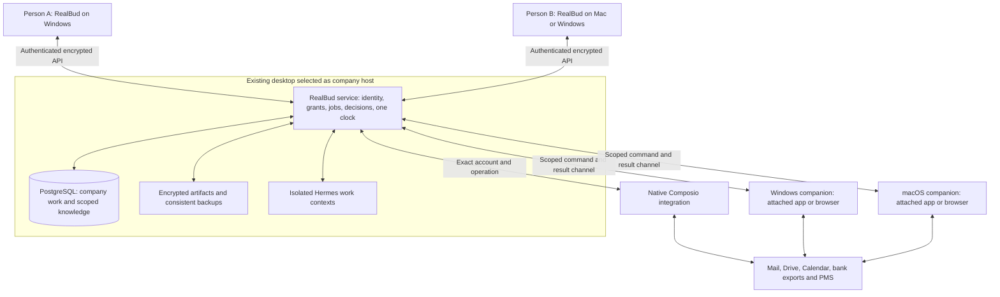

# RealBud company platform: Hermes, shared work and connected desktops

14 September 2026 · Architecture recommendation and implementation contract · **Planned, not implemented**

For a self-contained current-state handoff, use the [GPT-6 Pro core brief](REALBUD-GPT6-PRO-CORE-BRIEF-2026-09-14.md) and [build prompt request](REALBUD-GPT6-PRO-BUILD-META-PROMPT-2026-09-14.md). The [compatible-update strategy](REALBUD-UPDATE-STRATEGY-2026-09-14.md) extends N12/R06 without adding a second updater authority or changing the 61 planned-task count.

## Decision

Keep **unmodified Hermes** as the reasoning and learning engine. Build **one RealBud company service**, with PostgreSQL for shared operational state, and a small authenticated companion on each Windows or Mac desktop that Bud may operate. Use QM's source-observed patterns for scopes, grants, persistent work and deployment configuration; evaluate specific source reuse before rebuilding those primitives. Do not put two complete agent platforms in charge of the same work.

**Native integration requirement:** [Composio, Cua and Hermes browser/CLI utilities](REALBUD-NATIVE-INTEGRATIONS-2026-09-14.md) are explicit parts of this architecture. Composio owns supported service authentication/tool transport behind RealBud's exact-account operations; Cua Driver supplies native computer control through the enrolled companion. Admit Hermes browser, website-to-CLI and file/code utilities through the same authority. Session/cookie protection, native connection lifecycle, driver compatibility and Windows/macOS acceptance are required work, not optional post-release polish.

The product is **one Bud persona, with a private working context for each person and explicitly shared company work**. A person may use several desktops. A desktop is an execution resource, not an employee or a second company. Cooperating workers are an internal implementation detail; staff see who owns the work, its sources, where it runs, and who must review it.

The current request expands architecture planning beyond Kevin-only and two-device restrictions: all three proposal workflows must be available to each authorised member, and the design must support repeatable company setup and additional Windows/macOS desktops. Start acceptance with two members and two devices; expand through measured capacity limits. No arbitrary scale, unattended GUI availability or unchanged delivery price is implied.

This plan takes precedence over conflicting older *planning* deferrals in the two-desktop, team and goal documents. Runtime restrictions stay in force until their replacements are implemented and verified. Revision 32 customer documents remain unchanged; this plan is not a signed scope variation, new deployment, or authority to access customer accounts.

## The complete outcome

| Promise | What completion means | Available to each member |
|---|---|---|
| Morning priorities | Acquire the agreed mail/calendar scope; rank work with reasons and source links; retain waiting items and unfinished work; show partial, stale or late coverage; meet an agreed, measured ready-by time. | A personal brief from that member's granted sources, plus explicitly assigned shared work. |
| Expected and missing bills | Confirm expectations from approved history; collect invoice evidence; preserve corrections and continuing cases; distinguish expected, received, processed, funded, payment arranged and independently verified paid. | Review/prepare permitted cases. Shared accounts work remains one company case with an owner and reviewer. |
| ANZ reference preparation | Acquire the agreed export through an authorised source/session; preserve the original; propose supported reference corrections; hold ambiguity; save and read back a reviewed copy preserving dates, amounts, row count, row order and every untouched field. Human reference decisions bind the current batch/original digest; staff checks actual REI recognition/preview before financial processing. | Run or review where their role and exact source/account grants permit. Never create a second financial processing run because another person opened it. |
| Included assistance | Calendar preparation and exact-approved internal entries without attendees/notifications; scoped Drive/Docs/Sheets lookup; five agreed templates; verified new draft copies; on-demand and weekly summaries; phone continuation and operating/recovery guidance. | Same capability catalogue, with individual permissions and source bindings. Additional source count is separately scoped. |

There are three customer outcomes, supported by four existing preparation stages: inbox triage, invoice intake, bill exceptions and ANZ candidates. Those stages are not yet a complete automatic pipeline. CRM is optional and is not workflow three. A manual bank upload remains a useful labelled fallback; it does not pass automatic-acquisition acceptance.

Preserve the proposal's exclusions: sending, invitations, money movement/payment execution, signing, statutory notice drafting/issuing/service, mailbox mutations and source-file mutation. Airbnb and Form 11 remain outside this delivery. Human login/MFA remains human. An internal calendar edit or new draft copy has its own narrow approved route; it must not unlock general browser writes. Current locked `never` rules remain locked.

Scope sources: [revision 32 engagement](AUSTIN-ENGAGEMENT-2026-09-10.json), [agreement, scope and Schedule D](AUSTIN-IMPLEMENTATION-AND-CARE-AGREEMENT-DRAFT-2026-09-13.md), [customer pack index](../outputs/austin-monday-2026-09-14/README.md), [accounts pack limitations](../pack/workflows/austin-accounts/README.md).

## What runs where

The host desktop can also be Person A's client and execution device. Joining clients do not get another company database or clock. The host runs without the RealBud window being open; its GUI companion runs in the signed-in desktop session. These are separate processes and permissions.

PostgreSQL stores RealBud membership, grants, work, decisions, receipts and scoped knowledge. PMS, bank, mail and files remain authoritative for their records. There is no duplicate manually maintained rent roll. Large documents, screenshots and source snapshots live in a protected artifact store referenced by hash and access scope, rather than being copied into every prompt or database row. Postgres is private to the service; clients never connect directly.

Default worker placement is host-side, with one lifecycle owner for each isolated context. This reduces setup on joining desktops and makes schedules independent of client windows. It is conditional on an enforceable confinement and ordinary-PC capacity proof. The host may otherwise run the same worker contract in a managed isolated substrate. Device-local Hermes is a later placement option if measurements justify it, not an automatic engine/login installation on every client. Placement must not change the job, permissions, memory owner or sole scheduler.

First support LAN access. Choose a separately scoped encrypted remote-access route only when required; do not expose today's localhost server or database to the internet. Host sleep, outage or shutdown means the shared service is unavailable. Clients show last-sync and paused work; they do not elect themselves new hosts or run stale approvals offline.

## What to take from each system

| Component | Keep or adopt | Adapt/build | Exclude from this release |
|---|---|---|---|
| RealBud | Desk/Ask/Schedule/You; job state; approvals; receipts; source validation; routine occurrence dedupe; existing workflow evaluators; admitted runtime manager. | Member and device authority, Postgres repositories, service lifecycle, scoped event/artifact delivery, companion transport and setup journeys. | Exposing the current per-boot API token to clients; sharing JSON/SQLite/Hermes homes over a network drive. |
| Composio | Official service authentication/tool transport and existing strict Gmail account checks. | Native Connections lifecycle, stable company/member identity, exact account/tool/version/resource binding, hard operation denial, verified results and durable source events/polling. | Shared platform keys in customer installers, unrestricted router/batch/proxy tools, automatic account substitution or assuming OAuth means every action is authorised. |
| Hermes | Supported ACP adapter, admitted stock release, native personal learning/skills, provider support, useful file/code/browser utilities and cancellable reasoning. | Server-selected execution context, restricted filesystem/network environment, explicit RealBud tools, reviewed website-to-CLI adapters, per-context lifecycle and measured resource budget. | Source fork, Hermes.app, independent cron/gateway, self-granted tools or permissions, raw credential-bearing HAR/profile exports, multiple writers on one home. |
| QM | Personal/shared scope model; explicit grants; knowledge provenance; versioned shareable skills; durable queue/claim patterns; deployment-config separation. | Reuse audited modules only where dependencies and authority fit; retain notices for copied code and an upstream revision/test record. | Whole-core adoption by default, duplicate scheduler/approvals, broad sandbox credentials, default open sharing, Slack as an installation prerequisite. |
| Cua Driver | Existing native SDK/driver packaging, selected browser attachment and local capability checks. | Admit a matching driver/SDK/manifest; RealBud-owned broker for **every** Ask/Prepare/routine route; per-device dispatch, session/cookie lifecycle, local Stop and recovery on Windows/macOS. | Treating a Docker workspace as the user's desktop; unrestricted raw Cua or duplicate Hermes wrapper; assuming newer browser utilities work on the current 0.19.3 pin. |

**QM source correction:** commit `361a6c0095dcd3d156aca91353f3ffba0bb8b69b` includes a Docker deployment target. The earlier local assessment's Fly/AWS-only statement is incomplete. Docker setup is useful infrastructure evidence; it is not a finished RealBud Create/Join installer, Hermes adapter or staff desktop controller. See [CLI source](https://github.com/yc-software/qm/tree/361a6c0095dcd3d156aca91353f3ffba0bb8b69b/cli) and [QM assessment](AUSTIN-QM-HOST-ASSESSMENT-2026-09-14.md).

The published `@yc-software/qm` package is its deployment CLI, exporting only the deployment contract; the private root package does not publish an identity/memory/runtime SDK. Its Docker backend requires a Unix socket, so native Windows named-pipe support must not be inferred. QM already has email invitations and a background-work disable switch; neither supplies native device enrolment or proves all direct trigger routes conform to RealBud's clock. [Package exports](https://github.com/yc-software/qm/blob/361a6c0095dcd3d156aca91353f3ffba0bb8b69b/cli/package.json#L1-L34), [socket requirement](https://github.com/yc-software/qm/blob/361a6c0095dcd3d156aca91353f3ffba0bb8b69b/cli/src/backends/docker.ts#L119-L130), [invitations](https://github.com/yc-software/qm/blob/361a6c0095dcd3d156aca91353f3ffba0bb8b69b/src/api/routes/admin/users.ts#L77-L205), [background gate](https://github.com/yc-software/qm/blob/361a6c0095dcd3d156aca91353f3ffba0bb8b69b/src/index.ts#L67-L70).

The concrete extraction candidates are [atomic grants](https://github.com/yc-software/qm/blob/361a6c0095dcd3d156aca91353f3ffba0bb8b69b/src/acl/postgres-grant-store.ts), [versioned scoped memory](https://github.com/yc-software/qm/blob/361a6c0095dcd3d156aca91353f3ffba0bb8b69b/src/memory/postgres-memory-service.ts), and SQL claim/recovery patterns from [durable runs](https://github.com/yc-software/qm/blob/361a6c0095dcd3d156aca91353f3ffba0bb8b69b/src/runs/postgres-run-store.ts). The run module depends on QM orchestration types, so reuse its tested ideas rather than importing it wholesale. Any extraction becomes maintained RealBud-owned code with the upstream notice and provenance; there is no supported QM runtime library contract to assume.

**Reuse decision:** time-box the QM compatibility spike to two engineering days, as a planning budget. Test one isolated primitive and a synthetic job round-trip; map its dependency graph. Adopt a module only if it works behind the selected RealBud boundary with a pinned version, isolation tests and an update path. If it requires replacing RealBud's controller or maintaining a broad fork, keep the pattern and implement the narrow boundary locally. Record the result once and continue; do not leave QM adoption as an indefinite prerequisite. No QM process or Docker installation is needed just to reuse patterns. A time budget is not a promise that integration will pass.

## Identities, data and authority

Keep these independent: `companyId`, `memberId`, `deviceId`, interactive `sessionId`, `workerContextId`, `sourceAccountId`, `jobId`, `runId`, and `decisionId`. A human identity is authenticated; it is never inferred from display name, a model message, a device name or a requested object ID.

| Record group | Minimum contract |
|---|---|
| Company and service | Stable ID, timezone, active host epoch, schema/config revision, supported client/companion versions. |
| Members and sessions | Membership state, explicit role grants, revocation generation, short-lived sessions and private event subscription. One person may enrol multiple devices. |
| Devices and desktop sessions | Public key, company/member binding, OS/architecture, declared capabilities, app/companion version, last seen, active login session and revocation generation. |
| Sources and accounts | Exact provider/account/resource IDs, owner, permitted audience, operations, freshness/coverage policy, credential reference and revocation generation. No worker-readable central keychain. |
| Workflow installs | Version/digest, dependencies, source bindings, parameters, sample/live state, assigned owner/reviewer and explicitly activated cadence. |
| Jobs and runs | Workflow/version, requested actor, effective scope, source snapshot, occurrence key, assigned worker/device, checkpoints, bounded attempts, deadlines and result status. |
| Decisions and action attempts | Exact action/payload/source hashes, actor, scope revision, device/session/generation, expiry, one-use consumption and verified or uncertain outcome. |
| Knowledge and handoffs | Scope, source references, provenance, freshness, author, review status, version, correction/supersession links and recipient grants. |

Company API authorisation precedes storage access, search, list/count projections, events, downloads and job dispatch. PostgreSQL tenant/scope policies provide defence in depth; the app role must not bypass them. Actor/scope context is transaction-local and cleared between pooled requests; scheduled service actors carry explicit effective grants. Test interleaved principals on one connection pool. An API helper that forgets a scope must fail, not query the entire company. Logs and support bundles must not reveal private prompts, source contents or credentials.

Use transactional repositories behind existing domain services. Migrate existing JSON/encrypted SQLite through a stopped-writer export, verified backup, strict validation, dry-run report and one atomic selection of the new store. Preserve IDs, corrections, training/live labels, original evidence and unresolved work; legacy unknown authors stay explicitly unknown. Never dual-write two authorities. Before activation/accepted new-store writes, abort to the original unchanged store on failure. After cutover, freeze writes and recover or forward-repair the latest authority; never reactivate stale JSON/SQLite as a writable fallback. Invalidate outstanding old grants before reactivation.

## Business brain and cooperating assistants

Use three knowledge scopes: **private person**, **granted team/case**, and **company procedures**. Personal preferences and conversations remain private by default. Shared cases contain only intentionally published work and evidence. Company procedures and reusable skills are versioned, reviewed and revocable. External business facts retain source time and freshness; inferred notes never silently replace source truth.

Grant revocation denies future reads/dispatch and ends affected warm worker sessions. Invalidate derived caches, indexes/embeddings and procedure versions that depend on revoked material. Retained historical evidence has its own explicit audience and retention policy; revocation cannot erase information already seen by a human. Native Hermes memory can also retain previously supplied text, so source-derived learning requires provenance and a tested purge/rebuild or reference-only policy. Until that mechanism passes, keep revocable shared content in ephemeral job contexts and broker-backed references rather than durable personal memory. Do not claim that changing a database grant makes a worker forget.

Hermes may improve private notes and propose a better procedure. To make an improvement available to colleagues: create a candidate → remove secrets/private examples → replay representative fixtures → have the designated owner approve → publish a version → allow rollback. Learned text cannot alter permission policy, source grants, budgets, schedules or statutory rules. Do not claim learning guarantees accuracy or speed; record correction rate, completion rate, elapsed time and cost per accepted result.

Cooperation uses a typed handoff on a shared case: parent job, requested output, allowed input references, recipient scope, deadline, budget and return schema. The recipient can use only the intersection of the handoff grant, their own current entitlements and the job policy. The requester cannot borrow the colleague's mailbox, cookies, personal memory or approval power. Reject cycles, excess depth, duplicate subjobs and uncontrolled agent-to-agent chatter. Begin with one bounded helper task per parent; expand only after measured benefit.

Example: a morning brief finds an invoice. With an accepted workflow scope, Bud creates/links a shared accounts case and asks the accounts context to check its expected period. The accounts result links the same case and sources. The originating brief gets an authorised status summary. It does not receive the colleague's private conversation, and the invoice is not processed twice.

Upstream explicitly distinguishes profiles from filesystem sandboxes and warns against two processes sharing one profile. Native tools and code execution make enforceable worker isolation a release prerequisite. Preserve stock Hermes; prove the boundary with hostile private markers and attempted direct file, process, network and credential access. [Pinned Hermes profile contract](https://github.com/NousResearch/hermes-agent/blob/939e45c91d751fadd94dcd1b873ac3cb44846213/website/docs/user-guide/profiles.md).

## Computer use is a first-class work path

Use supported APIs or checked file transforms where they produce the required outcome. Use computer interaction for actual app/browser steps that require it. Both paths go through the same source authority, job and verified-result contract. Browser/native capability is required on both supported desktop platforms, not an optional demo.

Every command carries a server-issued envelope: company, actor, job/run, device, interactive session, host epoch, device lease generation, exact source/account, allowed operation/target, payload hash, current decision when required, expiry and unique command ID. Never accept caller-supplied authority as proof. The companion verifies the signed envelope and its own current state before each action, and returns device/session identity, command ID, before/after evidence and outcome. A new window/focus/account is a recheck, not an automatic target substitution.

The companion initiates its encrypted authenticated connection to the company service. Its local native helper remains private. Enrolment and revocation govern both transport and dispatch. File paths are device-bound references or explicit authorised copies, never assumed to exist on another PC. Browser cookies and OS keychains are not synchronised.

One interactive desktop session has one active GUI controller. Independent analysis may run concurrently, and separate devices may operate concurrently, but the same screen cannot serve two mouse/keyboard agents. Staff input, lock, logout, UAC/secure-desktop transition, lost focus, expired grant or lost host connection causes an appropriate pause/stop. Never weaken OS protections or require automatic login to make a schedule look reliable.

**Source-confirmed priority gap:** `server/drivers/acp/core.ts` currently mounts the raw computer descriptor, while `ComputerLeaseManager` is used through the bounded portal path. The new broker must replace/bind every actual ACP computer route; a new lease table alone does not protect Ask. Current turn settlement also does not establish that asynchronous process termination completed. Release tests must observe the helper stopped and the device released.

Local Stop revokes the session grant immediately at the companion, interrupts the action executor, and reports an acknowledged stopped state. A host Stop that has not reached the companion stays **Stopping / device unreachable**. Grant expiry fences future actions; it cannot undo an already accepted click. Do not reassign control until the old operation is acknowledged stopped or reconciled. If the external effect is uncertain, read back and reconcile; never replay it merely because a lease expired.

Approval consumption and command recording are transactional. The companion also maintains a protected durable command journal: persist accepted intent before native execution, then completed/denied/uncertain status and receipt. On restart or repeated delivery, consult that journal before acting; the host database alone cannot deduplicate a click whose reply was lost. A crash between an external action and its receipt yields **Needs checking**, not an exactly-once claim. Read-only steps may retry within a budget; side-effect retries require idempotency or verified absence of the effect. Reconnect, changed source content, membership revocation and host migration invalidate stale capabilities.

A host service can prepare API/file work while client windows are closed. GUI work requires an available, unlocked, authorised interactive session. A dedicated execution desktop is optional if work must run while staff use their own screens. An always-on host alone does not create that desktop session.

## Setup experience

Retain the existing Warm Operational Ledger design and four navigation places. Company/member/device controls live under **You**. Shared work appears within **Desk**; private conversation stays in **Ask**; there is one **Schedule**. No model shop, new assistant roster or database console on the main path. This is a flow specification, not a generated or visually validated prototype.

| Journey | Visible steps | Required completion evidence |
|---|---|---|
| Set up a company | Choose this computer as host → name company and owner → automatic compatibility/storage checks → install protected service/runtime/storage → secure recovery method → connect approved sources → enable companion permissions → run three sample outcomes → invite colleague. | Reopen and restart; same company and owner; verified sample receipts; backup test; host availability clearly shown; live schedules still require acceptance. |
| Join a company | Enter/open short-lived invite → verify company/host identity → authenticate as a named person → enrol this device → choose local computer access → run capability check → open own Desk/Ask. | Private A/B sessions; expired/reused invite rejected; no extra clock/database; ungranted sources inaccessible; accepted local app-read/Stop test if control enabled. |
| Enable a workflow | Select prepared workflow → see required sources and operations → bind exact accounts/files → name owner/reviewer and execution device → sample → review saved result → accept live source test → approve cadence. | Plan, dependencies, scripts/schemas, output verification and support-file install complete; installed/connected/sample-tested/live-accepted/running states distinguishable. |
| Move or restore company | Choose verified backup → stop/fence old host → install candidate → validate restore → authorise host replacement → reconnect/re-enrol devices as needed → recheck sources → resume accepted work. | Consistent work/knowledge/artifact restore; old host cannot dispatch; stale commands rejected; no duplicate occurrence; uncertain work remains held. |

Enrolment binds company ID, host public key/certificate, intended authenticated member, one-use nonce and expiry using owner-issued trust. Discovery, company display name or possession of an arbitrary link is not identity proof. Define verified host-key rotation and recovery before accepting another host certificate.

Target usability measures, to validate with a new operator: client join and a harmless capability check within five minutes after installer download; host infrastructure setup within fifteen minutes on supported hardware, excluding downloads, OS prompts and third-party sign-in; no terminal commands or manual database/container configuration in the supported customer journey. Treat failed measurements as product work, not reasons to change the stopwatch definition after testing.

Automate runtime acquisition with hashes, dependency checks, per-OS service registration, database initialisation, certificates/device keys, migrations, health checks, pack dependency installation, safe updates, retryable setup and diagnostics. Humans still grant OS permissions, sign into business accounts, choose sharing/approval authority and accept live schedules. Restart setup from a durable checkpoint after interruption; do not create duplicate companies, accounts or databases.

To add further systems or automations, reuse a capability registry and versioned workflow-pack contract: trigger, exact sources, required operations, typed steps, output verifier, owner/reviewer, retry policy and resource budget. Bud may propose a pack from an operator's description or approved demonstration; validate it, bind sources, run sample/recovery cases and review it before activation. Unsupported operations stay unavailable until their adapter and verifier are implemented. A connection catalogue is discovery, not proof that every application can already be automated. This makes expansion repeatable without granting arbitrary scripts an independent clock or broader authority.

## Packaging and host operation

Prefer the lightest maintained host distribution that passes confinement, restart, backup and capacity checks. The first feasibility milestone must decide whether to package a native service plus pinned Postgres and a supported worker isolation mechanism, or a managed local VM/container substrate. Do not promise native worker confinement before proving its actual mechanism on Windows and macOS. QM's Docker path is one candidate, not a required customer-managed prerequisite.

The customer installs RealBud. Technical dependencies remain managed details with clear progress, disk impact and repair actions. Keep service credentials and private data under the supported RealBud data root, owned by the service identity; worker contexts must not inherit those privileges. Handle Windows service/interactive-session separation and macOS system-service/GUI-agent separation explicitly. Closing windows, restarting the service, rebooting and restoring after disk protection unlock are distinct tests.

Set concurrency, CPU/memory, disk and model-usage budgets. Begin with two members and one GUI lease per device; queue excess reasoning work fairly. Reserve capacity for the human using the host. Report provider usage once per parent/child job and avoid duplicating OAuth refresh-token owners. Shared API billing may be supported through an approved credential broker; private provider accounts require explicit ownership and upstream-supported authentication.

Back up Postgres, artifacts, membership/grants, pack versions, persistent worker memory/skills, configuration and recoverable keys as one consistent set. Never copy a live database directory as a backup strategy. Encrypt off-device copies and test a restore on a different machine. Establish recovery-point and recovery-time targets with the office; provisional acceptance targets are at most one business day of data loss and a four-hour supported restore during service hours, subject to the chosen backup cadence and measurements.

The first release uses a single authoritative host and manual authorised recovery. Host epochs alone cannot stop an isolated old host signing commands to an isolated old client. For planned moves, require old-host shutdown/fencing acknowledgements; for lost-host recovery, rotate authority, re-enrol reachable devices, keep jobs paused and establish that the old host cannot retain a controllable device before activation. Do not offer automatic failover or two writable hosts without a separate quorum/fencing design.

## Atomic implementation sequence

The [61-task implementation register](REALBUD-COMPANY-PLATFORM-TASKS-2026-09-14.md), also available as [structured JSON](REALBUD-COMPANY-PLATFORM-TASKS-2026-09-14.json), gives each work unit an owner, dependencies, affected/proposed files, acceptance and evidence. All items start planned. New paths in that register are proposed module boundaries, not existing implementation claims.

| Milestone | Build outcome | Gate before advancing |
|---|---|---|
| M0 — Resolve foundations | Freeze the three-outcome/native-capability contract; bounded QM reuse decision; Windows/macOS host substrate, restricted stock-Hermes feasibility and Cua version/facade admission. | Reproducible local startup/restart, confinement denial, matching driver manifest, cancellable synthetic worker and evidence-based substrate decision. No wholesale migration yet. |
| M1 — One company, two people | Transactional company store; member authentication; encrypted entry point; device enrolment; private API/events/files; preserved legacy state; independent service. | Two clients cannot read one another's private markers; one shared case is deliberately accessible; revocation works mid-run; windows may close without killing service. |
| M2 — Hermes controls the correct desktop | Isolated contexts and source accounts; explicit broker; device commands, leases, Stop and recovery; native Windows/macOS implementation. | One harmless end-to-end source-read → prepared result → verified receipt through two clients, with wrong-device, denied-action, disconnect and uncertain-result cases passing. |
| M3 — All proposal work | Native Composio operations/events; full pack installation; morning acquisition; inbox→invoice→bill chain; ANZ acquisition and checked copy; Calendar/Drive/templates/summaries; browser conveniences and utilities; one clock and phone continuation. | Every promised output has real acquisition and persisted-result evidence; individual and shared ownership tested; no duplicate work from concurrent users. |
| M4 — Shared learning and handoff | Scoped company knowledge, bounded delegation, reviewed procedure/website-to-CLI adapter promotion and rollback. | Private/credential leakage tests pass; helper cannot borrow permissions; failed/cyclic/duplicate handoffs stop predictably; replay shows benefit without weakening rules. |
| M5 — Repeatable delivery | Complete Set up/Join/Move flows, signed installers, backup/restore, host resource limits, support guide and named-office acceptance. | Clean hardware/OS matrix, restore onto another machine, normal staff use under load, all three workflows per authorised member and accepted observation period. |

Build the smallest M1/M2 vertical path as soon as its dependencies exist: host + Postgres, two synthetic members, one shared bill case, one isolated Hermes context and one enrolled Windows read operation. This gives useful proof before broadening all workflows. macOS adapter and host checks are required before claiming both-platform release. Team learning follows reliable individual execution and shared authority.

M0 is time-boxed research; the rest is implementation through acceptance. Estimate the delivery schedule after M0 using measured gaps. The older single-user proposal timeline must not be silently reused for a multi-user service, both host OSs, native companions and restore tooling. Do not defer the full scope indefinitely after a successful vertical slice; it is the first milestone, not completion.

## Acceptance and evidence

| Dimension | Minimum cases |
|---|---|
| Host/client OS | Windows host + Windows client; Windows host + Mac client; Mac host + Windows client; Mac host + Mac client. Test each advertised CPU architecture or explicitly exclude it. |
| People/devices | One person/two devices; two people/two devices; one person revoked; second company denied; device replaced; host used by a working staff member. |
| Workflows | Each of three outcomes × each authorised member × Windows and macOS client; route UI steps to a compatible enrolled device with explicit execution location. Prove native adapters on both OSs using representative supported apps; a Windows-only app still needs Windows. Shared source once; personal sources separate; API-only preparation when client closed. |
| Computer state | Correct/wrong device, app, account and foreground; login/MFA; screen lock/logout; local takeover; Stop while connected/unreachable; crash after action before receipt. |
| Work durability | Restart at every boundary; repeated delivery; concurrent routine/manual requests; missed ready-by; timezone/DST; expired source or approval; original bank-file invariants; corrupted storage. |
| Privacy/learning | Private markers absent from other prompts/search/events/files/logs; direct native/code tool attempts denied; scoped handoff; malicious imported skill; revoke shared knowledge; procedure rollback. |
| Installation/recovery | Interrupted install, limited disk, denied OS permission, no internet, client/host version mismatch, service reboot, encrypted backup failure and restore to replacement host. |

For every acceptance run retain exact source revision/dirty snapshot, app/runtime/driver/pack versions and digests, OS/device identity, synthetic/live label, inputs/source scope, actor/decision, command/receipt IDs, observed result, corrections and unresolved limitations. Do not record secrets. Unit and integration tests protect authority and failure behavior; actual rendered UX and native-device work require interactive verification.

Use focused existing tests for affected modules; add tests for real isolation, concurrency and recovery contracts. Run integrated local QA when the modules are wired. A packaging pass is not native-control proof; a Mac result is not a Windows result; source fixtures are not live ANZ/REI/mail acceptance. Only the final named-office layer establishes delivery against the accepted scope.

## Current source anchors and proof limits

Reviewed source: HEAD `058aceabe04aed77c285f2f52f7803fc19bc7ee9` **plus substantial pre-existing uncommitted work**. No product changes or runtime tests were made for this planning pass.

| Existing boundary | Reuse and change |
|---|---|
| `server/session-auth.ts`, `server/index.ts`, `server/store.ts` | Local session and single-operator state need a separate authenticated company API, scoped subscriptions and member-owned state. |
| `server/workflow-database.ts`, `server/job-runs.ts`, `server/job-executor.ts`, `server/routines.ts` | Preserve durable workflow semantics; move shared operations behind transactional repositories and one host service. |
| `server/drivers/acp/hermes.ts`, `server/drivers/acp/core.ts`, `server/recipe-draft.ts`, `server/hermes-*` | Preserve stock runtime admission/safe mode/native learning; resolve context on every launch; replace raw computer mounting with the job broker. |
| `server/computer-lease.ts`, `server/cua-bounded.ts`, `server/portal-fence.ts`, `electron/cua-control.mjs`, `electron/cua.mjs` | Extend exact source/action fencing to remote device identity and acknowledged termination. Existing in-process bounded-portal locking does not cover every ACP route. |
| `server/composio.ts`, `server/composio-gmail.ts`, `server/workflow-packs.ts`, `pack/workflows/austin-accounts/` | Reuse strict account checks and preparation plans; finish per-member grants, dependencies, acquisition, output read-back and live install acceptance. |
| `electron/main.mjs`, `.github/workflows/package-win.yml`, `scripts/prepare-cua.mjs` | Windows native packaging exists in current source; extract service lifecycle and prove actual installed Windows and Mac behavior. |
| `src/components/Onboarding.tsx`, `src/components/you/OfficeCard.tsx`, `src/components/DeskPage.tsx`, `src/components/YouPage.tsx` | Extend existing UI patterns into company setup, membership/device state and clearly scoped work. |

Previous synthetic/local installed evidence is documented in [accounts QA](AUSTIN-ACCOUNTS-WORKFLOW-QA-2026-09-13.md). It is useful regression material, not proof of this company architecture. Current source inspection and upstream research establish the plan only. QM has not been installed or executed in this task, and no customer account, schedule, database, installer or deployment has been changed.

## First execution handoff

Start D01–D03 and N01/N06, then the dependency-ordered company store/auth, native Composio and companion vertical slice. Record QM reuse, credential provisioning, worker substrate and admitted driver/facade decisions before adopting production dependencies. Preserve existing uncommitted changes; work in an isolated reviewed branch/snapshot for implementation. The first demonstration must show two people using one company, a private conversation each, an exact-account service connection, one shared bill case and a correctly named desktop completing a stoppable, verified read.
