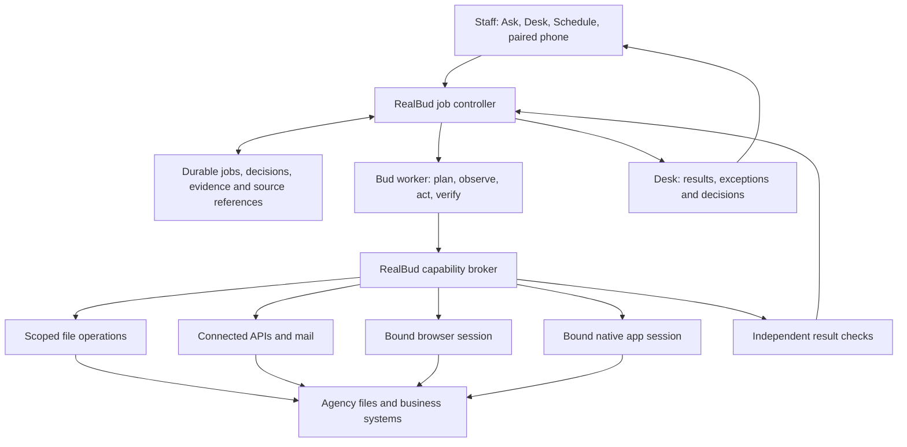

# RealBud: computer-connected work and durable routines

Date: 2026-09-12

Status: architecture recommendation and implementation sequence; not a completed runtime migration.
Review: current working tree at base `058aceabe04aed77c285f2f52f7803fc19bc7ee9`, including existing uncommitted work.

## Decision

RealBud should be an agency's local work assistant: understand an outcome, use the approved computer, files and business systems, verify the result, and repeat proven work on a schedule. Desk is the work and decision queue. A property appears as context for a job, not as a second portfolio staff must maintain.

Keep one Bud identity and the existing Hermes worker integration. RealBud owns job state, permissions, scheduling, decisions and receipts. Extend the existing execution path instead of adding another agent runtime or scheduler. Computer access is a primary capability; choose a direct file operation, supported API, browser interaction or native application according to the job.

Do retain structured operational memory. Expected bills, source identities, unresolved exceptions and prior actions cannot live only in chat. The distinction is **who owns each fact and who must maintain it**, not whether RealBud has a database.

This decision replaces the local-portfolio-centred and permanently browser-only direction in older planning. It does not remove existing runtime safeguards. Broader desktop capability must be implemented and verified behind the same job authority before use.

## Evidence read and its limits

I read the three review-draft transcripts, their detailed analysis, the relevant Cursor continuation and the execution/storage modules listed below. I did not re-listen to the complete recordings. Speaker attribution and flagged ASR passages remain provisional. Interview descriptions are evidence of reported work, not verified vendor limitations, measured savings, legal rules or technical permission.

Local interview sources:

- [Clip 1](/Users/yoda/Downloads/Austin-Realty-Interview-2026-09-10/clip-01-transcript.md)
- [Clip 2](/Users/yoda/Downloads/Austin-Realty-Interview-2026-09-10/clip-02-transcript.md)
- [Clip 3](/Users/yoda/Downloads/Austin-Realty-Interview-2026-09-10/clip-03-transcript.md)
- [Detailed analysis](/Users/yoda/Downloads/Austin-Realty-Interview-2026-09-10/detailed-analysis.md), including prior selected-frame observations of Windows, Drive and Excel.
- [Cursor continuation](/Users/yoda/.cursor/projects/Users-yoda-projects-PropertyMe/agent-transcripts/c725496a-7545-45e3-a30a-90f505fcd28a/c725496a-7545-45e3-a30a-90f505fcd28a.jsonl): portfolio discussion around lines 770–814, existing-browser mismatch around 902, user realignment request at 1214 and response at 1218. Earlier assistant claims are hypotheses, not test results.

| Meeting evidence | What it supports | What it does not establish |
|---|---|---|
| C1 01:26–03:48; C2 01:26–03:34: bank CSV is checked and references corrected before REI Bulk Receipting | Read and transform files; retrieve current tenant/reference context; produce an explainable checked copy | Autonomous rent posting; that all receipting is manual; safe matching by name alone |
| C1 08:09–09:18: Excel bill tracking creates duplicate work | Avoid another manually maintained property/bill register; derive observations from sources | Eliminate persistent bill expectations |
| C1 09:47–10:49; C2 08:50–10:10: use history to spot a bill that has not arrived; water dates vary; mark a received bill in process | Persist expected arrival windows, source coverage, receipt and processing evidence | A fixed universal due date; treating in-process as paid |
| C2 06:35–08:04: missing bills, insufficient owner funds and company advances | Track distinct exceptions and route decisions to the appropriate person | Permission for Bud to pay, advance funds or reconcile trust |
| C2 04:23–05:21: staff save/copy notice evidence | File handling and retrievable source evidence | A saved PDF proving delivery; Bud drafting or sending statutory notices |
| C1 13:15–14:12: one Airbnb payout includes several bookings | A later cross-system allocation preparation job | Ordinary one-payment/one-tenant matching being sufficient |
| C2 16:39–17:31; C3 12:23–13:38: company-owned information across staff | Agency-owned records, explicit source access and responsible staff | Kevin's computer automatically having authority over every mailbox |
| C3 00:21–01:04; 11:24–14:12: price matching first, post-call enrichment still needed, missing Excel contributions invisible | Later enquiry intake plus staff enrichment and submission tracking | Inferring a buyer's confirmed budget from a listing; eliminating human input with email extraction |
| C3 14:17–14:32: REI and bills first, Excel/classification later | Finance-related preparation first; CRM later | A customer choice of every feature or a fixed delivery deadline |

The broad computer-assistant direction is our architectural conclusion from these cross-system tasks. Yoda's C2 11:22 claim that the assistant can do what a person does on the computer is a product explanation, not independent evidence that current RealBud can do it.

## Alternatives and corrections to the earlier discussion

| Option | Benefit | Cost / failure | Decision |
|---|---|---|---|
| Maintain a full portfolio in RealBud | Easy local joins and offline views | Staff reconcile two records; ownership and tenancy drift | Reject as the core product |
| Stateless chat with unrestricted computer tools | Fast general demonstrations | Repeated discovery, forgotten work, duplicate effects, no reliable absence detection | Reject |
| Fixed scripts for every screen | Predictable on stable known paths | Expensive to extend and repair; cannot handle unfamiliar exceptions alone | Use for stable steps within workflows |
| Agent plans within a durable job contract, using several adapters | Covers real files/apps/sites; supports recovery and repeat work | Requires an authoritative tool boundary and proof of completion | Recommended |

Three corrections matter:

1. **A thin property index alone is insufficient.** Missing-bill detection needs an obligation model and evidence of what sources were checked. A zero-result mailbox search is not proof a bill never arrived.
2. **Computer-connected does not mean every action should be a screenshot click.** Parse a CSV with a file tool, read a supported API when available, and use the UI for work that needs the UI. A bank export should not be transcribed from pixels.
3. **One worker does not mean one-person ownership forever.** Start with one operator/device, but bind records to the agency and access to named people/accounts. Danny's company-wide requirement is real and belongs in later shared-source/CRM work.

The earlier claim that a portfolio product automatically “loses to AiMe” was not established by this interview. The stronger reason to change direction is the duplicate work Kevin actually describes.

## Operating architecture

This is the target, not a diagram of fully wired current code. A single job may read a bill attachment, compare an REI export, prepare a file and inspect a browser record. All four adapters receive the same run identity and scope. Switching adapters must never increase permission.

### What Bud should do

- Find and read job-relevant records, emails, attachments and working files within configured access.
- Extract facts with source links; distinguish observations from guesses and user rules.
- Compare records, detect missing/ambiguous items, prepare checked files and private drafts.
- Navigate apps and websites, enter permitted fields, and verify what changed.
- Resume after a login or human decision; preserve progress and avoid repeating completed work.
- Suggest a reusable routine after a successful example; save the routine only through the user's explicit job/schedule action.

The model chooses the next useful step within a job. Deterministic code handles financial arithmetic, schema validation, permissions, deduplication, persistence and completion checks. Do not make the model re-invent these each run.

### What the human controls

The person grants a workflow access to named accounts, folders/apps and permitted operations. Bud should not ask again for every harmless read within that active grant. Any new scope or changed authority needs review. Current per-call approval flows remain until reusable grants have enforced scope, expiry and revocation.

Preserve the existing product prohibitions on trust movement, statutory notices, signing and unattended sending. Job approval is not permission for those actions. Existing opt-in, non-prohibited portal submission remains an exact per-action decision. Future reversible shared-record changes need a concrete before/after preview and verified persistence; this document does not enable them.

Login, MFA and credential entry remain a human handoff. Rebind to the intended account and app after return. Do not collect browser cookies into RealBud. For attended work, use the chosen existing session where the host supports it; if attachment is unavailable, expose that failure and the explicit alternative instead of silently opening a fresh browser.

### Minimum state and ownership

| State | Owner / authority | RealBud retention |
|---|---|---|
| Properties, current tenancies, balances and posted transactions | Existing PMS / financial source, according to record type | Read projection with source/account ID, external record ID, observed time and coverage; refreshable |
| Property/tenancy identity mapping | Source identities plus verified office resolution | Small index with aliases and validity dates; never merge by address/name alone |
| Expected bill obligation | Office-confirmed rule or explicitly provisional inference from history | Property/source reference, provider/account, bill kind, expected period/window, evidence, confidence, responsible person and exceptions |
| Bill observations | Mail, document or PMS evidence | Source IDs/digests, receipt time, processing observation and payment evidence separately |
| Job definition and schedule | RealBud, authorised by the user | Versioned outcome, source scope, allowed effects, trigger, verification, limits, recovery and grant |
| Runs, decisions and learned site procedures | RealBud | Checkpoints, operation identity, results, source references, procedure version and last successful verification |
| Buyer/CRM information, later | Company-designated workbook or optional CRM | References and operation receipts; CRM is independently removable from Bud |

Do not require a portfolio import before a selected-file or selected-record job. For an office-wide missing-bill claim, however, obtain a current authoritative scope: which properties and obligations should have been covered. Display unknown/uncovered scope honestly. New managements need a one-time expectation setup where no history exists; Bud cannot infer a bill it has never seen with certainty.

Retain property and tenancy as separate identities. A tenant changes while the property persists; a rent reference may be reused. Policies need ownership, effective dates and review when the source changes. User notes must not override current source facts or grant tool permissions.

Bill state should have separate dimensions: expected arrival, document received, processing progress, funding exception, and verified settlement. A bill may be received and awaiting funds simultaneously. An acknowledgement dismisses an alert; it must not manufacture a paid state. Bud derives observations when possible; staff only supply decisions or information absent from the sources.

Reuse `WorkflowDatabase` for durable operational state where appropriate. Its encrypted payloads and compare-and-swap transactions are useful foundations, not proof that every caller is authorised or every record is validated. Preserve existing `desk.json`, notes, mappings and drafts through a versioned migration. Do not delete the book to achieve the new product framing.

### Jobs that become proper schedules

The user starts with an outcome, for example: “Check for expected water and levy bills and show me anything missing.” Bud uses a guided first run to establish the sources, interpretation and stopping point. It then proposes a reusable job with:

`agency + operator + outcome + sources/coverage + allowed operations + procedure version + completion checks + trigger/timezone + run limits + exception owner + recovery policy`.

Record procedures as semantic steps and observable outcomes, with selectors as hints. A demonstration is an example to generalise and test, not a recording to replay blindly. A changed page can be re-observed within the same scope; a changed business action or procedure grant needs review.

Support three trigger families over time: explicit Run now, clock, and a source event such as a completed CSV download. The scheduler claims one due occurrence durably. Event watchers must wait for stable files and deduplicate by source/version; an email arriving in two mailboxes must not become two business actions.

Proposed run lifecycle: queued → checking prerequisites → running → verifying → completed/partial, with explicit waiting-for-login, waiting-for-user, waiting-for-device, failed, cancelled and interrupted states. These are proposed semantics, not claims about today's exact status enum. A wake-up evaluates missed work against its freshness window; it does not replay every missed click.

On a staff computer, foreground control is cooperative: show the active task, provide Pause/Take over, and yield the desktop during human work. A schedule may prepare through API/files while the UI part waits. Do not promise execution while a laptop is asleep, the host is offline or the required session is unavailable. An always-on office execution device is a separate deployment with its own sessions and permissions, not a Mac Mini that magically controls another employee's Windows apps.

## Current code: reuse and gaps

These are observations of the inspected paths, not an exhaustive security audit or installed-app verification.

| Module | Useful existing foundation | Change required for this direction |
|---|---|---|
| `server/routines.ts`, `routine-persistence.ts` | Named clock, bounded history, timezone handling, invalid-state recovery | Current clock deliberately does not launch CUA. Add durable capability/device prerequisite handling for live-source jobs; keep one scheduler |
| `server/job-executor.ts`, `job-runs.ts` | Immutable attempt spec, idempotency and structured prepare result | Preparation uses `askWorker` with file/web/todo toolsets, not the same complete live adapter path as interactive work. Unify dispatch and independently verify outputs |
| `server/workflow-packs.ts` | Saved Austin job templates | Expected-bill copy says to read Gmail but capabilities are `read-book/analyse/draft`, with no allowed origins. Template installation is not live mailbox ingestion |
| `server/desk-context.ts` and executor | Revisioned saved snapshot, explicit training/live-source caveat | Replace mandatory local-book context where a job can bind directly to selected sources; track scope and freshness |
| `server/cua-bounded.ts`, `portal-fence.ts`, `portal-sessions.ts` | Attended browser contract, scope and action checks | Bounded contract allows navigate/read/fill/semantic click and forbids raw desktop tools. Native app/files need their own enforceable adapter scope; do not simply delete the deny list |
| `electron/cua.mjs`, `cua-control.mjs`, `server/cua-human-control.ts` | Local host plumbing; serialized release/verify/restore handoff | Prove end-to-end existing-session attachment and revocation; a bundled driver is not a verified office workflow |
| `server/connected-apps-broker.ts`, `drivers/acp/core.ts` | Interactive app broker, approval, cancellation and operation receipts | Reuse this authority model in scheduled execution. Avoid mounting raw global MCP or broad account credentials |
| `server/computer-lease.ts` | Shared in-process lease | Lease checks distinguish owner category; the same owner can replace a different work item. Durable per-run/device ownership and fencing are needed before broader concurrent scheduling |
| `server/expected-bills.ts`, expected-bills routes in `server/index.ts` | Expected windows and several bill statuses already exist | JSON read failures currently return an empty list; flat status and optional source reference do not enforce coverage or settlement proof. Add strict recovery, observations, revision checks and recurrence identity |
| `server/bank-reference.ts`, `bank-reference-store.ts`, `workflow-database.ts` | Checked copy, source digest, repeat-file reuse, revisioned encrypted storage | Reuse, add live source binding; exact-file reuse alone does not deduplicate overlapping exports |

Hermes isolation already has RealBud-owned-home handling in `server/hermes-pack.ts`; generic/legacy fallback branches also exist. Verify every product entry path, including scheduled CLI work, instead of assuming the document's home path guarantees isolation.

Do not label a well-formed model JSON result as verified mail retrieval, a file write or a PMS change. Store adapter receipts separately from model explanations. The completion check should read the resulting file/object or observe the target state. An uncertain side effect stays uncertain and must not be retried blindly.

## Delivery sequence and acceptance

### 0. Prove Bud's hands before extending workflows

This is the prerequisite from the Cursor realignment, not work to defer behind the finance implementation. Check the actual running app: model attachment, a real model response, RealBud-owned Hermes home, cancellation/recovery, and the intended browser session. Verify interactive and scheduled launch paths separately. A healthy app server or saved model setting is not a successful worker call. If login needs the user, preserve the pending task and resume after authentication.

Acceptance: Bud answers a harmless request through the actual app using the intended provider/profile, remains separate from personal Hermes Desktop, and can read one explicitly selected existing browser page without silently opening another login session. Do not interpret this as proof of REI account access. Then proceed to the source-bound workflow below. Verify paired Telegram decisions on that same workflow after its local path succeeds; cosmetic work stays later.

### 1. One source-bound finance preparation job

Start with bank-reference preparation as a concrete file/browser path and a small expected-bill history example alongside it. This ordering within REI/bills is our recommendation, not an agreed customer ranking. Confirm the actual Austin operating system/browser; the prior video analysis shows Windows, so a Mac demonstration alone is insufficient.

Bind a selected source file/account and coverage period, resolve only the needed property/tenancy IDs, prepare a separate copy and produce an evidence-backed exception queue. No manual portfolio setup prerequisite. Kevin reviews and imports in REI himself.

Acceptance: repeated original file reuses its review; overlapping exports flag duplicate transactions without collapsing legitimate identical payments; amounts/dates/row count/totals are unchanged except explicitly permitted reference fields; ambiguous identity stays held; original file remains intact; selected source becoming unavailable cannot become a clean result.

### 2. Reliable bills memory and live observation

Migrate the existing bill register safely, preserve originals, validate every record, and bind observations to the actual approved mail/PMS sources. Add expected-period identity, coverage watermarks, receipt/processing/funding separation and evidence requirements. Use the existing workflow storage pattern; do not add a generic second PMS schema.

Acceptance: missing, received, in-process and verified-paid remain distinct; a failed/partial scan shows incomplete coverage; a duplicate attachment does not create a second obligation; a forwarded or revised invoice is reconciled; a corrupt register triggers recovery and cannot be overwritten as empty; changed tenancy/management does not inherit inappropriate rules.

### 3. Broader computer work through the same job boundary

Add scoped native-app and file actions alongside browser/API operations. Bind browser account/tab, native app/window and canonical file roots to the run. File operations must enforce real paths, symlink boundaries, read/write separation, atomic new outputs and preservation of originals. Browser scope must be checked at the executor, including redirects and account switches; labels supplied by the model are not proof of an action's effect.

Acceptance: a file dialog can complete the approved job; MFA releases control and resumes at the correct account; a changed window invalidates a pending action; unapproved navigation/write is denied; page/document instructions cannot widen tools; all entry paths preserve the same prohibitions; native workflows pass on the target OS.

### 4. Promote proven jobs into schedules

Connect the same job runner to clock/event triggers. Store grant and procedure revision, claim a unique occurrence, checkpoint progress and acquire a per-run/device lease with fencing. Stopping a job must cancel/revoke its tools; a timeout alone is not proof its worker stopped. Two processes or two devices must not claim the same work independently.

Acceptance: restart after enqueue and after an action; late worker results are rejected after cancellation; changed policy invalidates approval; two same-category jobs cannot share the desktop; sleep/lock/offline produces a visible waiting/missed state; catch-up respects data freshness; a result whose write may have succeeded is reconciled before another attempt. Run across several real operating cycles, including faults, before calling it unattended-ready.

Suggested Austin cadence is configurable: bill checking daily; bank preparation on the agreed export cadence. The interview says roughly every two days. Existing Mon/Wed/Fri pack times are a template approximation, not a customer-confirmed schedule.

### 5. Agency workflow expansion

Only after the first path is useful, add Airbnb allocation preparation, evidence filing, then company enquiry intake/enrichment and optional CRM. Persist agency/source/operator identifiers now; introduce shared services when multiple operators actually need them. Do not sync live SQLite database files through Drive. Choose one office coordinator or an explicit server authority for shared claims and writes.

Twenty remains an optional company record system, not the primary agent or scheduler. Browser automation cannot recover buyer preferences never recorded after a phone call. Staff still need a simple way to contribute and correct that information.

### Verification, resources and rollback

For each run capture source freshness and coverage, time spent waiting for people/device, verified artifacts, corrections, duplicate prevention, and sanitized failure codes. Compare Kevin's active time and checking burden before/after; do not count a draft or a scheduled trigger as time saved. Cap turns, runtime, tool calls, downloaded bytes, retained screenshots and retries. Load only job-relevant context; use incremental checks instead of scanning the whole office every run.

Keep source documents under agency-controlled access and retain only necessary excerpts/digests in receipts. Local execution does not mean local-only data processing: model and connector calls may transmit selected text or images. Make that flow visible during setup and keep credentials outside prompts and ordinary logs.

Deploy each new execution capability disabled until its tests and attended example pass. Roll back by disabling the new runner/adapter and preserving its jobs/evidence, then using the prior prepare-only path. Database migrations need an original backup, version marker and one active writer; do not roll back by reactivating a stale writable copy.

Revisit this architecture when multiple staff need simultaneous execution, a supported source API replaces a fragile UI path, or measured review effort outweighs saved work. These are decision triggers, not newly created reminders.

## External feasibility checks

Current [Anthropic computer-use documentation](https://platform.claude.com/docs/en/agents-and-tools/tool-use/computer-use-tool) distinguishes full-desktop tools from webpage tools and places tool execution in the application's environment. Its prompt-injection cautions reinforce enforcing permissions outside the model. This supports the adapter separation; it is not a recommendation to replace Hermes or proof of RealBud capability.

[Microsoft's unattended desktop-flow documentation](https://learn.microsoft.com/en-us/power-automate/desktop-flows/run-unattended-desktop-flows) describes explicit session provisioning and active/locked-session constraints. Its exact restrictions are Power Automate-specific. The relevant architectural inference is that unattended work needs a managed execution session, not merely a cron time.

## Review result

The product direction is supported; the runtime migration is still to build. Preserve the existing worker, queue, approvals, checked-file workflow and recovery patterns. Stop extending the manual portfolio as the product centre. Put the next engineering effort into fresh source access, verified actions and repeatable recovery through one job path.

Validation on 2026-09-12: 84 existing tests passed across `routines-recovery`, `job-executor`, `portal-fence`, `bank-reference` and `expected-bills` (5 files). These characterize the existing code, not the proposed adapters or migration. The documentation's local links and fenced blocks were checked. No customer account, installed-app flow or real scheduled computer job was exercised in this review.
