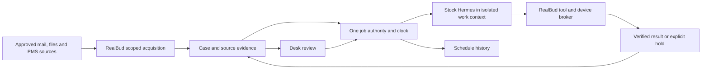

# Desk operations and QM integration review

15 September 2026. Coordinated with **Plan RealBud multi-desktop agents** (`01a09daf-87ab-7e60-9ad3-23f8313c4cd6`). This task owns this review, its evidence directory, the coordinated fix in `server/expected-bills.ts` and its focused tests, and the narrow `ExpectedBillsBoard.tsx` error/retry fix; the other task owns the active Composio/account-isolation and physical runtime work. Other application edits and the active implementation register remain intact.

## Decision

Keep **Desk**. Keep durable work items, decisions, evidence and recovery. Reframe the default experience around **work and reviews**, with properties as linked source context and optional matching tools. A manually maintained portfolio must not be the prerequisite for an inbox, selected-file or bank-export job.

RealBud is **partially integrated**, not a finished QM + Hermes company platform. It already adapts useful QM PostgreSQL semantics, and the company service has substantial identity/storage work. The everyday Desk/Ask/Schedule path still uses the local workspace. Installing QM does not complete that connection.

The latest product direction in [GOAL-PROMPT](GOAL-PROMPT.md) supersedes the older portfolio-first spine in [DESIGN](../DESIGN.md) and [PRODUCT-DESIGN-PLAN](PRODUCT-DESIGN-PLAN.md). Those design documents should be aligned during the coordinated UI implementation; their older wording is not evidence that the current portfolio structure remains the target.

## What to retain or change

| Surface or object | Recommendation | Operational reason |
|---|---|---|
| Desk | Retain; sidebar description becomes “Work & reviews” when the combined projection lands. | Staff need one place to see decisions, prepared outputs, failures and unfinished work. |
| Tasks/cases | Retain the durable object; make the title describe the work, such as “Review 2 unclear bank references.” | Ownership, reminders, decisions and recovery must survive chat closure and restarts. Staff should not have to recreate the list manually. |
| Properties/tenancies | Keep source-linked identities, aliases, history and matching tools under a secondary source-record view. | Bills and payment references need reliable identity. Property identity is optional for work that does not concern one property; tenancy stays distinct from the asset. |
| Existing book/import/notes | Preserve through a verified migration; retain a clearly labelled manual-import fallback. | Removing the primary portfolio framing must not erase records, notes, history or useful source matching. |
| Bills board | Fold actionable bill exceptions into Desk; retain a focused bill view for period/status/evidence detail. | An empty standalone register above the queue currently consumes space without representing the workflow pack's results. |
| Ask | Start/investigate work, explain evidence and teach repeatable procedures; open the same case/run as Desk. | Chat must not become a separate approval or completion record. |
| Schedule | Own reusable job definitions, trigger settings and run history; link into the same results. | A run in Schedule and its review on Desk are two views of one operation. |
| You | Company/member, devices, connections and recovery, progressively disclosed. | Membership, device ownership and connected-account access are different facts. |

The screenshot is sample-book UI evidence, not a live-office result. Its property heading, rent/contact facts and licence hold are appropriate within a relevant property case. They should not define the default detail view for a mailbox brief or a file-preparation job. Preserve licence holds and exact decisions; show the immediate required action first, with supporting policy/evidence available on demand.

Suggested Desk structure inside the existing navigation:

```text
Desk                                  Work & reviews
Scope: My work / Shared work           Source coverage · checked time

Needs you | In progress | Waiting | Finished

Work to review                        Selected work
  Morning priorities                  Outcome and reason it needs you
  Missing water invoice               Owner/reviewer · source account
  Bank references ready               Latest evidence · coverage · freshness
                                      Review / Continue / Open source
                                      Result and recovery history

Secondary: source records · bill history · activity
```

These are proposed display groupings, not a new persisted status enum. Resolve them from existing typed states and the eventual authoritative company operation. “Finished” must name what finished: preparation, review or verified source effect. Approving wording or acknowledging a result must never appear as a verified payment or completed external action. Keep errors and incomplete coverage visible even when a filter hides routine FYIs. Scope tabs require real backend authorization before enabling them.

## Current wiring and gaps

| Observed source | What works or exists | Gap relevant to this request |
|---|---|---|
| [Sidebar](../src/components/Sidebar.tsx), [DeskPage](../src/components/DeskPage.tsx), [desk-queue](../src/lib/desk-queue.ts) | Desk queue combines local V2/V3 cases, drafts, escalations and import issues. It counts work, not properties. | “Tasks & properties” and address-first rows still centre the old book. `buildDeskQueue` does not receive job runs or expected-bill rows. Optional property IDs already exist; extend that model instead of inventing fake properties. |
| [JobRunFeed](../src/components/desk/JobRunFeed.tsx), [work-activity](../src/lib/work-activity.ts) | Jobs/routines have a merged activity trail; linked clock wrappers are suppressed to avoid duplicates. | Desk exposes it through More → Activity, separately from the attention queue. Reuse its deduplication and links when projecting actionable results. |
| [ExpectedBillsBoard](../src/components/desk/ExpectedBillsBoard.tsx), [expected-bills](../server/expected-bills.ts) | Separate local bill register and grouping. The UI correctly says preparation packs do not update it automatically. Failed loads now offer explicit retry. | No continuous invoice/expectation/run-to-case reconciliation here. The register has a flat status and optional source reference. Missing arrival, processing, funding and settlement need separate observations. |
| [desk-context](../server/desk-context.ts), [job-executor](../server/job-executor.ts), [workflow-packs](../server/workflow-packs.ts) | Bounded source-labelled Desk snapshots; an exact snapshot is captured for `read-book` jobs. Current built-in bills/payment packs use `read-files` and explicitly hold absent inputs. | Do not claim every job requires a book today. The property-context projection still filters work through property IDs; it cannot become the general company work context unchanged. File-pack preparation is not automatic source acquisition or persisted business reconciliation. |
| [Company API](../server/company-host.ts), [setup UI](../src/components/CompanySetupCard.tsx), [company schema](../server/company/schema.ts) | Member/scope/knowledge/claim APIs and company setup/joining. Claim rows have owner/fence/expiry/outcome. | Source explicitly states existing Desk, Ask, sources and schedules remain local. A claimed company case is not yet the same operation as a local JobRun, approval, artifact or Cua lease. |
| [Hermes ACP adapter](../server/drivers/acp/hermes.ts), [job executor](../server/job-executor.ts), [routines](../server/routines.ts) | Existing stock-Hermes execution, job preparation and RealBud clock. | Full company/member/device authority across Ask, Prepare, clock and companion execution remains an integration gate. A separate profile or safe mode alone is not OS confinement. |

**Bill recovery defect found and fixed:** `loadFile` previously treated malformed JSON, unexpected file shape and read failures as an empty register; a later upsert could overwrite the damaged original. The isolated [reproduction](../outputs/realbud-desk-operations-audit-2026-09-15/check-bill-recovery.mjs) and [pre-fix result](../outputs/realbud-desk-operations-audit-2026-09-15/bill-recovery.json) preserve the finding. The coordinated fix now allows empty first use only for a missing file; corrupt/unreadable data, invalid rows and duplicate IDs produce a safe 503 recovery error and block subsequent inserts/updates without changing original bytes. Valid v1 data and unrelated metadata survive; malformed new numeric/source fields are rejected before saving. No delete API exists here, and no office data was migrated or repaired automatically. [Post-fix result](../outputs/realbud-desk-operations-audit-2026-09-15/bill-recovery-current.json). Full lifecycle, concurrency and settlement proof remain F04 work. The board now hides its empty-state sentence on failure, retains the actionable recovery error and offers Try again with loading feedback. Successful retry restores records; legitimate first-use emptiness retains the original message.

## Appropriate use of QM

The existing [D02 decision](REALBUD-QM-REUSE-DECISION-2026-09-14.md) adopts semantics in RealBud-owned modules, not QM's full runtime. Fresh official-source review found HEAD `3e5dc7a820277d7c898e33778d0ced8268ce4fbc`, committed 14 September 2026 at 19:41:03 UTC, eight commits after D02's `361a6c0`. The three inspected grant, memory and run-store source files are byte-identical between those revisions. [Source URLs and hashes](../outputs/realbud-desk-operations-audit-2026-09-15/upstream-review.json).

| QM capability | RealBud treatment |
|---|---|
| Scoped company/member grants | Already adapted: transactional grant changes, current-principal checks and scope protection. Wire that authority through actual work and output delivery. |
| Versioned memory/knowledge | Already adapted at the storage-primitive layer. Complete reviewed source-backed knowledge access, freshness, revocation and derived-context invalidation; do not share private Hermes homes. |
| Atomic claims and fencing | Already adapted at the company-case primitive layer. Bind actual run, approval, device control and receipt to that ownership. |
| New durable swarm sessions/messages | Evaluate selected lifecycle/outbox/budget patterns for K02. Keep helper work subordinate to one RealBud root job and existing approval/cancellation boundaries. |
| Whole QM runtime, UI, scheduler and harness selection | Not required by this design. Adopting these would need an explicit replacement of overlapping owners and a new compatibility review. |
| QM sandbox computers | Useful reference for execution isolation; not proof of control over an employee's Windows/macOS apps or session. |
| General sharing/browser consent policies | Do not transfer unchanged. RealBud's privacy and exact-action contract must remain enforced by RealBud. |

QM's current [harness catalogue](https://github.com/yc-software/qm/blob/3e5dc7a820277d7c898e33778d0ced8268ce4fbc/src/model/pi-models.ts#L25) lists Pi, OpenCode, Codex, Claude and a mock harness; it has no Hermes entry. Its [CLI package](https://github.com/yc-software/qm/blob/3e5dc7a820277d7c898e33778d0ced8268ce4fbc/cli/package.json) exports a deployment contract, not the company kernel interfaces used by RealBud.

The new [swarm documentation](https://github.com/yc-software/qm/blob/3e5dc7a820277d7c898e33778d0ced8268ce4fbc/docs/swarms.md) describes durable reservations, scoped messages, run-bound fencing, finite budgets and restart recovery. Workers receive blank provider computers; parent files and approval grants are not inherited. Its cited tests use model/provider doubles. This makes it a relevant design reference, not installed desktop or Hermes acceptance. The [local backend](https://github.com/yc-software/qm/blob/3e5dc7a820277d7c898e33778d0ced8268ce4fbc/src/sandbox/local-sandbox.ts) uses Docker. QM's [security policy](https://github.com/yc-software/qm/blob/3e5dc7a820277d7c898e33778d0ced8268ce4fbc/SECURITY.md#L108) also says browser-runner actions bypass some core approval/command gates; RealBud cannot assume those routes preserve its own exact-action boundary.

“Fully utilizing QM” should mean using the capabilities that improve these workflows with clear ownership. Feature parity with the entire upstream platform is not an acceptance criterion.

## One operational path



The following is a target contract, not a new schema or an authorization supplied by the model:

- **Work identity:** company/scope, stable case, job definition/revision, occurrence and attempt. A case can continue across runs; a run can produce several cases.
- **Source identity:** provider/account/external record/version, observed time and coverage; optional verified property/tenancy references. Address/name alone cannot merge records.
- **Authority:** authenticated requester, owner/reviewer, current grant, allowed operation, exact approval, target device/session and claim fence.
- **Result:** typed preparation/effect state, artifact digest/reference, verification evidence, uncertainty and next action. Model text and adapter receipts remain separate.
- **Audience/recovery:** private/shared audience, current access check, unresolved effect state, stop acknowledgement and restart checkpoint.

Project the same identity into Desk and Schedule; do not copy results into another task database. Apply audience checks before counting, searching, fetching, rendering or sending events. Sharing a task title must not silently publish private email, files or warmed worker context.

## Crosswalk to the three outcomes

| Outcome | Normal Desk item | Needed context and evidence |
|---|---|---|
| Morning priorities | “Review today's priorities” and durable unfinished follow-ups. | Granted mailbox/calendar scope, coverage and freshness, thread/event references, reviewer edits. A property is optional. New replies update an existing item where identity matches. |
| Expected/missing bills | One continuing bill case per expectation/period with the current next action. | Confirmed expectation, linked invoice/source identity, property where verified, separate arrival/processing/funding/settlement observations. Incomplete mailbox coverage cannot prove absence. |
| ANZ reference preparation | One source-bound batch review with held rows and a checked-copy artifact. | Original digest, coverage, reference decisions and reviewed output preserving untouched fields. Staff REI preview/recognition remains a separate acceptance step. |

These outcomes follow the [current company plan](REALBUD-COMPANY-PLATFORM-PLAN-2026-09-14.md). CRM is optional and is not workflow three; Airbnb and statutory notices are outside this delivery. Included Calendar/Drive/template/summary/phone assistance must use the same work and authority path.

## Implementation order in the existing register

Do not start a competing task register. Apply these acceptance refinements to [the active register](REALBUD-CORE-EXECUTION-2026-09-14.md):

| Existing tasks | Concrete next slice | Acceptance |
|---|---|---|
| H02–H04, H08–H09, U03 | Repository-backed work/result projection, then one verified company cutover; align the Desk design documents. | Preserved old IDs/history; job and clock wrapper count once; propertyless work visible; private/shared counters and details scoped; stale reviewer loses the write. |
| W01–W05, C01–C04 | Bind one company operation through the actual Hermes/tool/companion path. | Two distinct members compete for one shared case; one execution wins; wrong account/device is denied; revoked or late work cannot settle; Stop is acknowledged or explicitly uncertain. |
| F02–F04 | Connect acquisition, invoice evidence and continuing bill cases; retain the new register recovery guard. | Same invoice/new reply updates correctly; corrupt store stays preserved; partial scan stays partial; a paid label requires independent settlement evidence. |
| F05–F06 | Connect bank acquisition, review and checked-copy result. | Preserve original and untouched data; changed source invalidates old review; duplicate/overlapping input held; actual REI preview separately checked. |
| F09, U03–U04 | One company clock and visible source/device/waiting state in existing navigation. | Host offline/sleep/lock is visible; no independent duplicate occurrence on a joining desktop; catch-up respects freshness. |
| K01–K03 | Add reviewed shared knowledge and bounded helper work after the core slice. | Private canaries remain private; revoked derived context cannot be reused; child work shares root limits, cancellation and receipts. Study new QM swarms here. |

The first integrated rehearsal should use two synthetic members and one shared missing-bill case: source acquisition → case → claim → exact source/tool scope → evidence → human review → persisted result on both clients → restart and revocation. This is a checkpoint toward all three outcomes, not completion of the platform.

## Evidence and limits

- Screenshot inspected as supplied; current renderer/source wiring inspected. The narrow Bills board error/retry change was rendered with the real component and project CSS against a synthetic API at 1280×720: error without empty-state text, retry/loading, restored bill and valid empty state all observed. [Renderer check](../outputs/realbud-desk-operations-audit-2026-09-15/bill-ui-verification.json). Frontend `tsc -b --pretty false` passed. No full Desk redesign or installed-app result is claimed.
- **41 existing tests passed, zero failures/skips**, across Desk queue, work activity, Desk context, job executor and expected bills. [Machine-readable results](../outputs/realbud-desk-operations-audit-2026-09-15/vitest.json), [full log](../outputs/realbud-desk-operations-audit-2026-09-15/tests.log). The bill test covers persistence/grouping, not corruption, live acquisition or settlement verification.
- **After the fix: 65 tests passed, zero failures/skips**, across the same five files, including 25 bill tests (24 new). [Results](../outputs/realbud-desk-operations-audit-2026-09-15/after-fix-vitest.json), [full log](../outputs/realbud-desk-operations-audit-2026-09-15/after-fix-tests.log). `tsc -p tsconfig.server.json --pretty false` passed. Existing GET/POST error handlers propagate the safe recovery error; no route changes were needed. These counts overlap and must not be added.
- Current QM source was read and hashed; no QM dependency/runtime was installed or executed. No claim that upstream tests were run.
- Prior PostgreSQL proof is recorded in D02 and later project receipts; it was not rerun by this audit and does not establish the missing end-to-end company workflow.
- The other active task reports work on per-user Composio ownership and native two-Mac rehearsal. Its checks remain attributed to that task; this audit does not upgrade metadata isolation to second-member live-account or peer-worker proof.
- Windows installed acceptance, actual peer Hermes execution, live customer acquisition and customer acceptance remain separate gates in the [two-device acceptance plan](REALBUD-TWO-DEVICE-ACCEPTANCE-2026-09-15.md).
