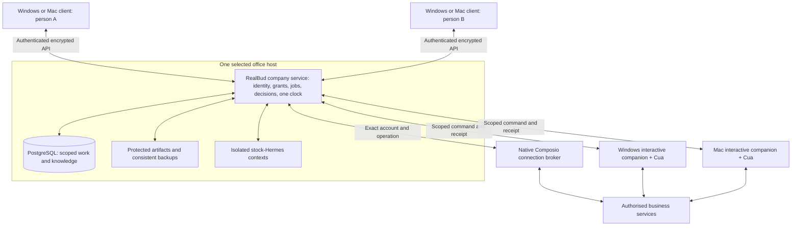

# RealBud core completion: project brief for GPT-6 Pro

14 September 2026 · Prepared for Yoda · Self-contained planning and implementation handoff

**Purpose:** Give GPT-6 Pro enough accurate context to critique the architecture and produce one complete execution prompt for a repository-enabled coding agent. That agent should implement, integrate and verify the missing core through the full agreed scope. This is not a request for another open-ended audit or another plan that ends at scaffolding.

**Current position:** RealBud has an implemented local desktop foundation, an admitted stock Hermes engine, guarded preparation workflows and useful macOS/synthetic evidence. The requested company platform—PostgreSQL, authenticated staff, repeatable joining desktops, isolated cooperating workers and complete Windows/macOS delivery—is planned, not delivered. The current implementation register has **61 tasks, all planned**. No QM runtime or source was adopted during this planning work.

Use the companion [copy/paste request](REALBUD-GPT6-PRO-BUILD-META-PROMPT-2026-09-14.md). This brief contains the essential facts even when Pro cannot open repository-relative links. The links provide drill-down material for the eventual coding agent.

## 1. What we are building

RealBud is the product; **Bud** is its assistant. The repository is called PropertyMe for historical reasons. RealBud helps a property-management office prepare and track work using its existing mail, calendar, files, bank exports and property-management system. Those external systems remain authoritative for their business records. RealBud owns work state, permissions, decisions, evidence, recovery and the clock; it must not create another manually maintained rent roll.

The founder wants a reusable product that an ordinary desktop user can set up, then invite another person to use. One existing Windows or Mac desktop can become the **company host**, containing the company service and PostgreSQL. That computer can remain its owner's everyday workstation. Other Windows/Mac computers join as clients and, when enabled, as computer-use devices. A separate machine or cloud host should be optional, not an initial purchase requirement.

Each person has Bud with a private conversation, preferences and learning. Staff can explicitly share a case, procedure or knowledge with a team or company. Internally, scoped workers can help one another. The product should retain one Bud identity and clear work ownership, rather than exposing a technical agent roster. People and devices are different: one person may use several desktops, and a company may add more of both within measured capacity.

All three customer workflows must be available to **each authorised member** through the same product. This does not grant every member access to every bank account, mailbox or desktop. A Windows-only application can be operated on an enrolled Windows device while the reviewer uses a Mac. Both native platform adapters must also work for their supported local applications; remote routing alone does not prove native Mac support.

Austin Realty is the initial design partner. Kevin has been the main operator and Danny the owner/reviewer in earlier material. The current architecture request expands beyond the old Kevin-only/two-device delivery assumptions. It does not rewrite the customer agreement, confirm a price, establish paid acceptance or authorise access to live customer accounts. Optional CRM expansion remains separate.

## 2. The complete workflow contract

| Outcome | End-to-end result required | Important distinctions |
|---|---|---|
| **Morning priorities** | Acquire the granted mail/calendar scope; identify and explain priorities with source links; preserve waiting/FYI and unfinished work; use saved preferences and filters; show freshness, missing coverage and late runs; meet an agreed measured ready-by time. | Synthetic inbox classification is not live acquisition. A short bounded mailbox scan must never appear to cover the whole agreed period. |
| **Expected and missing bills** | Establish reviewed expectations from approved history; acquire invoice evidence; carry accepted facts into durable continuing cases; preserve corrections; identify gaps and exceptions; assign an owner/reviewer. | Expected, received, processed, funded, payment arranged and independently verified paid are separate states. A missing invoice is not automatically unpaid. |
| **ANZ reference preparation** | Acquire the agreed export through an authorised API/file/session route; retain the original and its digest; propose supported reference corrections; hold ambiguity; bind human decisions to the current batch; write and read back a reviewed copy; staff checks actual REI recognition/preview before financial processing. | Preserve dates, amounts, row count, row order and every untouched field exactly. Preparing/exporting a copy does not prove successful REI processing. Manual upload is a labelled fallback, not proof of automatic acquisition. |

Included assistance also needs completion: scoped Calendar preparation and exact-approved internal entries without attendees/invites/notifications; Drive/Docs/Sheets lookup; five agreed templates; verified new draft copies; on-demand and weekly summaries; phone continuation; setup, correction and recovery guidance. The final source inventory and templates must come from the current agreement/configuration, not invented examples.

The latest reviewed customer proposal is revision 32. Its quoted bounded delivery still describes one Windows 11 workstation, at most two Gmail sources, one Calendar, one Drive source tree/output folder, one ANZ/REI format and one phone route. Use that as the initial source-binding example, while building the expanded company architecture. Additional staff/source counts, service levels and commercial terms remain separate decisions.

There are **four existing preparation stages**: inbox triage, invoice intake, bill exceptions and ANZ candidates. They support the three outcomes; they are not yet an automatic complete pipeline. Workflow-pack import currently transfers plans without all supporting skills/scripts/files, private source bindings, approvals and schedules. Portable installation must supply and validate those dependencies before claiming readiness.

Preserve the existing exclusions: no sending, money movement, payment execution, signing, statutory notice drafting/issuing/service, mailbox mutation or editing, overwriting, moving, deleting or changing permissions on existing source files. Airbnb and Form 11 are outside this delivery. Humans perform login/MFA. Approved new draft copies and narrowly approved internal calendar writes use their own bounded operations. Existing locked “never” operations cannot become available through a generic Allow button, browser fallback, generated CLI or delegated worker. Existing portal Submit is tied to the exact job and per-instance decision and excludes pay/sign/notice/send.

Scope references: [engagement record](AUSTIN-ENGAGEMENT-2026-09-10.json), [agreement and Schedule D](AUSTIN-IMPLEMENTATION-AND-CARE-AGREEMENT-DRAFT-2026-09-13.md), [accounts pack](../pack/workflows/austin-accounts/README.md).

## 3. Architecture recommendation and component ownership

**Keep unmodified Hermes. Extend RealBud into one company service. Selectively reuse QM's useful company primitives. Make Composio and Cua native product integrations behind the same authority.**

Pro may challenge the implementation choice with concrete evidence. The user's required outcomes, private staff boundaries, stock-Hermes rule and Windows/macOS target must survive any alternative. “Integrate QM” is a requirement to seriously evaluate and use appropriate QM capabilities; it does not establish that deploying the entire QM runtime is technically necessary.

| Component | Its role | What we must build or adapt |
|---|---|---|
| **RealBud** | Product UI, identity, policy, job authority, decisions, evidence, recovery and one schedule. | Independent service, PostgreSQL repositories, member/device scope, brokered execution, setup/join/restore, complete workflows and release lifecycle. |
| **Hermes** | Reasoning, supported model access, native learning/skills and admitted browser/file/code utilities behind the existing ACP adapter. | Isolated context provisioning, explicit tools, supervised ownership/cancellation, safe utility admission and compatible updates. No source fork, monkey patch, extra Hermes app or independent cron/gateway. |
| **QM** | Candidate source/patterns for scopes, grants, knowledge revisions, durable claims and reusable configuration. | Bounded extraction-versus-local implementation decision, provenance/licence notices and tests. Keep RealBud's authority and clock. |
| **Composio** | Native service authentication and supported tool transport. | Product Connections lifecycle, stable member/company identity, exact account/resource/action/version grants, hard denials, verified results and reliable source events or polling. |
| **Cua Driver** | Native desktop/browser control in the selected signed-in device session. | Matched SDK/native/helper/manifest admission, authenticated companion, all-route command broker, local Stop/takeover, session lifecycle and real Windows/Mac acceptance. |

The company host must continue API/scheduled work while client windows are closed. GUI work needs the correct available interactive session. On Windows the system service cannot operate the desktop from Session 0; use a separately authenticated user-session companion. On macOS the signed GUI permission owner must hold the required Accessibility/Screen Recording grants; a daemon must not borrow another process's consent identity.

Default worker placement is host-side to simplify joining desktops and centralise scheduling. **This is conditional on actual confinement and ordinary-PC capacity tests.** Different folders and Hermes profiles do not isolate arbitrary Python/shell/browser execution. D03 must select and demonstrate an automatically provisioned OS/VM/container boundary on both host OSs. Record privileges, install footprint, restart/unlock behaviour, resource cost and recovery. If a substrate fails on one OS, that target remains incomplete; silently dropping Mac or Windows hosting is not completion.

Start with authenticated encrypted LAN access. Keep PostgreSQL private to the service; clients never get database credentials. Remote access is a separately scoped secure route. A sleeping/offline host makes the shared service unavailable; clients show last sync and paused work. There is no automatic client election or stale offline execution. Optional always-on hosting can improve availability later.

## 4. What QM actually provides

Reviewed official QM source: commit **361a6c0095dcd3d156aca91353f3ffba0bb8b69b**. It has PostgreSQL-backed company concepts, a Docker deployment target, email invitations/revocation and a background-work disable option. Earlier “Fly/AWS only” claims were corrected. Its Docker backend expects a Unix socket; native Windows named-pipe support cannot be inferred.

The published **@yc-software/qm 0.1.11** is a deployment CLI exporting the deployment contract, not a reusable identity/memory/runtime SDK. The checked-in CLI package version differs from npm. QM's listed harnesses do not include Hermes. Whole-runtime adoption would need an integration and reconciliation of overlapping work/agent authority; it is not simply an npm install into RealBud. [Official QM source](https://github.com/yc-software/qm/tree/361a6c0095dcd3d156aca91353f3ffba0bb8b69b), [exact published package](https://registry.npmjs.org/@yc-software/qm/0.1.11).

Useful extraction candidates are the grant store, scoped/versioned memory service, transactional run claims and content-addressed configuration/pack concepts. Relevant source includes src/acl/postgres-grant-store.ts, src/memory/postgres-memory-service.ts and src/runs/postgres-run-store.ts. Run storage has orchestration dependencies, so do not copy it wholesale without tracing them.

**D02 is a two-engineer-day decision gate:** compare narrow attributed MIT-source extractions with small RealBud implementations; exercise concurrent revision rejection, revoke denial and duplicate claims; record dependency/migration ownership. Use the useful primitives if they reduce risk and work. Record a justified no-extraction decision where dependencies outweigh benefit. No complete QM daemon, Docker installation or broad QM fork is a prerequisite. There is currently **no demonstrated QM adoption in RealBud**. [Detailed assessment](AUSTIN-QM-HOST-ASSESSMENT-2026-09-14.md).

## 5. Current repository and honest evidence

At inspection on 14 September: HEAD **058aceabe04aed77c285f2f52f7803fc19bc7ee9**; **474 dirty/untracked status entries** before this handoff's additional documentation. That count is a timestamped snapshot, not a stable invariant. Source package and installed Mac metadata both report **0.1.18**; matching version labels do not prove matching source or bytes. The executing agent must preserve existing work and capture a reviewed source manifest/diff before packaging. Building HEAD alone would omit substantial local work.

The stack includes Electron/React/TypeScript, a Node service, ACP Hermes adapters, local JSON state and an encrypted SQLite workflow database. Package metadata requires Node >=24 and pnpm 10.33.0. This is a working local product foundation, not an empty repository.

| Evidence layer | Recorded result | What it does not establish |
|---|---|---|
| 12 Sep source validation | 1,927 passed / 8 skipped across 188 test files; build/typecheck and five e2e suites recorded as passed. | Historical changing source, selected coverage exclusions; not current full-tree or Windows acceptance. |
| 12 Sep Mac permission repair | Correct Developer ID replacement recognised required permissions and started the embedded helper. | The earlier broken-signature/helper state was repaired; selected-tab and route-containment proof remained separate. |
| 13 Sep Hermes admission | Stock 0.21.2: actual memory/skill persistence, file access, ACP recovery, configured-versus-explicit MCP isolation and whole-script approval/deny/disconnect checks. | Safe mode/approval guards do not establish cross-person OS isolation. |
| 13 Sep Mac directory package | 522 resource matches, strict Developer ID signature, disposable-profile packaged smoke, installed promotion and real-model Ask/Prepare. | No new DMG/ZIP, notarization, publication or Windows acceptance in that receipt. Later source fixes are not covered. |
| 13 Sep installed accounts example | One synthetic bill Prepare passed 28 checks, preserved inputs and replayed saved results; separate Ask read source evidence. | Other three installed procedures not proven; tested bill stayed paused, others unapproved, all four schedules null. |
| Later 13 Sep pack/model QA | Installed import/export/restore; two source-test office round trips; selected passing scenarios; affected bill rerun 186/186 checks and 3/3 model cases; 97 focused tests/typecheck. | Mixed source revisions, earlier malformed-result failures and later source-only fixes. No single complete run on the final packaged build. |
| 14 Sep architecture validation | Latest receipt checks 61 planned tasks, 15 requirement groups, links and dependency ordering. Earlier receipt checked 49. | Document/register checks only; listed future evidence filenames are not completed runtime tests. |

No live customer mailbox acquisition, ANZ download, actual REI financial operation, company Postgres rollout, multi-person privacy acceptance or Windows installed acceptance is established by these records. No current percentage-complete or measured reliability percentage is defensible from task count or selected successes.

Evidence: [12 Sep validation](REALBUD-VALIDATION-2026-09-12.md), [permission repair](REALBUD-PERMISSION-REPAIR-2026-09-12.md), [13 Sep Hermes/package receipt](../outputs/realbud-hermes-latest-2026-09-13/README.md), [latest accounts QA](AUSTIN-ACCOUNTS-WORKFLOW-QA-2026-09-13.md), [native-plan validation](../outputs/company-platform-plan-2026-09-14/native-integration-validation.json).

## 6. Concrete gaps at the current integration boundaries

These are findings from source review, not instructions to rewrite the whole application. Line numbers drift; inspect the named modules and their callers before editing.

| Existing seam | Required change |
|---|---|
| server/index.ts binds localhost; session-auth.ts uses a per-boot local token. | Build authenticated company transport. Do not expose the local API/boot token on the LAN. |
| store.ts has a bot-global active thread, busy state and queue. | Separate company/member/context ownership across requests, events, artifacts, search, counts and execution. Adding a user selector is insufficient. |
| workflow-database.ts provides local encrypted SQLite; other state remains JSON. | Add scoped PostgreSQL repositories and a verified migration while preserving records, IDs, corrections and labelled fixtures. |
| drivers/acp/hermes.ts selects a fixed property profile with safe-mode/approval environment; private home is managed from Electron. | Server-select isolated context homes and restrict filesystem/network/credential access. Keep stock native learning within its owner scope. |
| drivers/acp/core.ts mounts raw Cua MCP beyond the bounded computer-lease path. | Route every Ask, Prepare, routine, browser and utility call through one authoritative broker. A fence around one handoff route leaves a bypass. |
| computer-lease.ts ownership is process-local; bounded use passes through cua-bounded.ts and portal-handoff.ts. | Persist per-device lease/fencing ownership; local companion must enforce it. Reject stale sessions/commands. |
| core.ts cancellation can report completion before process death; Windows taskkill in procs.ts is asynchronous. | Revoke first, obtain execution-stop acknowledgement, reconcile uncertain effects, then release device/context ownership. |
| Ask and preparation can use separate launch paths. | One supervisor owns context locks, queues, job versions, cancellation and recovery for all paths. No concurrent writers to one Hermes home. |
| routines.ts has useful occurrence claims and retains ownership while timed-out work remains unsettled. | Preserve these semantics in transactional company scheduling; no second scheduler in Hermes or QM. |
| Native connection UI and general Composio broker coexist with a stricter Gmail path. | Complete one member-bound product connection lifecycle and hard operation policy; retire bypasses through legacy/general routes. |

### Composio must be a native product feature

“Native” means first-class connection UI, identity, state, tool execution and recovery in RealBud. Existing REST integration can be retained or moved to an official SDK where it helps; a package dependency alone is not integration. Current code has no @composio/core dependency.

The stricter Gmail path validates active private accounts and explicitly executes with a connection/user/tool version, but presently supports only three read tools, a bounded ten-thread/seven-day window and no attachment flow. Its first toolkit schema is discovered without a release-approved version; alignment provides session consistency, not durable schema admission. Add approved toolkit/action/schema fingerprints, drift holds and coverage reporting.

The general Tool Router uses installation-level identity and is not an exact-account business boundary. Current broker tests show unknown/mixed operations can be treated as reviewable and dispatched on Allow. Hard-deny prohibited operations **before** approval, including batch subactions, proxy APIs and fallback routes. Merely hiding Send in the UI is insufficient.

Build connect/reconnect/expired/revoked/disconnect/rebind states. Bind provider principal independently to the authenticated member or assigned company resource; a forwarded OAuth link must not silently bind another person's account. Grants bind exact account/resource/action/version. Workers receive handles and bounded tools, not host/provider secrets.

Choose a documented credential-provisioning model: an isolated office Composio project credential may be held by that office's protected host; a shared platform master key must stay in a managed connection broker, never inside customer installers or staff contexts. Hosted connection links with authenticated polling can work for LAN offices. Production webhooks need a reachable authenticated receiver or narrow relay with host outbound delivery; otherwise implement honest durable polling. Source events suggest work; they do not authorise actions.

### Cua and Hermes browser/CLI utilities need joint admission

As of the official refresh at **03:04 UTC, 14 September 2026**, Cua's stable npm channel is **0.28.1**. RealBud pins **0.19.3**. Cua's GitHub “Pre-release” label is monorepo bookkeeping explained in the release; it is not evidence that stable npm is a beta. Still, 0.28.1 is an **unadmitted RealBud candidate**. Admit the SDK, native executable, helpers, manifest and broker together. [Official Cua release](https://github.com/trycua/cua/releases/tag/cua-driver-rs-v0.28.1), [platform contract](https://cua.ai/docs/reference/cua-driver/platform-support).

Hermes 0.21.2's native computer-use facade needs a newer Cua contract (>=0.20 plus required manifest capabilities); native computer_use is excluded from its ACP-native tool set, while native browser tools are included. Reuse the explicit RealBud-brokered MCP path until a native facade can be exclusively bound to the same authority. Do not enable raw Cua alongside it. Setting the managed driver command must retain the upstream override that prevents independent installer repair/replacement.

RealBud currently targets **Windows x64 and Mac arm64** packages. Other upstream architectures do not establish RealBud support. Installed Mac metadata says minimum macOS 12; the actual driver/feature minimum must be resolved through current platform admission, not copied from that plist. Test Windows session/elevation limits, Mac permission continuity, browser identity, capability changes and driver termination on real supported systems.

Prefer typed API operations for supported services, then reviewed typed CLI adapters or scoped browser DOM actions, then native computer interaction where required. Every route carries the same job/account/device/action policy. Native browser execution can expose unrestricted Python, CDP and credentials; Hermes safe mode blocks configured plugins/MCP/hooks but does not itself confine these native tools.

Hermes offers an optional HAR-derived API-client skill. It supplies capture/summarisation aids; it is **not** a finished automatic website-to-CLI generator. Reviewed source can capture credential-bearing headers/bodies, and its derivation skips Cookie without comprehensively redacting Authorization/API keys. Build an exact-target capture → sanitise before model/persistence → typed adapter → fixture tests → versioned review/promotion flow in RealBud. Do not modify Hermes upstream or auto-run a newly generated production client.

Humans sign into the selected existing browser or an explicit device-owned dedicated work profile. Cookies remain on their owning device/profile; do not clone personal browser stores between staff, OSs or the company brain. Keychain/DPAPI protect stored metadata/secrets but do not replace runtime confinement. Hermes's encrypted vault with an adjacent key is not an OS credential boundary. Raw HAR/profile snapshots and authentication databases are not routine onboarding, learning or support artifacts. Automatic password login remains outside the current human-sign-in contract.

Test browser disconnect, locked desktop, expired login, account mismatch, revoked permission, changed process generation, stale element references and interrupted downloads. Preserve a visible Stop/takeover control, and require reattachment when identity cannot be re-established. [Full native contract](REALBUD-NATIVE-INTEGRATIONS-2026-09-14.md).

## 7. Shared business brain, cooperation and data recovery

Keep companyId, memberId, deviceId, interactive sessionId, workerContextId, sourceAccountId, jobId, runId and decisionId distinct. Resolve identity/grants at the authoritative service before reading data or dispatching tools. PostgreSQL scope/RLS is defence in depth, with transaction-local actor context and non-bypassing application roles. Test pooled connections with interleaved users and scheduled service actors.

Use **private person**, **granted team/case** and **reviewed company procedure** knowledge scopes. Every shared fact/skill has provenance, revision, owner, permitted audience and freshness. Personal learning is not automatically company knowledge. Shared procedure promotion should be explicit and reversible. Native Hermes learning is valuable, but no performance or continual-improvement guarantee follows simply from enabling memory.

Revocation must block future retrieval, warm worker context, caches and derived skill reuse. Knowledge derived from revocable sources needs traceable scope and invalidation; keep it ephemeral until persistent purge is proven. Do not claim that revocation can erase information a human has already seen.

Start cooperation with one bounded helper, explicit assigned work, depth/budget limits and durable receipts. Effective authority is the intersection of requester, recipient and job grants. Helpers cannot approve their own work or gain access by delegation. Prevent loops, duplicate dispatch and competing edits. Shared bill work remains one case with revision checks, not two privately diverging copies.

For computer work, one controller owns a device/session at a time. Journal intent before native dispatch, use sequence/generation/fencing information and acknowledge results. Different devices can work concurrently. A timeout or expired lease does not prove that an old controller stopped. Unknown external effects go to a reconciliation hold rather than an automatic retry that might duplicate them.

Migration must stop relevant writers, validate a consistent backup, convert with strict record checks, preserve identities/corrections/fixture labels and switch atomically. Before cutover the old store may remain authoritative; after new PostgreSQL writes, do not silently fall back to stale writable JSON/SQLite. Corruption must not become an empty successful office.

Backups cover coherent database/artifact/worker-state references and recoverable keys under encryption. Restores verify hashes, relationships and private scope. Browser authentication stores are excluded by default and require human reattachment. Host transfer is explicit: stop/fence the old authority, rotate trust and re-enrol where necessary. An epoch alone cannot stop a partitioned old host; no automatic active/active failover. Test the recovery path before promising resilience.

## 8. Keeping the system current

The user wants easy updates and access to the latest capabilities. The recommended product promise is **newest compatible stable release**, with automatic upstream discovery, verified staging and owner-configured activation when work is idle. Do not float customer execution to upstream main or whatever latest resolves to that day.

Hermes latest stable at the dated refresh is **0.21.2**, tag **v2026.9.11**, commit **939e45c91d751fadd94dcd1b873ac3cb44846213**. RealBud's approved catalog already recommends it, and the 13 September installed evidence used it. HERMES_PIN 0.20.3 is a retained fallback/rollback baseline; it is not proof that the selected runtime is 0.20.3. Recheck installed selection and official releases at execution time. [Official Hermes release](https://github.com/NousResearch/hermes-agent/releases/tag/v2026.9.11).

Existing Hermes update foundations include manual bounded upstream checks; approved official commits and installer hashes; fresh staged installs with cancellation/setup lock; exact source/version checks and isolated ACP smoke; atomic next-launch selection; manual previous-runtime selection; private state outside versioned runtimes. The current install smoke does not replace real model, memory, tool-policy and recovery admission tests.

The Electron updater checks packaged apps shortly after startup and hourly, but download/install are user-triggered. Its actual guard is packaged status, not demonstrated signing. Current Windows packaging is explicitly unsigned and skips publisher verification when publisherName is absent. There is no completed company job-drain, signed remote compatibility manifest or automatic health rollback controller.

Implement one durable lifecycle: **discover → qualify exact platform bundle → approve/sign → stage/verify → drain/checkpoint → activate → health probation → stable or recover**. Freeze component versions per active job. Signed metadata needs trusted roots, exact digests, platform/protocol/schema compatibility, expiry, monotonic sequence/replay protection, withdrawal and tested key rotation. The compiled approved catalog can remain the simpler initial admission channel; a remote feed must not be enabled until its controls are implemented.

Journal each maintenance transition before changing selection or schema, reconcile selected and running versions after restart, and recheck approval/withdrawal/freshness before activation or rollback. Downloads may resume after verification; interrupted Hermes installation retries use a fresh candidate directory. Activation must stop new applicable dispatch and wait for acknowledged execution settlement, preserve pending work and negotiate host/client/companion versions. After activation, rollback only to a runtime compatible with the **current** data and profile; never erase newer office records to restore an old executable. Otherwise hold and forward-repair. Retain bounded previous bundles and preserve memory/skills/private settings.

Cua ships as a matched tested set. QM-derived source changes enter ordinary RealBud review/releases. Composio toolkit/action schemas and generated CLI/workflow packs need explicit admitted versions and drift handling. External browser changes require capability checks and honest holds. Do not invent upstream EOL dates or treat a new version as automatically safe.

Provide simple update status and an owner setting to automatically install compatible stable updates when idle. Once enabled, ordinary compatible updates need no repeated permission. New privileges/services or incompatible migrations need their own decision. Show upstream, approved, staged and running versions separately in details. [Full update strategy](REALBUD-UPDATE-STRATEGY-2026-09-14.md).

## 9. Setup and everyday product experience

Keep the existing **Desk / Ask / Schedule / You** navigation. Technical machinery should be progressive detail, not the normal workflow.

**Create company:** choose this desktop as host → guided dependency/storage/permission checks → create owner and company → automated recoverable host/Postgres/worker provisioning → choose protected backup destination → connect approved sources → install a complete workflow pack → review source coverage and do a dry run → deliberately activate permitted schedules. Show host availability and ordinary-PC resource impact. No shell, database password management or mandatory Docker setup should be the normal customer's task; D03 must prove the chosen provisioning approach.

**Join company:** open a short-lived invitation or pairing code → verify host/company identity → authenticate the member → enrol this device → select whether Bud may operate its desktop → guide native permissions and browser sign-in → confirm visible private/shared work. Forwarded/expired/reused invitations, wrong company, already-enrolled devices and revoked staff have explicit safe outcomes. A joining desktop does not create a second database or clock.

**Use and recover:** show who owns work, which source/account and device it uses, what has been checked and what needs the person. Surface ready, partial, waiting for login, device unavailable, needs review, stopped, uncertain effect and recovery states truthfully. Reconnect expired services or reattach browser sessions in context. Move/restore a host through a tested guided journey. Phone access continues the same job/decision authority; it does not create another agent or scheduler.

## 10. Build order and atomic task register

The [structured register](REALBUD-COMPANY-PLATFORM-TASKS-2026-09-14.json) and [readable register](REALBUD-COMPANY-PLATFORM-TASKS-2026-09-14.md) contain stable task IDs, owners, dependencies, affected paths, acceptance criteria and future evidence targets. **All 61 remain planned.** Follow dependencies, not display order; some platform/backup work must begin before final release.

| Milestone | Tasks | Deliverable |
|---|---:|---|
| M0 — Foundation decisions | 5 | Freeze full contracts; bounded QM choice; prove Windows/Mac Postgres and worker confinement; define native capabilities; admit the Cua SDK/driver/manifest and select the computer facade (D01–D03, N01, N06). |
| M1 — One company and two people | 10 | Authoritative repositories/migration/service; authenticated members/grants; invite/join; private events/artifacts; company-bound connection identity and credential topology (N02). |
| M2 — Isolated Hermes and connected desktops | 17 | Supervised isolated contexts; all-route broker; enrolled native companions; exact account/tool authority; first real two-person vertical slice on correct devices. |
| M3 — Complete proposal workflows | 13 | Portable dependencies; full live-source preparation chains; coverage, correction, persistence and scheduling; supporting Calendar/Drive/templates/phone; reviewed browser/CLI utilities. |
| M4 — Shared knowledge and cooperation | 4 | Scoped versioned knowledge; bounded delegation; review/revocation and safe utility/profile handling. |
| M5 — Repeatable setup and delivery | 12 | Create/join/restore UX; backups/trust transfer; diagnosis; compatible updates; signed platform packages; final installed and office acceptance. |

The ID groups are D01–D03, H01–H09, W01–W05, C01–C07, V01, F01–F10, K01–K03, U01–U04, R01–R07 and N01–N12. N12 owns capability/update lifecycle; R04/R05 produce signed artifacts and R06 tests their final matrix. These are substantial tasks with acceptance, not 61 equally sized units or a completion percentage.

**Immediate execution:** preserve a current source snapshot; complete D01–D03, N01 and N06; begin N02's credential-topology decisions early where independent, with implementation in M1. Close the QM and confinement decisions before broad company migration. Reuse existing modules and narrow tests rather than restarting the product.

**First vertical slice:** two authenticated people → private conversations and exact account grants → one shared synthetic bill case with revision/owner/reviewer → an authorised read on the correct enrolled Windows desktop → acknowledged Stop, preserved receipt and restart/reconnect. Demonstrate the corresponding Mac native path before claiming both platforms. This checks the architecture early; it is a checkpoint, not the project's finish line.

Continue through all three full workflows, supporting assistance, portable setup, shared learning, updates, backup/restore and final release acceptance. Parallelise backend, native-platform, integration/workflow and UI work behind agreed contracts, with non-overlapping file ownership. Resolve failures and wire the feature end to end before marking a task verified.

## 11. Completion and remaining real-world gates

Completion requires a traceable matrix showing all three workflows for each authorised member from Windows and Mac clients, against both supported host OSs. Test all four host/client OS pairings, native adapters for representative supported applications, account/privacy boundaries, exact decisions, Stop/takeover, duplicate prevention and recovery. Windows-only application execution stays on a compatible Windows device.

Clean supported Windows x64 and Mac arm64 installations must create/join a company, recover dependency failures, reconnect sources, preserve private learning, run when client windows close, survive host restart, update to an admitted version and restore safely. Final artifacts require Windows signing/publisher checks and Mac signing/notarization/permission continuity. Record artifact/source digests; a successful build or app version label is insufficient.

Run meaningful unit/integration tests around authority, isolation, migration, concurrency, stopped/uncertain effects, tool denials, native session identity and non-destructive financial transformations. Add real-model admission tests where mocks cannot establish Hermes behaviour. Keep synthetic/local/package/installed/live evidence separate. After checks pass, broaden testing only for changed scope, failures or unresolved concerns.

Actual customer accounts, sample formats, supported machines, signing credentials, required network permissions and observed customer acceptance may not be available to the coding agent. Complete all independent local preparation first, record the precise gate and continue other work. Do not invent passes, silently remove scope, or stop after finding the first external dependency. Customer live source access, sending, publication, paid provisioning and deployment require their actual authority; this brief is not that approval.

Before live acceptance, resolve the deployment worksheet: real people/devices and architectures; chosen host's uptime/capacity; LAN/remote needs; actual source inventories and ANZ/REI formats; schedule/ready-by requirements; reviewer roles; template set; backup destination/recovery expectations; connection provisioning; signing/release identities. Most engineering can proceed with explicit synthetic configurations while these facts remain pending.

## 12. What GPT-6 Pro should return

First give a concise architectural critique, correcting any material assumption with a source or an explicitly labelled inference. Then produce **one complete master implementation prompt** that can be pasted into the repo-enabled agent. It must include the outcome, invariants, current-state caveats, bounded initial inspection, ordered milestones/tasks, source areas, acceptance/evidence requirements, failure handling and finish criteria above.

The prompt should tell the agent to act, implement, integrate, test, fix and document continuously; use a plan as a working aid, not as its sole deliverable. Preserve unrelated dirty work. Reuse existing architecture and tools. Keep product workers distinct from development subagents. Do not modify upstream Hermes or add an independent scheduler. Do not use arbitrary latest dependencies or bypass approvals to make a demo pass.

Require actual evidence before changing task status. At each milestone record changes, exact verification, failures, migrations and remaining limits in project status/handoff documents. Avoid repeating the entire audit after each checkpoint. If Pro has no repository access, it must not claim that it inspected or tested the source; its execution prompt should assign those checks to the coding agent. Ask only for decisions that truly alter behaviour, authority or deployment, after completing independent work.

## 13. Repository handoff map

Repository: **/Users/yoda/projects/PropertyMe**. Private application data: **~/.realbud**. Read applicable AGENTS.md before work; it contains active product, Hermes and verification rules.

| Topic | Current reference |
|---|---|
| Full architecture | docs/REALBUD-COMPANY-PLATFORM-PLAN-2026-09-14.md |
| Atomic execution register | docs/REALBUD-COMPANY-PLATFORM-TASKS-2026-09-14.json and .md |
| Native tools/browser/session policy | docs/REALBUD-NATIVE-INTEGRATIONS-2026-09-14.md |
| Compatible update lifecycle | docs/REALBUD-UPDATE-STRATEGY-2026-09-14.md |
| QM source assessment | docs/AUSTIN-QM-HOST-ASSESSMENT-2026-09-14.md |
| Durable computer work and portal fence | docs/REALBUD-COMPUTER-WORK-ARCHITECTURE-2026-09-12.md; docs/PORTAL-WORK.md; server/portal-fence.ts |
| Stock engine and lifecycle | docs/REALBUD-HERMES-UPSTREAM-2026-09-12.md; docs/WORKER-LIFECYCLE.md; server/hermes-releases.ts; server/hermes-runtime-selection.ts |
| UX and identity | DESIGN.md; docs/PRODUCT-DESIGN-PLAN.md; docs/IDENTITY.md |
| Workflow implementation/evidence | pack/workflows/austin-accounts/; docs/AUSTIN-ACCOUNTS-WORKFLOW-QA-2026-09-13.md |
| Current direction and verification | docs/GOAL-PROMPT.md; docs/NEXT-WAVE.md; docs/QA-LIVE-DEBUG.md; package.json |

The 10 September Pro audit brief/meta-prompt and older Kevin-only/CRM-first/upstream-version claims are historical. Use this 14 September handoff for the expanded core-completion scope. Current source and newer dated receipts override stale implementation claims; old failures remain history, not automatically current blockers. Current runtime safeguards stay in force until their replacements are implemented and verified.

This handoff was prepared through source/document inspection and an official upstream version refresh. It does not install software, run new product tests, connect accounts, deploy a host or establish customer acceptance.
