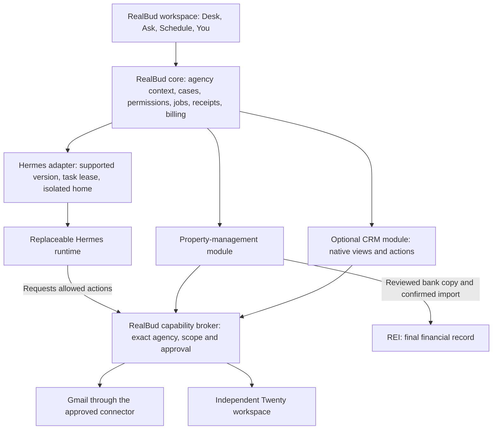

# RealBud as a modular harness over Hermes

Revision 6 human handover: [sign in, verify and continue](AUSTIN-HUMAN-HANDOFF-2026-09-10.md) defines durable login/MFA waits, privacy, correct-account checks, shared notifications and safe checkpoint recovery. Deliver configured, tested workflow packs; Kevin consents and accepts them rather than engineering routines. No Hermes fork is planned.

Revision 5 workflow extension: [guided routines, daily bank/inbox work and shared approvals](AUSTIN-ROUTINES-AND-APPROVALS-2026-09-10.md). Daily inbox organisation is now Phase 1; mailbox changes and sending remain separately scoped. This controls conflicting earlier scope statements.

10 September 2026 · Architecture decision and implementation plan · Source-reviewed; proposed changes are not implemented.

Execution register: [Austin setup, workflow coverage and delivery tasks](AUSTIN-DELIVERY-PLAN-2026-09-10.md) consolidates the work below into stable task IDs, dependencies and acceptance gates. Edit its JSON source when the delivery scope changes.

Consolidated Windows delivery and commercial plan: [Austin operating plan](AUSTIN-OPERATING-PLAN-2026-09-10.md). Its revision 4 decisions supersede earlier Mac-only scope and pricing.

## Decision

Build **one RealBud product**, with a replaceable Hermes execution adapter, reusable first-party modules and independent agency configuration. Austin is an agency installation that enables property-management workflows and later the Twenty CRM module. It is not a fork of RealBud or Hermes.

RealBud owns the customer experience, records, permissions, approved actions, schedule, operation history and commercial entitlements. Hermes owns the execution of a bounded agent task. Twenty owns the shared CRM records. REI remains the financial record. None of these installers should erase another component's records or credentials.

“Independent” means a component can be disabled, repaired or replaced without resetting unrelated configuration or data. It does not mean dependent AI features continue running without an engine, that any future Hermes release is compatible, or that invalidated OAuth credentials never need consent again.

## What the current source actually establishes

Reviewed the working tree, not just a Git commit. File hashes and the complete test log are in the Austin `platform-review` evidence folder. No live installer, uninstaller, provider login or CRM operation was run.

| Boundary | Evidence | Assessment |
|---|---|---|
| Common engine interface | `server/contracts.ts` defines ProviderDriver/ProviderAdapter, runtime events and turn inputs. `server/harness/registry.ts` retains unknown driver configuration as unavailable and disposes instances. | Reuse it; do not add a second orchestration framework. |
| Separate execution | `server/drivers/acp/hermes.ts:38` adapts Hermes; line 68 launches `-p property ... acp`. `server/drivers/acp/core.ts:235` restores transcripts after a fresh process. | RealBud already acts as a harness at this seam. |
| RealBud owns external authority | `server/connected-apps-broker.ts:1` controls dispatch, operation receipts, cancellation and ephemeral access. Hermes configured MCP discovery is suppressed by the adapter. | Strong starting point. Extend this broker boundary for module capabilities rather than mounting unrestricted CRM credentials. |
| Engine compatibility | `server/hermes-pin.ts` pins 0.20.3 and explicitly admits 0.21.0. `repairExistingProfile` refuses an unknown release and preserves the shared CLI. | A support list exists; a complete side-by-side upgrade/rollback manager does not. |
| Bootstrap recovery | `server/worker-bootstrap.ts` verifies pinned installer hashes, uses a durable setup record and SQLite lock, blocks an unowned checkout and avoids overlapping orphan processes. | Reuse these controls. A bootstrap lock is not a lock for every repair, profile edit, active agent or add-on migration. |
| Independent app update | `electron/updater.mjs` handles RealBud's button-driven packaged-app updates. | An app update path exists. This does not establish independent engine/module migrations. |
| Persistent business data | `server/config.ts:38` defaults to `~/.realbud`; book, operation history and configuration live outside the Hermes checkout. | Good separation, but most configuration is currently one office per server process. |

### Gaps that must close before calling this plug-and-play

1. **Remove erases the profile.** `server/hermes-lifecycle.ts:49` preserves the shared Hermes checkout but recursively deletes the entire `profiles/property` directory. That directory can contain model settings, `.env`, OAuth state, sessions and memory. Existing tests prove book/personal-Hermes preservation, not preservation of this profile. A reinstall can therefore require setup again.
2. **Startup rewrites the pack.** `server/index.ts:175` calls `applyPropertyPack()` unconditionally. The pack writer (`server/hermes-pack.ts:82`) replaces four files, retains the model block and copies skills over the destination. It does not consult a persistent disabled state or an installed-module inventory. Removing the profile is not a durable off state; a later server start recreates its template. Copying skills also does not safely remove obsolete owned files.
3. **There is no full lifecycle drain.** The uninstall route (`server/index.ts:3056`) calls the deletion function directly. Its guard checks an install in progress, not active Ask sessions, pending app operations, OAuth refresh or scheduled work. ACP already has stop/dispose hooks; wire them into one lifecycle coordinator before changing files. Cross-process leases and generation checks are still required.
4. **Agency and worker identities are not independent enough.** A custom `REALBUD_DATA_DIR` does not select a separate Hermes home: `hermesHome()` defaults independently to `HERMES_HOME` or `~/.hermes`, with fixed profile `property`. `shared/office.ts` is an office questionnaire, not an authoritative tenant identity. The current configuration and operation stores do not establish hosted multi-agency isolation.
5. **Concurrent agent homes need an explicit policy.** ACP keeps per-thread runtimes, but the Hermes arguments use the same property profile and child environment for those processes. Current upstream guidance says agent processes should not share a writable profile. This is a compatibility/concurrency gap to verify on each admitted version; this review did not observe corruption. A different working directory alone is insufficient.
6. **The property pack is not a product module system.** `pack/property/distribution.yaml` has a version and broad Hermes requirement, but no RealBud extension API, contribution registry, module migration journal, per-agency entitlements or independent activation state was found in targeted source searches. The broad `>=0.20.0` pack declaration is also looser than the actual adapter support list.
7. **Credential ownership is mixed.** `hermes-bridge.ts` writes the model key into the property profile, while `hermes-oauth.ts:74` looks for provider login in both property and root auth files. Future agency setup must select one explicit credential owner and refresh path, instead of silently inheriting a personal login. Never copy mutable OAuth refresh tokens into several worker homes.
8. **Revocation is currently process-wide.** `revokeConnectedAppsBrokers()` closes all app brokers in that server process. That is defensible for today's office-wide connection change, but a CRM-module disable should not close an unrelated Gmail module. Scope revocation by agency, module, connection and generation.

The older `docs/WORKER-LIFECYCLE.md` describes deletion of runtime files and repair at the same pin. That no longer matches the current shared-runtime preservation path; its correction is part of this design pass.

## Windows delivery and engine priority

Austin requires Windows website and native-app control. Keep Hermes + Cua as the initial stack; current RealBud Cua packaging/startup is macOS-specific and must be implemented and verified on Windows 11. Build the reviewed current source through the active Package Windows GitHub workflow, then test the actual installer on the customer architecture. Defer an additional Codex engine until measured task reliability/cost or a concrete need justifies it. Provider API/OAuth billing is independent of engine choice. No hardware purchase is required by this architecture.

## Product layers and ownership



The engine does not own the CRM, bank adapter, customer subscription or business database. The same approved action handlers serve native UI actions and engine requests. Installing a module adds capabilities; it does not grant permission to perform them.

| Component | Owns | Must survive its code being removed |
|---|---|---|
| RealBud application | UI and host API implementation | Agency data, configuration, receipts, licenses and credential references |
| Hermes adapter/runtime | Process/protocol translation and versioned runtime artifacts | RealBud records, agency configuration, CRM data and retained engine state |
| PM module | Expected-bill and bank-preparation handlers, views and versioned schema | Bill history, bank originals, accepted references and audit evidence |
| CRM module | Twenty mappings, sync cursor, CRM views/actions, connection references | Local linkage/history and all remote Twenty records |
| Twenty service | Shared contacts, listings, opportunities and activity records | Its database is independent of the RealBud desktop and adapter lifecycle |
| Agency configuration | Enabled modules, settings, mappings, roles, cadence and budget | All of it; a new agency is a new identity/configuration, not copied customer data |

## Storage and runtime binding

Proposed layout, with names illustrative rather than a migration already performed:

```text
RealBud application / signed host release
RealBud data root /
  agencies/<agency-id>/
    core/                 durable records, settings, operation journal
    modules/<module-id>/  retained data, settings, migration state
    engine-state/         persistent engine identity and retained session state
  runtime-artifacts/
    hermes/<version>/     replaceable binaries and virtual environment
    modules/<id>/<version>/ verified module service packages
  runtime-state/          leases, lifecycle journal, active version pointers
  workrooms/<lease-id>/   isolated agent scratch and generated profile material
```

Credentials belong to the existing secure owning store or a deliberately introduced credential service. Store references in agency configuration; do not silently move current credentials into a new plaintext file. Design one refresh owner per OAuth login. Per-worker material is short-lived and cannot become a copied second refresh owner. If the admitted Hermes API cannot support this, serialize the owning runtime until an isolated supported method is proven.

Create a server-owned EngineBinding containing agencyId, instanceId, absolute executable path, admitted version/digest, adapter API version, profile/home binding, generation and enabled state. Status, Ask, readiness, OAuth and lifecycle actions must resolve the same binding; no mixed PATH-based and hardcoded lookups. Reject a mismatched or missing binding without falling back to personal Hermes.

Start with **one agency deployment per isolated server/OS boundary**. Supporting many paying agencies means repeating a known configuration and deployment, not automatically putting unrelated customers in one Node process. A shared hosted service needs tenant-aware authentication, database/storage constraints, scoped caches/queues/brokers, resource limits and cross-tenant tests first. A profile or directory name is not a security sandbox.

## Lifecycle contract

Persist requested state separately from observed health. Turning something off is an enduring preference; a boot-time readiness check must never reinstall or enable it.

| User action | Intended result | Data and dependent behaviour |
|---|---|---|
| Update RealBud | Stage a compatible host release; activate after checks | Retain agency/module data; incompatible modules remain visible as unavailable, not deleted |
| Update Hermes | Stage a supported runtime beside the active one; smoke-test, drain, then switch the binding | Keep old runtime for rollback; do not migrate CRM or rewrite agency preferences |
| Turn off Hermes | Stop new agent work, settle/cancel active leases and revoke its short-lived tools | Manual Desk/CRM and records remain; AI tasks show unavailable and schedules show missed checks |
| Remove managed Hermes code | Delete only artifacts proven owned and not leased | Retain settings and engine state by default; external/personal Hermes is never removed by this action |
| Reinstall/reconnect Hermes | Reattach to the retained binding/state and verify compatibility | Restore tasks from durable RealBud context; new consent only when required by the provider |
| Repair profile | Reconcile only versioned files owned by the selected pack | Preserve user/module data, credentials and unrelated files; report conflicts |
| Disable CRM | Revoke this module's capabilities; stop its jobs and sync | PM and Gmail remain; Twenty records and local module history remain |
| Uninstall CRM module | Disable, drain, detach handlers and remove owned service code | Keep data/configuration for reinstall; credentials can be disconnected separately |
| Erase agency data | Separate explicit destructive operation with a reviewed scope | Never a side effect of updating/removing Hermes or a module |

Each transition uses an operation ID, durable journal, expected generation, owner-path checks and a cross-process lease. Reject stale revisions and duplicate payload changes. Staging is validated before activation. Recover partial success after restart by reading the journal, not blindly rerunning installers. A deadline can stop waiting, but does not prove an external write failed; reconcile uncertain operations before retrying.

Use backups and expand/contract schema changes. Binary rollback is safe only while retained data is readable by the old code. Do not promise rollback after an irreversible migration without a tested data restore. Pack reconciliation needs a manifest of owned file hashes and a staging directory; a recursive copy is not a transaction.

## Reusable module contract

Introduce a small first-party manifest and registry. Reuse ProviderRegistry for engine instances; keep feature-module registration separate, without inventing a second scheduler, action broker or conversation store.

```json
{
  "id": "realbud.crm.twenty",
  "version": "0.1.0",
  "hostApi": "1.x",
  "dataSchema": 1,
  "dependencies": ["realbud.core"],
  "optionalEngineCapabilities": ["agent-task-v1"],
  "contributions": ["crm-record-list-v1", "crm-record-detail-v1", "desk-case-v1"],
  "requestedPermissions": ["crm.records.read", "crm.records.write.reviewed"],
  "commercialSku": "crm-twenty"
}
```

This is an illustrative contract, not a current installable package. It contains no agency name, credential, default external write permission or silently activated jobs. A content digest/signature and trusted publisher policy must bind the actual package. Adding requested permissions on update requires renewed permission review; existing grants do not expand automatically.

Persist separate installation states (absent/staged/installed/removing/failed), agency activation (off/on), connection health and entitlement. A billable entitlement enables an offer, not a bank action. The authoritative action gate checks agency membership, enabled module/version, declared capability, live connection binding, exact action approval where required, and spending policy. A hidden UI button alone is not a permission boundary.

For the first release, bundle a small registry of known native renderers in RealBud and independently version each module service/configuration. The module registers approved view/action contributions by ID. This gives CRM a native experience without downloading arbitrary JavaScript into Electron. A genuinely new renderer requires a compatible RealBud release. If independent arbitrary UI packages become necessary, design a signed, sandboxed host API separately; do not imply today's design already supports every future plugin without a host update.

Native contributions share typography, navigation, loading/error/empty states, case identity and recovery. Missing or incompatible modules should leave their saved configuration visible with one repair action. Do not silently drop unknown module records when an older app reads them.

## Austin CRM as the first add-on

1. Provision a separate Twenty workspace and record its immutable identity, approved API endpoint, credential reference and schema mapping in Austin's CRM module configuration.
2. Add a CRM view in Desk: buyers/contacts, listings, ownership and follow-up. Record details and “Ask Bud about this buyer” use the same RealBud shell. Offer “Open in Twenty” for advanced administration instead of promising to reproduce all of Twenty.
3. Twenty remains authoritative for CRM record fields. RealBud stores links, sync cursors, proposed changes and task receipts. REI stays authoritative for finance; connect identifiers explicitly and avoid guessing that matching names are the same person/property.
4. Native edits and Bud's suggestions use the same typed CRM handlers. Before a write, recheck the Twenty workspace, permission, current record version and the approved field changes. Schema administration is a separate permission from editing a contact. If an API version lacks conditional writes, implement serialized conflict checks and report the remaining race rather than claiming full optimistic concurrency.
5. Start with bounded incremental polling while the agreed Windows workstation is awake. Webhooks need a reachable authenticated ingress and durable queue; a localhost endpoint is not reachable from Twenty. Add a hosted receiver only when deployment, operating hours and recurring costs are agreed. Verify signatures, freshness and replay identity against the selected Twenty version; handle duplicate, reordered and deleted records and show partial coverage.
6. On an uncertain create/update, retain the operation ID and reconcile the destination. Do not invent an upstream idempotency guarantee. Use an agreed external reference field and destination lookup where supported; otherwise hold for review. Resuming sync must not resurrect deleted records or overwrite a newer staff edit.
7. Disable/uninstall detaches only the CRM module's jobs, views and tools. It must not delete Twenty records, cancel bill checks or remove Hermes. Reinstall reuses the existing module data, workspace identity and valid connection, then reconciles missed changes.

Twenty currently documents schema-specific REST/GraphQL APIs, role-scoped keys and separate record/metadata endpoints. The adapter must discover and validate Austin's actual schema and version before use. [Official API documentation](https://docs.twenty.com/developers/extend/api).

Twenty also documents signed change webhooks sent to a public endpoint. That supports the future ingress design; it does not prove our desktop can already receive them. [Official webhook documentation](https://docs.twenty.com/developers/extend/webhooks).

## Commercial packaging

Keep the current Austin proposal as a working offer: A$1,750 guided onboarding, A$299/month base and actual usage, with first-month usage over the agreed budget covered. Revision 4 pricing and Windows acceptance are defined in the consolidated operating plan; older pricing is superseded.

Use **base product + selected module subscriptions + actual attributable usage**, with separately scoped onboarding/migration. The CRM add-on price must cover its integration upkeep, agreed support and any hosting/backup costs; do not charge AI usage twice. Twenty vendor fees and shared infrastructure allocations need an explicit owner and treatment. No CRM amount is fixed until edition, users, data migration and service hours are known.

An agency receives a signed/configured entitlement and its own settings, not a copied app repository. Austin's feedback can improve a reusable module. Customer-specific mapping is configuration; an unusual custom workflow receives a quoted extension. Referral income is upside, not the assumption that pays for our engineering.

## Build sequence and release gates

Priority update: demonstrate one Windows workflow through Hermes + Cua before broad module/CRM expansion or another engine. Stage the necessary Windows preservation/binding work first; complete the module-removal proof before selling independently removable CRM. See W01–W07 in the execution register.

| Order | Work and existing owners | Required proof before moving on |
|---|---|---|
| 1. Preserve lifecycle state | hermes-lifecycle, hermes-pack, index lifecycle routes, config, bootstrap and ACP stop hooks | Off survives restart; profile repair preserves non-owned files; uninstall/reinstall preserves setup/data; no active process is deleted underneath |
| 2. Bind agency and engine identity | contracts, ProviderRegistry, Hermes adapter/status/OAuth/hands, credential owner | Every entry point resolves one binding; wrong agency rejected; no personal credential fallback; per-process profile policy proved |
| 3. Add module registration and activation | new shared module manifest/state contracts and a server registry; reuse broker, routine and operation stores | Dependency/version checks, scoped revocation, durable migrations, permission changes, failed activation recovery; a fake CRM module can be removed without affecting PM |
| 4. Finish Austin Phase 1 | bank-review and bill-occurrence owners from the rollout plan, Gmail recurring read adapter and native views | Real samples, unchanged money totals, missing versus incomplete coverage, calendar/phone recovery and measured operating cost |
| 5. Add Twenty | dedicated typed Twenty adapter and native CRM contributions | Selected workspace/schema verified, duplicate and conflict tests, sync recovery, removal/reinstall proof and a real staff acceptance sample |
| 6. Repeat for a second agency | same released artifacts, separate agency configuration/deployment | No code fork, no shared credentials or records; independent module selection, updates, invoice attribution and restore exercise |

The first implementation slice should close lifecycle preservation and binding. Do not install a real CRM to demonstrate modularity before the fake module can pass install → update → disable → remove → reinstall without resetting PM.

Required lifecycle matrix: app-only update; engine-only update; module-only update; each dependency unavailable; active jobs during removal; unknown external outcome; process crash during activation; duplicate lifecycle request; expired credentials; unsupported engine; corrupt manifest; unavailable disk; obsolete owned skill; rejected new permission; two agencies; concurrent threads; revoked entitlement with retained data; migration rollback compatibility. Show completion receipts and sanitized component/version/generation IDs. No credential, mailbox body or bank content in diagnostics.

### Verification performed in this review

**153 tests passed in 9 files**: Hermes lifecycle, pack, pin, bootstrap stages/install, Hermes environment, ACP sessions, connected-app broker and provider registry. These test existing behaviour, including the current profile deletion semantics; they do not certify the proposed preservation contract. The earlier separate schedule-recovery assertion failure remains recorded in the Austin rollout plan and was not rerun or fixed here.

Current official Hermes documentation describes profile isolation, warns against multiple writers to one profile, and notes that profiles are not filesystem sandboxes. Verify those behaviours against each admitted release before changing the adapter. [Official profiles documentation](https://hermes-agent.nousresearch.com/docs/user-guide/profiles/). Its distribution mechanism is a useful packaging precedent, while RealBud must retain its own product permissions and lifecycle state. [Official distribution documentation](https://hermes-agent.nousresearch.com/docs/user-guide/profile-distributions/).

Only review documents and a private static review site were produced. The product's runtime code, installed Hermes and agency records were not changed. This plan supersedes conflicting lifecycle guidance, not the observed implementation. Revisit when a second agency shares infrastructure, a module needs a new native renderer, the admitted Hermes protocol changes, or measured support/hosting costs invalidate the commercial assumptions.
