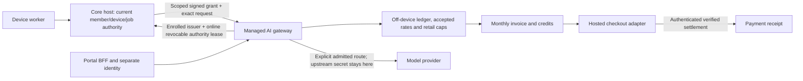

# RealBud managed AI and billing — implementation handoff

15 September 2026. **Local backend proof; no deployed gateway, working customer portal, provider spend or payment collection.**

## Current phase 2 result

The signed child-call ledger, direct DeepSeek/Kimi tool-continuation fixtures, Square draft/settlement fixtures, synthetic report fallback and private DeepSeek balance polling seam now supersede the original text-only/single-call implementation described below. See [the phase 2 handoff](../managed-gateway/PHASE2.md) for current contracts, measurements, proof and remaining gates. Square is the selected invoice provider; the existing website remains the intended interface. Automatic per-client provider history is **unsupported/unconfigured**, so automatic direct-key billing is not complete.

The original 55-test artifact, original patch and coordination-only receipt are retained unchanged. Phase 2 evidence is separate under `managed-gateway/evidence/phase2/`. No edits were applied to the core checkout or nested website repository.

## Original phase 1 implementation record

The remainder records the earlier 55-test checkpoint and its documentation-only coordination update. Where it says text-only, one-call-per-attempt or payment-provider selection pending, consult the phase 2 handoff for the implemented replacement. Historical proof is not promoted to current integration proof.

## Outcome and ownership

Implemented an independent off-device service under `managed-gateway/`: authenticated model routing, bounded streaming, retail spending reservations, durable metering, reconciliation, rate acceptance, private cost/margin configuration, monthly itemised local invoice documents, hosted-payment adapter contract and local settlement/refund simulation. The service factory and API are exercised through real local HTTP. Core company/device/worker/UI integration stays with **Plan RealBud multi-desktop agents**, task `01a09daf-87ab-7e60-9ad3-23f8313c4cd6`. Customer PDFs and commercial agreement revisions stay with task `01a09ddc-d568-7f13-aff8-632f3131467a`.

The originating task did not actually open an isolated worktree. Before editing, this task created `/Users/yoda/projects/realbud-managed-gateway`, branch `codex/managed-ai-billing`, from shared checkout HEAD `058aceabe04aed77c285f2f52f7803fc19bc7ee9`, then copied 611 modified/untracked source, configuration and documentation paths. It excluded 39,825 generated files under `output/`, `outputs/` and `tmp/` (the outputs directory alone was about 17.8 GB). Existing dependencies are a symlink to the shared checkout's `node_modules`; dependency files were not changed.

The exact transferred-path/hash manifest is `/Users/yoda/.codex/tmp/realbud-managed-gateway-baseline/baseline.json`, SHA-256 `ab87ffb0313e72c9a72c8258da4b8720e9db1a54f01d5f7d663859ae0efa5d99`. This is a dirty source snapshot, not a release commit. Only the new gateway directory and this document are owned edits. No core runtime/UI files, customer PDFs, upstream Hermes files or shared checkout files were edited by this task.

## Commercial contract implemented

- Supplier: **Yo-Da Lai**, sole trader, ABN **84 992 526 369**, GST registered. RealBud is the product.
- Care: **A$125/month including GST**, covering software and routine maintenance. Invoice close adds it only when the operator supplies that month's agreement reference. Partial-month/proration treatment is not invented.
- AI: two calendar months included after accepted go-live. The trusted provisioning record needs the accepted timestamp and evidence reference. Month anniversaries clamp to the last valid day and use Brisbane civil time. Starting billable work before accepted rates is denied. This conservative implementation requires accepted rates even for included usage so reservations have a known retail basis.
- After that period, measured AI usage is billed monthly in arrears at accepted published **retail AUD prices including GST**. No usage means no AI usage charge. Care does not add a second markup to usage.
- No margin or production prices are selected. The private cost catalogue supports explicit source prices, FX provenance and either markup or gross-margin calculations; its output is an **unpublished proposal**. Publishing and customer acceptance are separate operations. It never describes retail prices as provider pass-through cost.

This request supersedes the older actual-cost/no-markup language and A$150 amount in `REALBUD-MANAGED-RELEASE-AND-ONBOARDING-2026-09-15.md`. That historical document and the customer PDFs were not concurrently rewritten here.

## Architecture decision



Use a dedicated gateway process and database, never the desktop loopback API. Reuse Node and its SQLite support for a small, auditable local implementation. `BEGIN IMMEDIATE`, unique keys, WAL and FULL synchronous commits protect admission and billing across processes on the same durable volume. Immutable tables reject UPDATE and DELETE. A hash-linked event history is verified at startup.

Operational office records, browser credentials, selected documents and native computer control remain local. Gateway requests necessarily carry the selected prompt to the chosen provider; they are held only in memory here. Neither prompts nor output text are written to the ledger. A keyed request HMAC allows conflict detection without persisting the prompt or its plain digest. Never log HTTP authorization, body contents, upstream error bodies or payment signature secrets at a reverse proxy/APM layer.

SQLite is deliberately a **single durable service volume**, not a distributed database or shared network file. Horizontal replicas on separate disks would violate caps and idempotency. Before replicas, migrate the same transactional constraints to a central database and prove concurrency again. OS/DB administrators are trusted; triggers/hash chains cannot defend against an administrator rewriting both records and hashes or truncating a restored database. Production needs encrypted storage, controlled backup/restore, off-box audit checkpoints and anti-replay recovery review. `recover()` is an exclusive-startup operation; do not call it while another process has live requests. A durable single-owner process supervisor/lock is still a deployment requirement.

## Core integration contract — agreed seam

The core owner confirmed the snapshot uses **`x-realbud-member-session`**, an opaque token authenticated in `server/company-host.ts` / `server/company/index.ts`. Its earlier message saying `x-realbud-company-session` was corrected and verified against source. Do not forward either header to impersonate a gateway member.

### Provisioning and identity

1. A trusted off-device operator provisions the commercial tenant/license and accepted go-live record. The host cannot manufacture or extend a paid entitlement.
2. A verified installation enrols an Ed25519 **public** issuer key with `kid`, `companyId`, `hostInstallationId`, expiry and revocation status. One key cannot sign for another company or installation. Re-enrolment/key rotation needs a new `kid`; revocation is irreversible in the API.
3. Core authenticates the actual member session and current device enrolment, job/attempt, revision, permissions, account/resource scope and service capability. Service-admin authority never substitutes for member identity. No copied DB epoch is assumed to be a fencing token.
4. Core signs `canonical(grant)` as raw UTF-8 using Ed25519. Envelope: `{kid, payload, signature}`; signature is unpadded base64url. The envelope, encoded as base64url JSON, is the model endpoint's Bearer credential. Never expose its signing key to the worker.

`ExecutionGrant` includes:

```text
schema=1, aud=realbud-managed-ai, grantVersion=1,
companyId, memberId, hostInstallationId, deviceId, licenseId,
jobId, attemptId, revision, authorityVersion,
operation=model.stream, model, account, resource,
jti, iat, exp, rateVersion, maxSpendNanoAud, requestDigest
```

Times are integer Unix milliseconds. Grants cannot start in the future and last at most five minutes. `requestDigest` is SHA-256 of `canonical(ModelRequest)`, covering model, messages, output ceiling, rate version and idempotency key. `canonical` sorts object keys lexically; arrays preserve order. Import the supplied serializer instead of relying on JSON property insertion order.

### Required live authority adapter

`ExecutionAuthority.acquire(grant, signal)` must validate the current authoritative member/device/job/attempt/revision and scope through the paired host's authenticated transport. It returns `AuthorityLease {signal, assertCurrent(), release()}`. The lease is revocable and bounded; host loss, expiry, membership/device/job revocation or a stale revision must fail `assertCurrent` and abort its signal. This must be integrated at the same authoritative boundary as job dispatch. A signature, a service-admin session or caller-controlled company/member strings are insufficient.

The gateway rechecks the issuer, independent service entitlement and live lease before reservation, again immediately before dispatch, and before every stream event. It also bounds stuck authority/provider waits by cancellation and grant expiry. The core must not offer a fallback route around this gateway for supported managed model work. There is **no default allow adapter**.

The current core task reported that device enrolment and a common company execution binding are not yet admitted. Therefore actual core-host dispatch remains **gated**, not silently simulated in production. The local authority fixture exists only in `testing.ts`.

### H09 / W05 / S02 coordination — agreed next integration contract

The core owner explicitly agreed this boundary on 15 September after the PRD feasibility review. **This subsection is a documentation follow-up, not an implementation or acceptance claim.** The existing prototype still has the original `ExecutionGrant`, text-only transport and one-request-per-job-attempt constraint. The core owner retains the execution register, two-device evidence gate and acceptance tooling; this gateway task owns its transport, metering and billing side of the contract.

**A job attempt survives the whole Hermes tool loop.** Give each inference inside it a signed child `modelCallId` (or equivalently specified inference sequence), bound to the same company/member/device/job/attempt/revision and current authority. The exact request digest, allowed route/capabilities, accepted rate version, spending ceiling, expiry and JTI also belong to that child grant. Distinguish the child call's retry identity from the parent workflow attempt. The existing `UNIQUE(tenant, job, attempt)` currently permits only one inference; extending it requires a reviewed schema/grant migration, not repeatedly changing `attemptId` to evade uniqueness.

An identical retry must return that child's durable state without another provider call, reservation, debit or tool effect. Changed content conflicts. A new legitimate tool-loop inference receives a different child identity under the stable attempt. An uncertain previous call or tool action is reconciled or explicitly held before any dependent continuation; a fresh child ID is not permission to replay it. Migration must preserve existing requests, evidence, reservations and uniqueness history without inventing missing runtime authority for legacy records.

**The attempt has one aggregate spending envelope.** Reserve each child atomically against the remaining attempt budget, the customer's monthly cap and the child's own ceiling, using accepted GST-inclusive retail rates and the recorded included-period classification. Settled exposure plus all outstanding child reservations must fit the saved attempt envelope. Concurrent children and unknown/late usage share that same balance. Neither a new child, renewed lease, retry nor restarted worker increases it. Raising a budget or expanding recipient/model/tool scope requires its own current authority; it is not inferred from a previous approval.

**Authority checks stay local and revocable during streaming.** Establish/refresh authority through authenticated outbound connectivity from the office. At the gateway, `assertCurrent()` checks the locally maintained, expiring revocable lease; do not add a remote roundtrip per stream delta. The supported transport must deliver revocation and bounded refresh/heartbeat state. Expired, missing or stale authority denies the action and aborts outstanding work according to the explicit outage contract; absence of a revocation message is not an indefinite grant. Reconnection must re-establish current identity/revision before new dispatch. It never replays an uncertain effect or exposes office database ports.

The same current authority must govern **every protected action** at its authoritative core boundary, including tool dispatch, provider calls and local device control. A gateway model grant does not approve a tool's side effect. Native tool execution retains the exact account/resource/job fence and per-instance human decision where required. The current reader containment, no-send/no-pay/locked-`never` boundaries and denial of generic Platform execution remain intact. Transporting a tool call does not admit a new tool.

**Tool and continuation compatibility must be proven separately.** A future adapter must preserve tool definitions, call IDs, streamed argument fragments, ordered results and any provider-required continuation fields through multiple rounds. Provider continuation data stays in the confined worker context and permitted upstream request; do not write it to billing records, default logs or customer-facing usage views. DeepSeek's thinking/tool protocol was identified in the separate PRD review as requiring continuation fields; the exact provider schema and served capabilities must be rechecked at adapter admission. The current OpenAI text adapter and normalized endpoint support none of these tool-loop fields, and are not a drop-in Hermes/OpenAI-compatible base URL.

Current grants expire within five minutes and that expiry aborts the stream. Longer thinking or multi-step workflows need an explicitly bounded per-call deadline and lease renewal design. Renewal keeps the same child identity, rate pin, reservation and attempt ceiling; it cannot implicitly widen authority or redispatch. If a provider cannot supply an admitted hard unit/cost bound or the required protocol, reject the route. Do not reduce safety checks or add provider fallback merely to improve measured latency.

Required future proof for H09/W05/S02 includes: multiple legitimate model calls in one stable attempt; identical/reordered/conflicting retries; concurrent child reservations exhausting the parent budget; cancellation, late usage and lost responses; revocation/expiry/disconnect between tool rounds; migration/restart with unknown children; and provider-specific continuation/tool fixtures. These local checks must then be followed by the core owner's actual confined worker, two-device and supported-OS acceptance. The existing 55 tests do not establish any of that new integration.

**Evidence identity:** the original 33-file additive patch remains unchanged at `/Users/yoda/.codex/tmp/realbud-managed-gateway-baseline/managed-gateway.patch`, SHA-256 `bb7b409e38a543be6fe3b3d86cb5ee0514c74dd469c09f21c26437d27f351299`. The original test logs and `verification.json` remain unchanged and describe their dated source snapshot. This document's intentional subsequent change is recorded separately in [the coordination receipt](../managed-gateway/evidence/coordination-2026-09-15.json); code hashes remain bound to the original 55-test receipt. No runtime checks were rerun for this documentation-only update, and it authorizes no production deployment, spending, provider switching or new generic Platform tools.

### Provider interface and supported scope

`ProviderAdapter` supplies a stable route ID, a provider usage namespace shared across model-route versions, dated terms admission, a hard `bound(request)` for every possible charged unit and `stream(request,{signal,dispatchId})`. The selected route ID and namespace are persisted before dispatch and must match later usage/cost evidence. A provider request cannot be rebilled by changing model routes. Upstream credentials come from the gateway's trusted secret callback; they never appear in grants, portal data or worker environments.

The implemented OpenAI adapter supports **bounded text-only Chat Completions** with a configured pinned upstream model. It reserves the full admitted input context and maximum output, including an independent conservative cache-input ceiling. `max_completion_tokens` contains output; cached input is subtracted from uncached input; reasoning tokens are already in output. It sends `store:false`, requests final usage, rejects redirects and has no retries. Fragmented CRLF SSE, duplicate or missing usage, inconsistent counts, unsupported billable fields and interrupted streams are tested.

There is no seeded production route or guessed model/token price. Current Gemini/Anthropic/Responses, tool-call messages, images, audio, embeddings and other payloads are **unsupported and rejected**. In particular, this text adapter is not a claim of complete Hermes tool-calling compatibility. Before admitting another route, implement its request/response protocol, exact unit semantics, hard authorised cost bound, cancellation and reconciliation; run fixture/provider proof and upstream terms review. Do not approximate unsupported units as text tokens or forward unknown fields. Verify provider-specific data retention separately; `store:false` is not proof of zero provider retention.

## Metering, limits and recovery

1. Validate request, signature, issuer, tenant/license, current authority and route terms.
2. Pin the immutable accepted rate version, included/chargeable classification and Brisbane usage month. Calculate every worst-case unit at customer retail prices including GST.
3. In one transaction, check request cap, monthly cap and concurrency, then save the reservation and uniqueness constraints. Grants cannot enlarge customer caps.
4. Persist `dispatched` **before** the provider effect. Only that attempt can dispatch. Rate/month/included-boundary changes before dispatch require a new reviewed request.
5. Stream with cancellation/backpressure and current authority checks. Settled measured usage releases unused reservation. Provider-reported failed or cancelled requests charge only verified measured units, subject to the saved authorization. A failed request with no verified usage stays unknown; it is not assumed free.
6. Interruption, timeout, malformed usage, a lost response or process restart after dispatch moves to `unknown`. Keep the reservation, including across month boundaries; do not retry or infer zero. Only trusted provider reconciliation can supply late/zero evidence.
7. Verified overruns retain the actual evidence but cap customer liability at the saved reservation; the supplier absorbs excess. An unknown/unpriced unit remains unresolved. Upward corrections after a final settlement are not automatic new customer debits; record actual provider cost and absorb or explicitly review them. Downward corrections are immutable, bounded credits.

There are unique keys for tenant/member/idempotency, tenant/job/attempt, issuer/JTI, usage evidence, provider request ID, invoice period, checkout invoice, payment event/transaction and refund disposition. A retry with the same key and body returns the saved state and never replays output or provider work. Different content conflicts. Unknown results require reconciliation; a new key does not authorize replaying the same job attempt. Provider request evidence cannot be used twice or reassigned to a different route.

The monthly cap measures retail exposure, including included-period work. All unfinished reservations from earlier months remain committed until resolved. Lowering a cap below committed spend is rejected; refunds/credits do not replenish the authorization budget. This conservative treatment and max concurrency must be explained in the spending-limit UI. It does not change the included period's customer charge of zero.

Prices are exact rational amounts in integer nano-AUD per explicit unit quantity. Each request's unit categories round up only to the nearest nano-AUD, then the monthly total rounds to cents once, half up. Invoice line rounding is reconciled explicitly. GST is one eleventh of GST-inclusive AUD total, rounded to cents. No binary floating-point money calculations or arbitrary provider FX assumptions occur. Foreign provider cost and documented FX remain private; customers pay the accepted AUD retail card, not a floating conversion of the provider bill.

## Portal and billing contract

`createGatewayServer` is a dedicated Node HTTP service factory. Production requires HTTPS and a chosen same-origin portal BFF. Portal Bearer credentials are verified by a separately supplied `PortalIdentity` adapter, which returns a current tenant-bound `billing_owner` or `billing_reader`. Cookies, member headers, office sessions and model grants do not authenticate the portal. Portal membership grants no office membership or computer control. Origin checks, bounded bodies, no-store responses, strict payload fields and generic errors are installed; internet-facing rate limiting and TLS remain deployment work.

| Method/path | Authority and effect |
| --- | --- |
| `POST /v1/model/stream` | Scoped execution grant + live authority; normalized `ModelRequest`; SSE reserved/delta/settled/duplicate/error |
| `GET /v1/portal/usage` | Billing principal's own tenant only; usage, accepted rates, period, included time and limits |
| `GET /v1/portal/rates` | Published customer retail cards and exact acceptance digests; no private costs/margins |
| `POST /v1/portal/rates/accept` | Billing owner, `{version,digest}`; immutable acceptance |
| `POST /v1/portal/limits` | Billing owner, exact monthly/request amounts and max concurrency |
| `GET /v1/portal/invoices` | Own tenant's local documents |
| `GET /v1/portal/invoices/:id` | Own tenant only |
| `GET /v1/portal/invoices/:id/document` | Printable escaped HTML, restrictive CSP, no remote resources |
| `POST /v1/portal/invoices/:id/checkout` | Billing owner, positive unpaid invoice, local adapter only |
| `GET /v1/portal/invoices/:id/receipt` | Receipt only after verified settlement; includes refunded amount |
| `POST /v1/webhooks/payment` | Adapter-authenticated raw bytes; no portal role substitutes for settlement |
| `POST /v1/webhooks/refund` | Adapter-authenticated verified refund, matched to a persisted credit disposition |

`finalizeLocalInvoice(company, month, careAgreementRef)` is an operator-only local close API, not an HTTP customer route. It requires a completed month and no unresolved usage through that month. It closes once, uses supplier identity, customer identity/address, rate version, units and rates, credits, GST and sequential **RB-LOCAL** IDs. It never emails or sends the document. The production invoice sequence must be selected against the supplier's existing accounting records, not guessed from the local sequence.

The hosted-payment interface is implemented by a **local simulator** that makes no network calls. The `BillingService` constructor rejects sandbox/live adapters in this build. A browser success page or populated checkout never marks an invoice paid. Signature checking authenticates raw bytes with an age limit and environment; amounts, currency, invoice, checkout attempt and session must match. Replayed events and separate events for the same settlement do not duplicate receipts. Unknown checkout outcomes remain held; verified late settlement may reconcile the exact saved attempt.

Refunds consume an existing unapplied whole-cent customer credit, require the original payment to be settled, and reserve that credit's disposition before calling the adapter. The same credit cannot also reduce a future invoice. An uncertain refund is not retried. Only a matching signed verified refund updates the refunded total. Credits after a closed invoice become a later adjustment note or an explicitly requested verified refund; the original invoice remains unchanged.

## Verification and release gates

Local commands are in [managed-gateway/README.md](../managed-gateway/README.md). Evidence lives in [managed-gateway/evidence](../managed-gateway/evidence). The tests cover arithmetic/tax/FX, accepted rates, identity/signature/scope, independently required authority, failed/retried/cancelled streams, unpriced units, two-process shared caps, persistence/restart, unknown/late usage, invoice close, tenant isolation, raw webhook authentication/replay, lost checkout replies, credits/refunds and prompt/provider-cost isolation. A finite offline demo writes a labelled invoice and simulated receipt.

**Final local checks:** 55 focused tests pass with no skips; standalone gateway typecheck and the copied application's full `pnpm typecheck` pass. The database also rejects foreign/unsupported schemas and tampered event history. All 611 transferred baseline paths remain unchanged. The inherited root `git diff --check` reports a pre-existing extra EOF blank line in `src/lib/telegram-channel.test.ts:215`; the owned new-file whitespace check is clean. Automated visual preview of the invoice file was blocked by the browser URL policy, so only HTML/escaping/source checks are claimed. The demo's receipt is simulated, not a provider settlement receipt. Exact commands, logs and source hashes are in `managed-gateway/evidence/verification.json`.

Before managed customer work or charges:

1. Core owner implements and proves device enrolment, current company execution binding, grant issuance and authenticated online revocation lease; route all supported managed requests through the gateway. Test installed macOS/Windows/Hermes paths separately.
2. Select production provider/model/protocol coverage, verified hard limits, private credential storage, terms/data handling and reconciliation access. Admit each route after provider fixtures and explicitly authorised real-provider tests. No provider calls were made here.
3. Agree final retail card, inclusion/cap treatment and any care proration, then record customer acceptance. Choose production invoice sequence and accountant-reviewed invoice/adjustment policy. No invoice was sent here.
4. Select website repo/domain, identity provider/BFF, deploy host, TLS, request throttling, encrypted durable storage, backup/restore, exclusive process ownership and audit anchoring. No public deployment or portal frontend was made here.
5. Select and implement the production hosted payment provider. Add its exact signature/account/environment/settlement/refund adapter, explicitly authorised sandbox proof, reconciliation and production collection controls. Local HMAC simulation is not payment-provider certification. No real charge/refund occurred here.

The root security file describes the older loopback harness; it is not evidence that this new off-device surface is unauthenticated. Its secret non-disclosure rule was retained. No root security policy, statutory/legal workflow, locked `never` rule, approval fence, no-send/no-pay restriction, Hermes source or product scheduler was changed.

## Primary references reviewed

- [ATO: GSTR 2013/1 tax invoice information](https://www.ato.gov.au/law/view/document?LocID=%22GSt%2FGSTR20131%2FNAT%2FATO%22&PiT=99991231235958): supplier/recipient identity and tax-invoice intent. Invoice fields remain subject to production accounting review.
- [OpenAI Chat API reference](https://developers.openai.com/api/reference/resources/chat): stream usage, cached tokens and output accounting; an interrupted stream can lack final usage.
- [OpenAI Services Agreement](https://openai.com/policies/services-agreement/): provider-specific admission must be reviewed against the selected agreement; reading public terms is not approval of this deployment.
- [Stripe webhook documentation](https://docs.stripe.com/webhooks): raw payload authentication and duplicate-delivery concerns informed the adapter boundary. Stripe is not selected or connected.

Applied skills: architecture, security trust-boundary guidance and Bookkeeper & Controller for immutable close/reconciliation. The PayPal connector skill was inspected, but no payment provider/account was selected and no connector was invoked. No messages were sent to customers.
