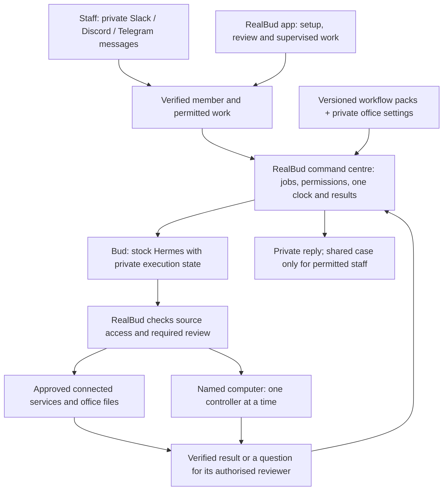

# RealBud command centre: private conversations, shared office work

13 September 2026 · Proposed extension, not implemented multi-staff acceptance

**14 September update:** the user now requests two-desktop/profile/host planning after choosing RealBud. Use [the current deployment plan](AUSTIN-TWO-DESKTOP-PLAN-2026-09-14.md) for build order and unresolved inputs. The Kevin-only commercial deferrals below are historical; they do not bar this planning, imply a signed team scope or establish private multi-staff support.

[Visual command-centre preview](../outputs/austin-accounts-workflows-2026-09-13/command-centre.html) · [Mermaid map](../outputs/austin-accounts-workflows-2026-09-13/mermaid/command-centre.mmd)

**RealBud is the command centre; Bud is the assistant people talk to.** The desktop app remains useful for setup, reviewing evidence and supervised computer work. In a later team edition, staff can request and review permitted work through their existing messaging service without installing a full desktop app. Kevin remains the sole initial operator and reviewer; extra staff are a separately scoped expansion.

This develops the existing [staff-session contract](REALBUD-STAFF-SESSIONS-2026-09-13.md) and [workflow-pack boundary](REALBUD-WORKFLOW-PACK-DISTRIBUTION-2026-09-13.md). It does not replace their scope gates. The two commercial outcomes are expected-bill visibility and rent-reference preparation. The current test pack breaks the work into **four preparation stages: inbox triage, invoice intake/review, bill-exception review and ANZ rent-reference candidates**. Each stage needs its own evidence; saying “two outcomes” does not omit the user's four-stage testing request. These preparation stages do not independently promise a general inbox, CRM or banking service. No implementation, membership, connection or schedule was activated in this review.

## Direction confirmed in this discussion

Keep one independent RealBud product with reusable, versioned workflow packs. An Austin deployment binds those packs to its privately configured sources, mappings, people and accepted cadence. Another customer gets the same application and reusable procedures with their own settings. Customer mail, credentials, learned private context and account bindings never belong in a distributable pack.

The command centre owns who requested work, its permitted sources, the accepted procedure, due occurrence, review decision, result and recovery. Staff messaging and the desktop Ask tab are entry points into that same work. A department is an access scope and a selection of workflows; it does not require a separate branded bot, scheduler or copied installation.

This diagram is the proposed team topology, not a claim that current channel adapters already enforce it. Keep one transport owner per bot token and one RealBud clock. Reuse stock Hermes profiles, sessions, skills and tools through the supported adapter; do not start its gateway beside the existing RealBud adapters. A future transport replacement requires a tested adapter migration, with the same job and approval authority.

| Department example | Useful request to Bud | Required boundary |
|---|---|---|
| Accounts — Kevin first | Prepare today's priority list, bill exceptions and reference candidates. | Agreed accounts sources; Kevin reviews; financial records remain in the bank/PMS. |
| Property management — later | Prepare a maintenance follow-up list and group the evidence for each case. | Assigned properties/cases and approved sources; private financial mail is not exposed. |
| Sales or administration — later | Summarise permitted enquiries, prepare follow-ups and organise approved files or calendar drafts. | Explicit team/source grants and separate acceptance of each workflow. |

These later examples are product expansion options, not additions to the Austin fee or included delivery. Use whichever single messaging service the customer already uses for the first team trial. A DM may request work, but membership and job permissions decide what can run. An internal staff reply is distinct from an outgoing tenant, owner or supplier message; current no-send/no-pay/no-sign/no-statutory boundaries remain.

The next implementation milestone is a dependable **import → check dependencies → connect named sources → run a sample → approve locally → choose a schedule** journey for Kevin. The current version-1 importer installs plans only. Supporting native guidance, input binding, compatibility checks, updates/rollback and the synthetic sample runner need to be joined into this product journey before promising effortless installation. The existing export is an office-plan backup, not a sanitised publisher release: review free-text instructions/site notes and keep the reusable release allowlist separate.

Only after that path is accepted should we add one more member on one channel and prove private conversation, exact account selection, correct reviewer, revocation and desktop contention. No full multi-user service or live channel was activated by this design decision.

## What people should experience

| Surface | Intended behaviour |
|---|---|
| My Ask | My conversations, attachments, preferences and task continuations. Another person opening or selecting a task cannot change my active conversation. Bud remains one product persona; staff are people, not cloned bots. |
| Office work | Shared cases for the agreed workflows, showing owner, source references, reviewed facts, artifacts, status and next step. Access follows explicit case/source grants. |
| Needs you | The relevant actor receives the pending request in their private Ask. The same request also appears on the shared case for authorised members. Both refer to one durable request and revision; resolving either updates both. |
| Schedule | One office clock owns each accepted routine. A staff member's browser or installed client does not start a second scheduler. |
| Devices | Bud identifies the named computer it needs and whether it is available. A request from another device does not implicitly authorise control of that person's computer. |

Only explicit reports, approved shared facts and the workflow's agreed evidence enter Office work. Do not stream all private chat or native memory into a team feed. A pending private-account login or private conversation does not make its content shared: the permitted case can show a limited “waiting for Kevin” status while the detailed request stays with Kevin. Notification delivery is not approval or completion.

For example, Kevin asks Bud to prepare a reference file. Bud attaches its checked draft and unresolved reference to the accounts case. Kevin sees the question in My Ask; an assigned reviewer sees the permitted evidence on that case. A decision records the real actor and exact revision. Staff perform the agreed REI handoff. No role gains permission to send messages, pay, operate trust money or draft statutory notices through this team feature.

## Smallest useful rollout

| Arrangement | Useful now | Limitation and decision |
|---|---|---|
| One installation, shared Ask | Kevin can conduct a supervised workflow trial; a reviewer can sit alongside him or receive a deliberately prepared handoff artifact. | Current product model. Named tasks help organise work but do not establish private staff access. Do not call this a team release. |
| An independent installation on each device | Separate local data can support separate solo assistants. | Today these are independent clocks, histories and connection settings. There is no verified office-wide case synchronisation or deduplication. Do not copy or network-share `~/.realbud`, Hermes homes, SQLite files or credentials to simulate it. |
| One office service with authenticated staff clients | Target for Kevin plus one named reviewer: private Ask, shared permitted cases, one source/decision ledger and one clock. One nominated interactive device executes computer work. | Recommended smallest professional team topology. It requires application work below; exposing today's localhost server is not this architecture. General personal assistants for every staff member remain a separate expansion. |

**Stage A — prove Kevin's two outcomes through all four preparation stages.** Use the installed local product, accepted sources and a nominated computer, with Kevin as operator and reviewer. Keep the current file-only preparation tests, installed-app checks and actual office workflow results distinct from this design review. The pack's synthetic import/model results do not prove multi-staff authorisation.

**Stage B — add Kevin and one identified reviewer.** Provide each with a private Ask scoped to their accepted accounts role and assigned cases. The reviewer can ask about a shared case and decide an assigned question without receiving Kevin's general mailbox tools or private history. Permit concurrent reading and non-computer work only after isolation tests pass; queue computer actions. Do not make general staff DMs, arbitrary personal accounts or control of every staff computer prerequisites for this first useful team slice.

**Stage C — add staff and devices by demonstrated need.** Add explicit source grants, private account onboarding and additional named runners. Re-run the relevant isolation and revocation cases. A new workflow pack does not grant a person access or expand the signed-off commercial scope.

### Windows and optional Mac hosting

Prefer the initial service and interactive runner on the nominated Windows machine if that is where Kevin's files and required applications live. Other authorised staff can use thin browser clients after Stage B is built. An office Mac mini is an optional host for web/file processing, provided its accounts and sources are explicitly connected. A Windows-only application still needs a Windows execution environment and an authenticated runner attached to its actual interactive desktop.

Platform support and customer-device acceptance are different checks. The earlier review used Hermes 0.21.0; the current pack test resolves the admitted 0.21.2 runtime at `939e45c91d751fadd94dcd1b873ac3cb44846213`. This does not establish Windows installation or remote desktop control. Follow the [runtime evidence](../outputs/realbud-hermes-latest-2026-09-13/README.md) and verify the nominated customer device separately.

Keep the existing loopback API private. Build a separate authenticated entry point with encrypted transport and server-side authorisation for staff clients; do not change `127.0.0.1` to a public listener or forward the per-boot token. A future remote device should accept only authenticated, job-bound commands through its runner. Do not expose raw Cua, terminal or MCP endpoints. Desktop work must handle logged-out, locked, sleeping, disconnected and sign-in/MFA states visibly; continuous computer availability is an acceptance condition, not an assumption.

## What the current source actually provides

Source review is of the working tree on 13 September, based on repository HEAD `058aceabe04aed77c285f2f52f7803fc19bc7ee9` plus local changes. These observations are not packaged, installed Windows or live-office proof.

| Foundation | Evidence and material gap |
|---|---|
| Separate task transcripts and provider continuations | [store.ts:118](../server/store.ts#L118) and [store.ts:849](../server/store.ts#L849) already provide them. Tasks lack a staff owner/visibility; [store.ts:871](../server/store.ts#L871) changes one global active task. [index.ts:1181](../server/index.ts#L1181) uses one bot busy flag. |
| Local API session and origin checks | [session-auth.ts:60](../server/session-auth.ts#L60) authenticates a per-boot token, not a person. [index.ts:4314](../server/index.ts#L4314) binds loopback. [index.ts:471](../server/index.ts#L471) broadcasts events to every connected client, and [index.ts:3424](../server/index.ts#L3424) exposes the shared bot view. These paths need audience checks before team access. |
| Unmodified Hermes ACP and native memory/skills | [hermes.ts:28](../server/drivers/acp/hermes.ts#L28) preserves native facilities while suppressing configured extensions. [hermes.ts:73](../server/drivers/acp/hermes.ts#L73) always selects `property`. [core.ts:267](../server/drivers/acp/core.ts#L267) spawns runtimes per thread, and [recipe-draft.ts:134](../server/recipe-draft.ts#L134) starts Prepare under the same profile. Separate transcripts therefore do not imply separate memory or a single profile writer. |
| Bounded Gmail account ownership | [composio-gmail.ts:107](../server/composio-gmail.ts#L107), [composio-gmail.ts:145](../server/composio-gmail.ts#L145) and [composio-gmail.ts:299](../server/composio-gmail.ts#L299) validate and dispatch against an exact PRIVATE account. Reuse this pattern. In contrast, [config.ts:13](../server/config.ts#L13) has one installation-wide connection object; [composio.ts:118](../server/composio.ts#L118) resolves one user, and [composio.ts:159](../server/composio.ts#L159) creates the general session without an exact account pin. |
| Durable runs, revision checks and recovery | [contracts.ts:489](../shared/contracts.ts#L489) stores frozen run context and dedupe identity, but no actor/source-grant/reviewer fields. [workflow-database.ts:83](../server/workflow-database.ts#L83) offers transactional revision updates. [routines.ts:396](../server/routines.ts#L396) guards manual requests; [routines.ts:536](../server/routines.ts#L536) correctly retains ownership while a timed-out executor remains unsettled. Preserve these foundations. |
| Review cards and paired messaging routes | [remote-decisions.ts](../server/remote-decisions.ts) checks pairing, current card and fingerprint. [Telegram](../server/channels/telegram.ts), [Slack](../server/channels/slack.ts) and [Discord](../server/channels/discord.ts) each retain one paired chat/channel and relay into the canonical Bud thread. These are useful integrity checks; none is a staff membership/reviewer-grant system. Do not pair different people across platforms and call their conversations private. |
| Bounded device lease | [computer-lease.ts:1](../server/computer-lease.ts#L1) explicitly says in-process, not an OS lock. [computer-lease.ts:22](../server/computer-lease.ts#L22) correctly refuses to infer that expiry stopped the old worker. [cua-bounded.ts:82](../server/cua-bounded.ts#L82) uses this lease; the direct ACP local-computer mount in [core.ts:223](../server/drivers/acp/core.ts#L223) still needs the same authoritative containment. |

Hermes natively separates gateway conversation keys and supports profiles with their own memory, sessions and skills. Its documentation explicitly warns against two agent processes sharing one home, and states that profiles do not sandbox filesystem access. The same warning appeared in the [earlier audited source](https://github.com/NousResearch/hermes-agent/blob/29112bef099274229cadff79cdff7bf7b99c4b77/website/docs/user-guide/profiles.md). Current upstream session settings also vary by chat type; do not equate a group/topic with a private person. Official messaging/profile/session documentation was rechecked for the command-centre review. [Profiles](https://hermes-agent.nousresearch.com/docs/user-guide/profiles/), [sessions](https://hermes-agent.nousresearch.com/docs/user-guide/sessions), [messaging](https://hermes-agent.nousresearch.com/docs/user-guide/messaging/).

The currently documented `max_concurrent_sessions` is a capacity control that can fail open if its local registry cannot be read or locked. It cannot replace a RealBud device lock or authorisation check, and is not intended for a home shared across machines. This current upstream behaviour still needs compatibility verification before relying on it in RealBud. [Configuration](https://hermes-agent.nousresearch.com/docs/user-guide/configuration).

## Minimum implementation before Stage B

These are bounded changes to RealBud's application, adapter and host capabilities. Keep the upstream engine unmodified and admit releases through the verified runtime manager. Do not start a second Hermes gateway or scheduler beside RealBud to bypass missing product boundaries.

| Change | Smallest concrete implementation and acceptance |
|---|---|
| 1. Authenticated people and grants | Add stable office/member IDs, active membership, server-owned roles and source/case grants. Resolve a person at every API entry, including reads, downloads, events, search and decisions. Reuse durable revision-controlled records where suitable; encrypted storage alone is not access control. Reject a non-member or an unauthorised case ID before returning data. |
| 2. Private conversations | Add owner and visibility to existing task records. Keep selected conversation per client; require an authorised conversation ID for writes. Move busy/queue/cancel ownership from the global bot to the conversation/execution. Migrate existing chats as Kevin's private legacy data only after ownership is explicitly assigned; never make them shared by default. Two people selecting, typing or stopping work must not affect the other's conversation. |
| 3. Private native state and bounded execution | Choose member-specific Hermes homes plus a separate office-work home, using the same admitted engine. Preserve native memory and skills. Initially allow only one owning worker process per home: retire/reconcile a prior thread's process before another writer or Prepare uses it, retaining supported continuation/replay. Do not clone private memory or credentials into new profiles. Constrain filesystem, terminal, session search, delegation, code execution and artifact routes, or use restricted execution environments. Profile naming and prompts are not sufficient. The [capability review](REALBUD-HERMES-CAPABILITY-REVIEW-2026-09-13.md) records the remaining alternate-tool proof gap. |
| 4. Actor-bound connections | Store account owner, exact connected-account ID, allowed operations, grant revision and expiry. Pin and revalidate the chosen account outside the prompt for each job/tool dispatch. Wrong-person OAuth completion, a newly connected account, a stale warm session or a forged ID cannot redirect a saved workflow. Account revocation invalidates queued calls and pending approvals before execution. |
| 5. Shared cases and identity-bound decisions | Add initiating actor, owner, permitted audience, source-grant revision, required reviewer and current proposal revision to existing run/case records. Reuse the existing checked bank-reference and bill handlers for accepted workflows. Publish only the agreed report/evidence. Project one durable Needs-you request into the relevant private Ask and permitted shared case; persist one authorised decision before dispatch and reject stale/duplicate effects. A prompt or display name cannot grant reviewer authority. |
| 6. One clock and one controlled device | Keep one office scheduler and dedupe by job/version/occurrence; all clients submit to it. Route every computer action, including Ask, through the same host broker and named-device queue. Bind lease owner, job, revision and a generation that rejects an old worker after takeover. On Stop, await termination or verified loss of control before the next run. On restart/unknown outcome, hold for reconciliation; a timeout alone cannot release authority. |
| 7. A narrow staff client and delivery proof | Expose only authorised My Ask, Office work and Needs-you operations to the authenticated client. A reviewer need not inherit setup/admin endpoints. Add revocation, sign-out, private event delivery and reconnect recovery. Prove the packaged Windows 11 path on the intended interactive device. Add a Mac-to-Windows runner only if the chosen topology actually requires it. |

For role assignment, Kevin can operate the approved accounts workflows and review only the actions the office assigns him. The named reviewer can inspect and decide assigned cases. An administrator can manage membership, connections and cadence without acquiring payment/legal authority. One person may hold more than one role if the office permits it; the design does not invent a mandatory two-person approval policy.

Composio supplies user/account binding and session account selection, not RealBud's office policy. A company mailbox requires explicit delegation to permitted staff. Personal mailbox content stays private except for approved case evidence. Composio's SHARED connections are experimental and the current bounded Gmail adapter rejects them; use only a verified provider/broker contract. Do not substitute a shared password or copy credentials. [Authentication](https://docs.composio.dev/docs/authentication), [account selection](https://docs.composio.dev/docs/authentication/managing-multiple-connected-accounts), [shared connections](https://docs.composio.dev/docs/extending-sessions/shared-connections).

## Acceptance that makes the team claim credible

| Case | Required observable result |
|---|---|
| Two staff, interleaved Ask | Each sees only their conversation, attachments, progress and continuations. Switching, editing, reconnecting and Stop remain correctly scoped. Server/API/SSE/artifact access rejects another person's IDs. |
| Private marker and permitted report | A synthetic private marker cannot cross via native memory, session search, learned skills, terminal/files, delegated workers or code execution. An explicitly shared report is visible to the intended case audience and survives restart. |
| Needs-you on both surfaces | One request appears in the assigned person's private Ask and the permitted shared case. Private login details stay private. Answering either resolves both once; loss or retry of a notification cannot repeat execution. |
| Two mailboxes and one shared source | Exact account identity appears in sanitised receipts. A prompt, alias, new connection or cached session cannot substitute another mailbox. Only granted staff access the shared source. Read access cannot label/archive/send, and no role overrides the product's never-rules. |
| Wrong actor, stale decision, revocation | Forged member/display names, forwarded phone cards and stale proposals perform no action. Removing a person/account during queued work invalidates pending dispatch. Reconnection does not revive old approvals. OAuth mismatch, duplicate callback and uncertain connection outcomes preserve ownership. |
| Two people, one desktop | The second control request visibly queues. Stop/takeover and worker/server crash cannot leave two controllers. Expired lease or timeout does not steal a live desktop. A sign-in checkpoint resumes only after renewed source and revision checks. |
| One clock across clients | Opening two clients, retrying Run now, reconnecting and restarting do not produce duplicate runs or artifacts. An unsettled timed-out executor remains owned until reconciled. |
| Pack/runtime/device lifecycle | Import/update preserves private conversations, native learning, grants and local corrections; new permissions stay ungranted. Runtime promotion passes isolation and recovery checks. Windows install/restart/lock/sleep and any selected remote-runner disconnection have recorded results. |

The team layer is ready to scope, not ready to advertise as implemented. Claim each workflow separately as configured, callable, guarded, tested, packaged, installed or live-office according to its actual evidence. A team proposal should include Stage B explicitly if separate remote staff use is required at launch; otherwise the first accepted delivery remains Kevin's supervised workflow pilot.
