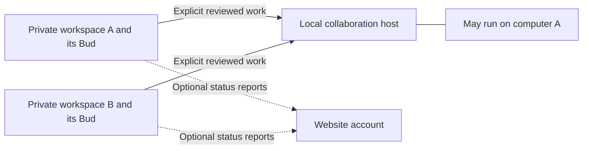

# Solo and local-office review

Date: 20 September 2026. Scope: current desktop source, local company service, Hermes identity, website installation links, and lifecycle design. This is a source-backed review and implementation plan, with focused local verification. It is not installed Windows/Mac, live-office, or customer acceptance.

## Implementation follow-up

The user subsequently authorised implementation. See [implementation receipts](PRODUCTION-LIFECYCLE-IMPLEMENTATION-2026-09-20.md) and [operating runbook](OFFICE-RECOVERY-RUNBOOK.md). The original findings and proposed mechanisms below are retained as the review baseline; this follow-up supersedes their implementation status.

- R02/R05: stable workspace continuity and restart-safe enrollment are implemented. Joining no longer changes the worker profile, so it requires no profile migration or interruption of a private job.
- R03/R06: guarded leave/disconnect, explicit offline detach, same-office re-pair, member/invitation management and recipient-accepted ownership transfer are implemented and tested locally.
- R08: encrypted bounded host backup, empty-host restore, standby/retirement/cutover controls and certificate/address renewal are implemented. Physical machine transfer and installed acceptance remain unverified; offline global fencing is not claimed.
- R09: encrypted share outbox, exact request recovery and explicit archived receipts are implemented.
- R12/R14: guided solo/join/host choices, semantic Card headings and recovery/owner interfaces are implemented and browser-checked. This is not a full screen-reader or contrast audit.
- R07/R10/R11 remain open: per-device enrollment, verified website-office/command authority, and complete durable workspace closure. Private workspace backup remains distinct from the new office-host backup.

## Conclusion and working decision

RealBud can support the intended structure: a useful independent workspace, with collaboration hosted by one existing office computer and other computers joining it. It does not need a third computer or mandatory cloud host for local collaboration. The shared-work foundation exists, but the transition and recovery experience is incomplete. Do not describe joining/leaving as seamless yet.

Working design assumption: **keep the same private Bud and local workspace when joining; add office collaboration alongside it.** This is a recommendation pending user correction, not permission to migrate existing data or merge identities. No identity migration was performed in this review. “Private” means scoped to the workspace, not a determination of legal ownership of office records.

Four concepts need distinct names and controls:

| Concept | Purpose | Must not imply |
|---|---|---|
| My workspace | My Bud, local book, Ask, sources, schedules, local evidence | Membership in a shared office |
| Local office | Named people exchange reviewed work and templates through the host | Shared private memory, shared book, another person's credentials or desktop control |
| Office host | One existing computer runs the collaboration service and its database | Authority over every private workspace; continuous availability when asleep |
| Website account | Billing/account management and linked-computer status | Local office membership, remote task execution, local administrator rights |

Independent means the private workspace does not depend on the collaboration host. It does not mean every model, connected app, licence check or internet operation works offline. Availability must name the unavailable capability and leave unrelated local work usable.

The arrows do not synchronise private memories or credentials. The website currently has no command arrow back to a Bud.

## Findings, ordered by impact

| ID | Finding and evidence | Disposition |
|---|---|---|
| R01 | Successful peer sign-in/join/recovery responses bypassed the company-ID check applied to ordinary requests. A pinned computer serving a replaced database could return an identity for another office. `server/company-installation.ts`. | **Fixed locally.** Compare successful session company ID to saved pairing before identity persistence or token return; reject missing identity too. Host connection alone no longer adopts a member from unauthenticated status. |
| R02 | First company sign-in changes the worker from the solo profile to a member profile. The local Desk/Ask remain, but worker setup/memory may appear lost because there is no continuity migration. `company-installation.ts`, `index.ts`, `hermes-profile.ts`. | **Release blocker for seamless joining.** Stable workspace binding, explicit same-person adoption and resumable migration required. The UI now discloses the current preview behavior. |
| R03 | No supported leave-office, detach-host, switch-office or host-transfer flow. Logout only ends a session; saved peer and seat remain. Different member/host rebinding is deliberately refused. | **Release blocker for reversible collaboration.** Add distinct lifecycle operations with work-resolution and recovery. Do not simply delete seat.json or peer.json. |
| R04 | Binding conflicts were swallowed as generic outages, and join 409s were described as unavailable usernames. | **Fixed for host/member binding conflicts.** Stable error codes reach the client and map to safe, actionable copy. Other setup failures still need an error taxonomy. |
| R05 | Host authentication/redeeming an invitation happens before local identity adoption and its busy/setup guard. If local adoption fails, upstream membership or password recovery may already have succeeded. | **Release blocker for reliable joining.** Persist an enrollment attempt, preflight locally, reserve the identity transition, and recover via sign-in/status; never report a spent invitation as an ordinary retry. |
| R06 | Owner invitation/member revocation exists in the backend, but the settings UI lacks a complete member/invitation list and revoke/reassign journey. Invitations returned to the UI also lack the management ID. | **Release blocker for self-service office management.** Implement API projections and owner controls, including departed assignees and owner succession. |
| R07 | TLS pins the host and individual members authenticate. This is not device enrollment: the host transport does not authenticate a unique client-device certificate, and the UI's token is window-scoped. | **Documented limitation.** Decide and implement device credentials/revocation before claiming enrolled-device security or company worker execution. |
| R08 | Host startup/restart and private storage have safeguards; there is no complete user-facing host backup, restore, machine replacement or certificate/address-change workflow. Local Desk recovery/backups are separate. | **Release blocker for unattended office operation.** A verified restore drill must cover database, identity, secrets, key recovery, and split-brain prevention. |
| R09 | Shared work has deliberate previews, scoped audiences, revisions, idempotent create and history. Uncertain share request IDs/payloads live in React state; closing the window can lose the retry context. | **Recovery gap.** Persist a minimal encrypted pending-write journal bound to workspace/company/member. On reopen, reconcile before creating a replacement request. |
| R10 | Website reporting is separate from the local company. Nothing currently proves those two “office” identities refer to the same organisation. Remote task submission/approval/delivery is not implemented. | **Integration gap.** Show both identities explicitly. Design verified association before treating portal inventory as office membership or control. |
| R11 | Wind-down helpers enforce stage order and retention eligibility, but durable stage persistence, verified export/archive and final key destruction are not wired. `src/lib/office-wind-down.ts`, `docs/OFFICE-LIFECYCLE.md`. | **Lifecycle gap.** An operator connection-decommission tool is not complete workspace offboarding. |
| R12 | Optional website/company controls appeared before basic office setup; “Company” copy suggested mandatory setup and hid transition limits. | **Improved locally.** Basics first; explicit optional collaboration and website roles; preview limits and sign-out semantics visible. Full guided onboarding remains planned. |
| R13 | Team documentation mixed future shared-book intent with current local-only books, described device enrollment as built, and overstated reversibility. | **Clarified.** Current implementation and future contracts are separated in `TEAM-DECISION.md`. |
| R14 | Generic settings `Card` titles are visual divs rather than semantic headings; the mobile screen also spends substantial space on navigation and explanatory copy. `SettingsPrimitives.tsx`, rendered You screen. | **UX follow-up.** Introduce an appropriate heading hierarchy and compact optional setup. Verify screen-reader navigation, focus and error announcements rather than equating visual labels with accessibility. |

## Target identity and storage design

Use a stable local workspace ID as the anchor for Bud and local data. Store office membership as a separate binding `(companyId, memberId)`; do not derive the only private worker identity from a mutable sign-in result. Installation ID, website reporting credential, host identity, billing principal and local service administrator remain separate authorities.

For compatibility, a versioned workspace manifest should reference the existing physical Hermes profile rather than renaming or copying it blindly. Existing member-bound workspaces retain their current profile. Solo adoption references its existing profile only after confirming it is the same person's workspace; another person receives a distinct data root. Never merge histories, credentials or keys between people. Never fall back to the base profile if a binding is damaged.

Enrollment needs a durable operation ID and states: prepared → host membership confirmed → local binding committed → worker readiness checked → complete. Reserve the transition before the host mutation so a new local job/OAuth/install cannot race it. Persist each boundary atomically. After a crash, reconcile the same operation; host success plus local failure is “finish joining”, not “join again”. Existing invitation redemption and recovery contracts need an explicit compatible extension for this, not automatic POST replay.

No migration may run while Ask, a scheduled job, computer work, installation or OAuth is active. The guard must cover all start paths, not only the settings button. Before switching, take a verifiable recovery checkpoint; after switching, prove model selection, readiness fingerprint, memory, connected-app identity and scheduled worker arguments still resolve to the same workspace. Abort preserves the original manifest; after committed membership, use a compensating leave/recovery flow rather than pretending rollback erased the host event.

| Data | Current/target home | Sharing rule and lifecycle detail |
|---|---|---|
| Book, Ask, worker memory, private evidence | Local workspace | Never ambient sync. Joining does not upload them. Leaving does not erase them automatically. |
| Model/OAuth/connected-app credentials | Local workspace or explicitly scoped connection service | No credential transfer in invitations, templates, reporting or handoffs. Office-provided access must be separately revoked when employment/access changes. |
| Reviewed work and evidence copy | Shared host, named audience | Preview exact content, recipient and source version. Copies may contain explicitly reviewed information; private sources are not automatically exposed. Revocation blocks future access, not already copied material. |
| Workflow templates | Shared host; explicit local import | Show capabilities, origins and version. Imported schedules stay off until the receiving person reviews bindings and enables them. |
| Work execution and schedules | Local workspace | One scheduler per workspace; host availability does not replay work. A handoff is not a second scheduler. |
| Members, invitations, shared revisions | Host | Server-side membership and revision checks on every operation; durable audit and backup. |
| Computer inventory | Website | Device label, versions, readiness report and timestamp only. “Last seen” is not proof of current connectivity. |

## Detailed user journeys and failure behavior

### 1. Start and work solo

1. Open the sample Desk and clearly distinguish practice from real work. No local-office sign-in or website pairing required to explore local work.
2. Set essential agency/book fields; software labels and technical details stay optional. Import a real book through preview, validation, confirmation and persisted readback.
3. Set up Bud with the chosen provider. A green check needs a receipt for the active profile/configuration, not a historical successful setup. Explain absent model, expired connection and unavailable internet separately.
4. Complete one bounded, read-only practice task; show source, result, time, and what still needs a human. Configure schedules only after previewing timezone, next run, source binding and permission.
5. Reopen the app and confirm local work and configuration survive. An office host outage must not affect this journey.

Acceptance: fresh installation; existing populated workspace; empty/invalid CSV; model denied/quota exhausted; offline model; expired connection; missing OS permission; restart mid-run; daylight-saving/timezone changes; locked computer. Independent local access must remain useful without manufacturing successful model/tool results.

### 2. Host collaboration on an existing office computer

1. Choose “Host this office” only under optional collaboration. Show that the machine must be awake and reachable, plus who will manage recovery.
2. Preflight supported database runtime, private storage, disk space, local service administration, available network binding and firewall. Do not create an empty company until storage is admitted.
3. Create the owner account and save the personal recovery key. Separate owner permissions from service-administrator permissions.
4. Enable LAN joining and show the host identity/name. Provide a host code and a separate one-use, expiring member invitation; never put either in analytics.
5. Show connected members, pending invitations, host health, latest verified backup and what stops when the host sleeps.

Acceptance: owner reboot; window close versus service stop; Windows service sign-in and sleep; disk full; interrupted initial database setup; port conflict; duplicate setup; firewall denial; host renamed/IP changed; certificate nearing expiry; no third machine required. Windows and Mac must be tested on installed devices, not inferred from Node tests.

### 3. Join an existing office

1. Preview the office and host being joined, the current private workspace, exactly what is shared, and how to leave.
2. Check reachability/certificate and compatibility without adopting a member from unauthenticated status. Confirm host company again on authenticated success.
3. Existing members sign in; new members redeem their invitation once. Same person keeps the existing local Bud under the proposed continuity design. Different person uses a separate workspace.
4. Resolve any busy-work or migration condition before consuming the invitation. Save recovery material and verify the final workspace/member/company binding.
5. Land on the private Desk with a clear “Office: …” status and a separate shared-work area. Do not turn on shared templates or schedules automatically.

Acceptance: wrong office; modified/expired host code; used/expired invitation; username collision; wrong password; response lost after membership commit; local write failure; two simultaneous sign-ins; application closed at every enrollment state; office restored with a different identity. There must be one understandable recovery action for each failure.

### 4. Daily work, review and handoff

| Workflow | Required steps | Fine details to verify |
|---|---|---|
| Morning priorities | Load latest authorised sources → flag missing/stale coverage → produce local cards → human review | Show as-of time and missing properties; no “all clear” from a partial fetch; one run per schedule occurrence; no backlog storm after sleep. |
| Bills review | Extract from authorised source → match property/vendor/reference → flag duplicates/ambiguity → show evidence → human decides | Preserve original reference and source version; distinguish prepared/reviewed/recorded; no payment or trust movement inferred from a summary. |
| Request a colleague's review | Select named reviewer → preview exact draft/evidence copy → submit with stable request ID → show saved receipt | Acknowledgement is not approval to execute; changed underlying source invalidates execution readiness; delivery status must not imply the colleague read it. |
| Handoff | Choose recipient and scope → recipient explicitly accepts → show responsible person and revision | Avoid dual ownership; stale acceptance/reassignment fails; original private accounts and browser session never transfer; define who resolves work if either member leaves. |
| Return/reassign/close | Refresh current revision → check actor/action permissions → record reason/result → persist history | A reviewer cannot silently close someone else's work; “closed” does not mean the external task was performed; preserve declined, unavailable and partial outcomes. |
| Run a local computer job | Preview target/origin/action → acquire permission and current source → execute bounded steps → verify persisted effect | Stop, user takeover, window moved, locked desktop, missing app, timeout, cancellation and uncertain external success must produce distinct recoverable states. Never replay an unconfirmed external action. |
| Adopt a template | Preview changed steps, capabilities and origins → bind local sources/accounts → practice → explicitly enable | No tokens, approvals, private attachments or another person's scheduler imported. Updates show a diff; old jobs do not silently gain powers. |

The current reviewed-work UI already contains important audience, revision and uncertain-result protections. Preserve them. Add a durable local pending-write journal for restart recovery. Do not interpret the existing generic case claim machinery as admission for shared Hermes execution; that remains gated separately.

### 5. Lose connection, sign out, leave, change computers

| Action/state | User-visible result | Required recovery/authority |
|---|---|---|
| Host unavailable | Private work remains; shared work shows unavailable/last check time | Read-only health retry; no mutation replay. Distinguish asleep, unreachable, rejected certificate and membership denial where evidence permits. |
| Session expired | Hide protected shared material; preserve safe private work | Sign in as the same member. Do not change private Bud identity. Clear identity-bound drafts when changing person. |
| Sign out | End current window session | Must not imply leave, delete or unlink. If revoke response is lost, retry revocation/reconcile; do not claim confirmed logout. |
| Disconnect this computer | Detach this device from the office | Resolve pending shared writes, revoke this device/session as applicable, retain private workspace. Offline local detach needs a separate “host revocation pending” receipt. |
| Leave membership | End the person's office access | Resolve/reassign active shared work, revoke sessions, remove future shared access; other members' records remain. No deletion of office-wide connection project. |
| Owner leaves | Transfer responsibility or explicitly close office | Verify successor acceptance; do not orphan the last owner or silently shut down the host. |
| Member removed | Host refuses future operations immediately | UI refresh clears protected state; shared assignee recovery remains available to an authorised person; copies already exported cannot be recalled. |
| Replace computer | Restore the intended workspace and approved connection bindings | Test key recovery, profile identity and receipt history. Re-authenticate connections as required. A filesystem copy alone is not a verified restore. |
| Change office | Leave/detach old binding, then explicitly join new one | No cross-office leakage through cached drafts, pending writes, templates, reporting labels or reused tokens. One active office binding per workspace initially. |

### 6. Website and Hermes capability growth

The website should show each linked computer's label, separate website office association, app/Bud versions, readiness and last report. Revoking this reporting link must not claim to revoke LAN membership, model credentials or the local workspace. Joining local collaboration must not silently enrol the machine in the website account.

Before adding remote tasks, define a separate command protocol: explicit device consent, verified office/workspace binding, allowed task types, authorisation at the desktop boundary, expiry, stable operation IDs, accept/start/cancel/complete receipts, stale-approval rejection, offline behavior and local override. Require explicit review for consequential actions. Keep unimplemented remote controls out of the interface.

Use Hermes features through a capability register: release supported → installed → configured for this workspace → callable → guarded → verified workflow. Test the specific selected provider/model, including DeepSeek, for structured responses, tool use, streaming, context limits, cancellation, latency and failures. A configured model label is not a successful tool-use receipt. Use bounded per-task spend and concurrency controls, and explicit fallback rules; changing model must not bypass tool permissions or silently change cost. Keep the admitted release/update/rollback path; “latest” alone is not a reason to enable every tool or replace a working runtime during an active job.

### 7. Recovery, export and closure

Provide separate backup scopes for the private workspace and shared host. A backup is successful only after a manifest, encryption/key handling and integrity check; record the last restore test independently. Restoring a host must preserve or explicitly rotate host/company identity and revoke stale sessions as required. Prevent both old and restored hosts from accepting writes as separate authorities. Restoring another company's data must trip R01.

Closing an office is a durable sequence: stop new scheduled/remote work → reconcile running and uncertain effects → resolve shared work → export with verification → revoke scoped access/connections → archive → apply the owner's recorded retention choice → separately authorised destruction. Preserve failure and partial-revocation receipts. No automatic legal retention claim; no guessed timer. Destruction must address recoverable key copies/escrow/backups, not merely deleting one local keychain entry.

## Interface plan

Keep **Desk** for today's work and results; **Ask** for interacting with the private Bud; **You → This office** for local basics, optional collaboration, then website association. Active office state should be visible without filling the solo user's screen with server fields.

Next UI pass: a compact collaboration summary with actions “Join an office” and “Host an office”; guided steps only after choosing. Joined users see office, member, host reachability and shared work. Owners get members/invitations/backup controls. Advanced service credentials stay separate. Include persistent labels, keyboard focus after each step, visible error summaries, secret reveal/copy controls, long-name wrapping, 390px/desktop layouts, light/dark contrast, and recovery-key copy failure. No blank screen or endless spinner on a stopped host.

## Implementation order and completion gates

| Stage | Work and main components | Exit proof |
|---|---|---|
| A — continuity and enrollment | Workspace manifest and migration journal; company-installation, hermes-profile, index, company auth/session contract; full busy reservation and typed errors | Populated solo → join → restart retains same private Bud/configuration. Interrupted enrollment reconciles without spending another invite or overwriting a different member. |
| B — reversible membership | Disconnect/leave endpoints, scoped device/session credentials, invitations/members projections, owner succession, SharedWork recovery and UI | Join → share → remove/reassign → leave → solo; wrong-office and revoked-device requests denied; pending writes reconciled across restart. |
| C — operational independence | Backup/restore and host transfer, certificate/address renewal, service lifetime/sleep, export/closure orchestration | Restore on a replacement computer with keys and records verified; original host cannot diverge; host outage never blocks independent local work. |
| D — guided experience | Solo/host/join steps and active summary; clear progress, recovery and permission wording | Fresh user completes both solo and two-computer onboarding without terminal commands or unexplained credentials. Keyboard, narrow layout and outage walkthrough captured. |
| E — connected instances and capability admission | Website/company association, scoped remote-command contract, Hermes/provider capability receipts and update rollback | Actual installed device pairs/reports/revokes against deployed website; each admitted workflow proves source, permissions, result and recovery. Separate remote-command acceptance before exposing controls. |

Stages A–C are dependencies for a broad “independent and can join/leave an office reliably” claim. Stage D can progress in parallel at the design level, but screens must reflect actual capability. Stage E remote execution is a separate feature, not an extension of a reporting credential.

Minimum acceptance matrix: solo; host owner; joined member; second unrelated office; signed out; removed member; host offline; website offline; model offline. Exercise fresh setup, populated upgrade, simultaneous action, stale revision, response loss, restart, sleep/wake, corrupt private state, backup/restore, leave and owner departure. Capture Linux/Node fixtures separately from installed Windows host + joining Mac/Windows receipts. No live office data is needed for the first complete rehearsal.

## Verification for this review

- Final focused suite: **122 tests passed across 11 files**, with real PostgreSQL enabled. Includes 5 installation/host tests and 9 shared-work integration tests using private directories and pinned TLS, plus binding, client errors, transport, response validation, setup, retention and continuation tests. No skipped tests in this run.
- The shared-work fixture originally attempted to enrol a second person on the owner's existing private workspace. Updated it to create a separate maintenance workspace and connect it to the host. Product identity isolation was retained; no assertion was weakened to allow rebinding.
- `pnpm build` passed; final `pnpm typecheck` passed. Build warnings remain about bundle size and mixed static/dynamic imports of boot-heal. A source-runtime startup check caught an unsupported TypeScript parameter property in the new error class; changed it to a normal field before final browser verification.
- `scripts/qa-solo-office-review.mjs` passed against a temporary local app server: basics-first ordering, optional collaboration wording, 1365px/390px layouts, and both new conflict messages through the actual fetch/client/UI path. Company responses were synthetic. No automatic retry and no browser runtime errors were observed. Screenshots were visually inspected; the desktop uses its current light palette, including under dark system preference. This is not a dark-theme or complete accessibility certification.
- Screenshots: `outputs/solo-office-review-2026-09-20/solo-desktop.png`, `solo-mobile.png`, and `join-conflict-mobile.png`. `git diff --check` passed.
- No real office was joined, no credentials migrated, no cloud migration/deployment performed, and no installed application was replaced. Workspace continuity, leaving, durable pending writes, full backup/restore, device enrollment and customer acceptance remain planned gates.

Earlier broad tests and website implementation evidence remain in `docs/decisions/2026-09-20-hermes-and-installations.md`; they do not substitute for the missing migration, leave, restore and installed-device gates.
