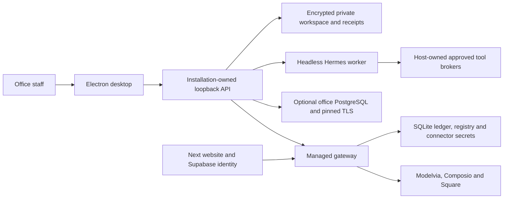

# RealBud system review — 9 October 2026

**Decision: Block a claim that the complete system is finished.** The architecture is coherent and much of the reusable foundation is implemented. Current local evidence still identifies broken website↔gateway contracts, incomplete mail approval and uncertain-effect recovery, lost reviewer edits, missing operator billing GUI, and platform containment/release gates. These are specific gaps in an existing system; the findings do not call for replacing the product or its visual identity.

This review covers the website, desktop interaction, workflow orchestration, organisation authority, commercial lifecycle, infrastructure and release boundaries. Three specialist agents reviewed separate areas; the session agent checked decisive source traces, reran the broker reproductions, inspected renders and reconciled versions. This is a review checkpoint. **No application fixes, deployment, customer data access, messages, invoices, payments or workflow activation were performed.**

## Decision and evidence in five groups

| Priority | What prevents completion | Evidence | Required outcome |
|---|---|---|---|
| 1 — commercial integration | New release billing plans cannot be decoded/accepted by the inspected website; manual-payment standing and receipts disagree; stale invoice tabs lack expected-company checks; operator month-close/payment screens are absent; invite progress can report ready despite blocked AI terms. | Real gateway/website function and route-handler reproductions, plus complete website route inventory. | One truthful, account-bound invite→plan→close→payment→receipt journey, including partial success and recovery. |
| 2 — exact approval | Gmail/Outlook forward cards omit original content/attachments; an expired connector session can be refreshed after approval using a different connected account. | Loopback synthetic broker reproductions against unchanged release modules. | Review the complete action and source account; bind approval to account generation and payload digest; invalidate on change. |
| 3 — recovery identity | An uncertain connected-app send survives as `unknown`, but a new equivalent RPC and second approval can create a second effect. | Commit/lost-reply fixture, broker restart and durable-store reopen. | Stable persisted effect identity plus an explicit reconciliation hold before an equivalent retry. |
| 4 — usable interruption | Unsaved mail-review notes disappear on navigation; selected normal text measures 4.33:1; mobile website setup places its first action at y1558–1660 in a 780px viewport. | Actual browser navigation, computed styles/contrast and responsive DOM measurement. | Retained/guarded edits, WCAG normal-text contrast, and the current mobile action before the long step rail. |
| 5 — operating boundaries | Windows/Linux workers lack the macOS OS containment boundary; direct/source startup overwrites a malformed workspace key; latest native release/upgrade/restore and consistent off-machine recovery evidence are incomplete. | Source, isolated key reproduction, release contracts and dated runbooks. | Platform-enforced boundaries and candidate-bound installed/recovery acceptance. |

The source-account and uncertain-send tests use fictional providers. They establish local broker behavior, **not an actual cross-account mail delivery or automatic duplicate retry**. The stale-company invoice issue preserves current authenticated tenant access; it is financial context confusion, not an unauthenticated tenant escape. The gateway already rejects full-amount card checkout after an active manual payment; **no double charge was proved**.

## Versions and attribution

| Source/layer | Exact inspected identity | Interpretation |
|---|---|---|
| Initial release source | `/Users/yoda/realbud-release`, `5257da5c33fa82412edad9adc7b634f2b872049f`, 0.1.45 | Clean tracked application source. Broad tests, original UI probes, broker and gateway reproductions use this baseline. Dependency installation used the frozen lockfile and did not change tracked source. |
| Public release at final check | 0.1.46 tag `2bc5b17e94af4f0ab48d4f2e5112b714ebdfee81` | Public guest download page lists 0.1.46. Tag fetched into an explicit audit ref and archived under the evidence directory without changing any checkout. Critical billing/broker/mail/contrast/sandbox/key and W1–W3 files are unchanged; setup and some chat/Workspace components changed. Latest core renders use this tag. Public release notes explicitly describe an unsigned build; the GitHub commit signature is not application code signing. Artifact contents and installed behavior remain unverified. [Release source](https://github.com/EzAuto399/RealBud/releases/tag/v0.1.46). |
| Remote main at final check | `cbd77bdbe109198a16ef679cceb4aaedffad283a` | Later Windows signing and invite-acceptance source work is considered separately. A main-branch change does not establish a released or deployed fix. See the delta packet for qualifications. |
| Website working source | Separate repo `/Users/yoda/projects/RealBud/website`, HEAD `90d294fb656513b0bac2157ee654b27f2088f203`, with local changes | Website findings apply to the hashed current working snapshot. The release checkout does not contain this website repo. No hosted website/gateway source equivalence was inferred. |
| Original desktop workspace | `/Users/yoda/projects/RealBud`, HEAD `0944a9fcf00ab0190ab270c67aec2f05e3fb8b77`, dirty 0.1.34 | Existing application edits are preserved. This report and minimal status pointers are the only tracked files added/changed by this review. Final release checkout status is clean; our generated Telegram test fixture was moved to ignored audit output and no original data was deleted. Historical `/Users/yoda/projects/PropertyMe` routes to this product. |

Current source and observed state take precedence over old checkpoints. Reports preserve historical failures rather than treating old versions, prior installed rehearsals or current test counts as proof of a new release.

## Architecture and authority

The responsibility split is fundamentally sensible. RealBud owns work state, permissions, review, scheduling and recovery; Hermes prepares bounded work. The desktop's private store, office collaboration database, website identity and managed billing gateway are distinct authorities. Server-derived actors, tenant/composite keys, scoped revisions, pinned office TLS, append-only financial events, durable provisioning intents and owner approval are established patterns rather than UI-only promises.

The completion defects occur at boundaries: displayed terms differ from the gateway's digested schema; payment presentation differs from canonical ledger standing; a review card lacks the full effect/account; and local request identity does not become durable effect identity. Keep those authoritative checks and repair the connections. Do not loosen strict digest validation, tenant scope, unknown-effect holds or signature checks merely to obtain a pass.

[Public GitHub workflow metadata](https://api.github.com/repos/EzAuto399/RealBud/actions/workflows) at 03:16 UTC confirms general CI, Windows probe and Windows targeted workflows are `disabled_manually`; Package Windows is active and both 0.1.46 candidate package runs completed successfully. The tag-bound `windows-latest` installer job reports successful native packaging, installation/exercise and runtime/memory-journal steps; this is useful candidate-specific native CI evidence, not a physical office/device or whole-upgrade/restore receipt. This is a current unattended-regression gate, rather than only an old note. Restore the intended CI coverage within separately authorized repository operations; package success alone does not prove the whole regression suite or physical-device acceptance. See [public observations](/Users/yoda/projects/RealBud/outputs/system-review-2026-10-09/public-github-observations.json).

The gateway currently operates as a single-host stateful service. WAL/FULL durability and local locks are useful, but do not constitute off-machine backup or multi-host coordination. Joining an office must not merge private profiles or personal connector credentials.

## Workflow implementation versus completion

| Workflow | What current release source implements | Boundary and remaining gate |
|---|---|---|
| W1 — bank→reviewed CSV→REI import | Conservative reference matching, import/hold/exclude partition, reviewed file/destination digest, durable upload intent, before-register baseline, exact row preview, human posting, attributed register readback and coverage advance only after proof. | Stronger reconciliation than the generic mail broker. Real bank format/account, tenant directory, REI destination, installed login/upload/interruption and customer acceptance remain separate. An uncertain upload is held, not blindly repeated. |
| W2 — Gmail/PDF→reviewed bills/calendar | Dedicated weekly orchestration, bounded source-bound PDF proposals, reviewer-confirmed property/facts, duplicate/version holds, expected-arrival patterns, coverage-aware follow-ups, saved results and changed-result notifications. | Internal review is built. REI bill entry/payment remains explicitly simulated/absent under current operating scope. A wider promise to write/pay bills requires a separate approved effect/readback contract. Installed extraction/mapping/notification and unchanged/offline/restart acceptance remain open. |
| W3 — Gmail→morning priorities | Account/binding/plan-checked batches, validated typed review, saved staff decisions, partial-coverage truth, persistent summary and unchanged-result suppression. | Internal advice/list is built. Intended-account review quality, substantive-reply reopening, notification permission, sleep/restart and measured 07:30→08:00 delivery remain unverified here. Work-start time is not a completion-time guarantee. |
| W4 — maintenance | Deterministic reviewed-bill/supplier/auth findings exist in the private Desk; the assigned-case department maintenance recipe remains explicitly MOCK. | Complete live maintenance-history intake/handoff and any approved external effect/readback are not established. Sherry review and Kevin financial authority remain separate. |
| W5 — inspections | History/rules, deterministic draft, saved accept/move and monthly draft loop exist. | No Property Inspect/Zapier booking adapter/readback. Pins exceeding changed closed-day/capacity rules are retained without warnings; move checks collision/closed day but lacks daily-capacity check. Local acceptance is not external booking. |

The first three source workflows are substantially implemented. This audit does not support “nothing is built”, nor does it support “everything is operationally complete”. The intended W2 simulation boundary is not itself a defect. Shipped W2 instructions saying weekly orchestration is unimplemented **are** obsolete and conflict with the running host implementation; update source/generated packs and their assertions together.

Department GUI→API wiring resolves current member role, department access, assigned case and configuration revision at the service boundary. The department worker currently prepares bounded assigned-case analysis/drafts; it does not thereby gain mailbox/file/browser/portal sources. Organisation source and local PostgreSQL/TLS evidence are substantial, while actual two-device department editing/revocation and all populated department views still need separate acceptance.

The reusable shell supports first-run setup, Desk evidence/work queues, Work preparation and review, Schedule plans/manual runs/clocks, and Workspace office/source/recovery settings. First-run persistence, narrow queue handling, navigation/selection retention and synthetic Desk outage recovery worked in the checked local states. The full enquiry→verified property/tenancy facts→reviewed actual reply/maintenance brief is not established merely by a saved priority list; scope it and prove its missing transitions before selling that broader journey.

## Defect register and concrete repairs

All backend line references below are in the unmodified 0.1.45 release checkout. Critical files are identical in the public 0.1.46 tag. Website references are the current working snapshot. S = usually under one hour of focused implementation; M = approximately half a day across a few components/tests; L = multiple days or a missing multi-step journey. Estimates exclude live/device commissioning.

### Commercial lifecycle

| ID / severity | Location and cause | Required repair / size |
|---|---|---|
| WB-01 — blocking | [managed-gateway/billing-plans.ts:220](/Users/yoda/realbud-release/managed-gateway/billing-plans.ts:220) includes `billingPlan`; [website/lib/commercial-terms-view.ts:56](/Users/yoda/projects/RealBud/website/lib/commercial-terms-view.ts:56) rejects that extra field and omits it from digest reconstruction. Real decode returns `invalid_commercial_terms`. | Extend the exact validated/digested contract, display plan charges/included months/standing acceptance and test real release presentation plus legacy/changed-plan acceptance. M. |
| WB-02 — high | [managed-gateway/billing.ts:227](/Users/yoda/realbud-release/managed-gateway/billing.ts:227) derives `paid` only from Square; canonical status/paid/outstanding includes bank payments. Receipt path at `:294` accepts only Square-backed settlement. Website invoice panel `:24`, `:122` uses only that boolean. | Render canonical standing/balances, restrict payment to eligible outstanding amounts and provide accurately identified manual-payment acknowledgment/receipt. Cover partial, paid, overdue, zero-value and reversal. M. |
| WB-03 — high | [website/app/api/account/invoices/route.ts:13](/Users/yoda/projects/RealBud/website/app/api/account/invoices/route.ts:13) and `[id]/route.ts:83` ignore expected company; invoice panel `:64`, `:92` does not send it. Expected A/current B requests return200 for B. | Apply the established `account_changed` guard, response-scope validation, stale-row clearing and company-bound payment-attempt persistence. M. |
| WB-04 — high | [website/app/admin/admin-shell.tsx:4](/Users/yoda/projects/RealBud/website/app/admin/admin-shell.tsx:4) exposes Desk/Offices/Margin/Connection, without the agreed operator Billing/Close/Record flow or gateway API bridges. Desk instructions still refer to OpenAI instead of current Modelvia provisioning. | Complete operator plan→reviewed close→invoice→stable manual payment→append-only reversal around existing APIs/confirmation components. L. |
| WB-05 — high | [website/lib/office-invites.ts:315](/Users/yoda/projects/RealBud/website/lib/office-invites.ts:315), `:363` accepts active boolean/cap string but ignores `acceptance_required`, `unconfigured`, `failed` terms and inactive readiness, then records `ai_access`/ready. | Persist partial completion, expose exact remaining terms/project step and resume without duplicating already-created accounts. Test inactive/blocked states as well. M. Post-tag invite acceptance work does not by itself repair this website's ignored-state logic. |

### Desktop approval, recovery and interaction

| ID / severity | Location and observed cause | Required repair / size |
|---|---|---|
| DW-01 — blocking | [server/connected-apps-broker.ts:763](/Users/yoda/realbud-release/server/connected-apps-broker.ts:763), `:870`, `:921`: forward card shows no attachments and only new commentary, without reading the original that will be forwarded. Both Gmail and Outlook fixtures reproduce it. | Fetch/preview exact original body, subject, attachments and recipient sets under the same verified account; recheck source digest after review; refuse unreadable originals. M. |
| DW-02 — blocking | Broker `:398`, `:405`, `:916`: session expiration refresh can change connected account while keeping one prior approval. Approval describes “the connected account”. | Bind review and dispatch to verified account plus binding generation and payload digest. Refresh on changed binding invalidates approval at desktop/gateway boundaries. M/L. |
| DW-03 — high | Broker `:164`, `:451`; operations store `:23`, `:84`, `:102`: in-memory RPC dedupe and durable unknown status do not block a new equivalent effect after restart/reapproval. | Persist stable reviewed effect identity before dispatch; reconciliation must resolve unknown before an equivalent retry. Preserve intentional second sends as explicitly distinct operations. L. |
| DW-04 — blocking | [src/components/desk/MailWorkPanel.tsx:69](/Users/yoda/realbud-release/src/components/desk/MailWorkPanel.tsx:69), `:169`, [src/App.tsx:249](/Users/yoda/realbud-release/src/App.tsx:249), [src/components/WorkspaceSavedView.tsx:65](/Users/yoda/realbud-release/src/components/WorkspaceSavedView.tsx:65): dirty note is component-only, with Cancel/Reload prompts but no route/saved-view/unload guard. Actual navigation loses it. | Reuse navigation/unload protection or persist version-bound private drafts. Cover saved-view-ID changes as well as page changes and refresh. M. |
| DW-05 — accessibility | [src/components/shell/ContextSidebar.tsx:19](/Users/yoda/realbud-release/src/components/shell/ContextSidebar.tsx:19), `:42`, `:122`, [src/components/shell/shell.css:45](/Users/yoda/realbud-release/src/components/shell/shell.css:45), [src/workspace.css:8](/Users/yoda/realbud-release/src/workspace.css:8): selected 12px detail/count is #63695f on #dde4d2 =4.33:1. | Use existing stronger secondary ink for selected descendants; verify selected row/summary combinations reach 4.5:1. S. |

### Infrastructure and operating evidence

| ID / severity | Location and boundary | Required repair / size |
|---|---|---|
| IR-01 — high | [server/worker-network-sandbox.ts:30](/Users/yoda/realbud-release/server/worker-network-sandbox.ts:30), `:423`: non-Darwin returns original executable/args; command-deny rules are explicitly a blocklist, not an OS boundary. | Enforced Windows/Linux containment and descendant/network/private-read/runtime-write rejection proof. Bound supervised platform claims until qualified. L. |
| IR-02 — high gate | Native Windows candidate package/install CI job succeeded; full job artifacts were not inspected. Current physical-device upgrade/repair/backup/restore/two-device evidence remains incomplete. Tag Windows signing is absent; later main introduces conditional signing configuration. | Attribute source/artifact hashes/feed/health to one candidate; qualify fresh install, idle/busy/setup update, reboot, repair/uninstall and restore on supported native platforms. Actual accepted signing/notarization is separate from config. M/L. |
| IR-03 — medium | [server/desk-key.ts:31](/Users/yoda/realbud-release/server/desk-key.ts:31) falls through and overwrites malformed key even with saved encrypted Desk. Electron custody `:317` correctly refuses that state. Local disposable repro confirms replacement. | Preserve original bytes and refuse with recovery guidance; generate only for a genuinely new workspace. Regression fixture preserves both key/data bytes. S. Bounded to source/non-Electron startup. |
| IR-04 — medium gate | Single gateway volume stores ledger/registry/secrets; no current automated consistent off-machine restore drill was identified. Office backup has 32MB/100,000-row limits. | Name backup owner/cadence/retention, measured RPO/RTO, consistent state/secret capture and provider reconciliation after a disposable restore. Qualify assisted large-office backup and scale before expanding. M. |
| IR-05 — medium gate | General CI/Windows probe/targeted workflows are currently disabled; Package Windows remains active. Default contracts are not two-device acceptance; gated/skipped suites and checker tests do not establish a physical-device receipt. | Restore agreed automated regressions through an authorized repo configuration change; complete missing integration/native/two-device receipts for the selected release, without converting simulations/skips to passes. M. |

### Remaining UI and documentation repairs

| ID | Observed gap | Repair / size |
|---|---|---|
| UX-01 — medium | Website setup's long seven-step rail precedes the action on mobile; header CTA also points away from setup. | Put current step/action first, with compact expandable rail and setup-specific header action. S/M. |
| UX-02 — medium | Website copy describes monthly manual terms/key setup; current release has standing plan acceptance and Modelvia provisioning. | Align setup/admin copy with the repaired authoritative flow. S. |
| WF-03 — medium | [maintenance-review.ts:213](/Users/yoda/realbud-release/server/maintenance-review.ts:213) filters unlisted/no-reference bills by kind keywords; `:217` does not extract forwarded original-sender evidence. | Add a reviewed maintenance classification and original-sender evidence/visible ambiguous queue before claiming full maintenance coverage. M; source-confirmed. |
| WF-02 — medium | [inspection-plan.ts:160](/Users/yoda/realbud-release/server/inspection-plan.ts:160) preserves pinned appointments beyond closed-day/capacity rules with no warnings; [inspection-bookings.ts:98](/Users/yoda/realbud-release/server/inspection-bookings.ts:98) move checks date/collision but not daily capacity. Pure real-function fixture returns2 pins on a closed day at capacity 1 with no holds. | Preserve human pins, visibly flag conflicts and require reviewed override/hold before acceptance. Do not silently rearrange prior bookings. M; [reproduction](/Users/yoda/projects/RealBud/outputs/system-review-2026-10-09/inspection-plan-repro.json). |
| WF-01 — medium | Published office/accounts W2 packs say weekly orchestration is not implemented; tests lock that stale sentence despite dedicated runner wiring. | Update reviewed source and generated pack bytes together; assert the actual host/proposals-only/REI-simulated boundary. M. |
| UX-03 — low | Requested better-ui press preference is 0.96; checked specific rules use 0.98; desktop icon stroke mapping also needs consistency review. | Consolidate shared treatments after blockers; no broad decorative restyle. S. |

## UI/UX judgment and coverage

The explicitly requested uiux, UI Designer and better-ui skills were applied. Provisional desktop rubric is **16/24**, with a scoped **Redesign** verdict for mail interruption/exact-action approval because work is lost on leave. Website source/public rubric is **15/24**, with a scoped **Redesign** verdict for the incomplete commercial journey. These scores are not a whole-product completion percentage. Keep the existing shell information architecture, paper/green palette, typography, tokens and restrained feedback.

| Evidence state | Actually inspected | Limit |
|---|---|---|
| First-run/empty/basic navigation | Persistent profile/sample setup; four core desktop surfaces; keyboard continuation; queue Escape/reopen and selected case/scroll; setup steps via Enter. | Fictional isolated workspace. Native Electron chrome, real office connection and all long/large datasets not covered. |
| Failure/recovery | Forced Desk GET503 then reload recovery; onboarding restoration checks; unknown-send broker fixture. | No universal provider/network/worker failure certification. |
| Dirty/returning state | Actual mail note edit→Work→return demonstrates loss; retained composer/other editor mechanisms source-inspected. | Two-window conflicts, every saved-view switch and all dialogs not rendered. |
| Responsive/accessibility | Desktop 360/768/1280/1536; desk narrow390/720/959/960/1400; website 320/360/768/1280; named detected controls, sampled Tab focus, reduced motion, selected-text contrast. | Hidden 1px file/radio controls and inline small links are scanner observations, not automatically target-size failures. Full accessibility-tree/WCAG audit, every contrast pair and 10%-speed animation inspection remain unverified. |
| Account/commercial/admin | Current route/source authority and real handler/function fixtures; public/unconfigured website renders. | **Authenticated billing/admin GUI not rendered:** disposable website PostgreSQL startup failed before page checks; cleanup removed its diagnostic log, so cause is unproved. Separate office PostgreSQL/TLS tests did pass. |

## Executed checks

| Check | Observed result | Evidence artifact |
|---|---|---|
| Broad release 0.1.45 Vitest + corrected failed-file rerun |Original 10,752 cases:10,240 passed, 189 failed, 323 pending. All 189 failed test identities subsequently passed in a 437-case focused run:425 passed, 12 skipped, 0 failed. Cause: sanitized env made test setup grant root-owned `/private/tmp`; owner-only canonical TMPDIR fixes the harness without changing source or containment. This is not a single green full-suite receipt. | `release-vitest.json`, `release-vitest.log`, `release-test-failure-analysis.md` |
| Release 0.1.45 renderer/server TypeScript |Both passed, no emit/incremental writes. | `renderer-typecheck.log`, `server-typecheck.log` |
| Website tests |303 cases:301 passed, 2 skipped, 0 failed. | `website-unit-tests.log` |
| Focused gateway billing/auth/provisioning |263 passed, 0 failed, 0 skipped; local simulated transports. | `gateway-unit-tests.log` |
| Release/platform contract checks |48 passed, 0 failed, 1 native-platform skip. | Infra packet's exact command/receipt |
| Real local office PostgreSQL 16.15 + pinned TLS |27 passed:17PostgreSQL integration,7departments,3multi-agency transport;0 fail/skip. Non-superuser, synthetic tenants. Original harness expected25; preserved count-validation failure corrected to actual17+7+3 without rerunning/weakening assertions. | `org-isolation/validation.json`, `vitest.json`, original `result.json` |
| Onboarding QA |13 checks; receipt passed, no product defects. | `onboarding/receipt.json` |
| Narrow Desk QA |10 checks passed, no page errors. | `desk-narrow/receipt.json` |
| Core desktop browser0.1.45 and 0.1.46 |Each 17 captures (4views×4 widths +503 state), first-run keyboard and error recovery pass; no page errors/off-origin requests/horizontal overflow. | `rendered/report.json`, `rendered-v0146/report.json` |
| Website scratch build |Final webpack build passed; previous symlink/import diagnostics retained. Scratch reused cached original fonts and included required sibling pure import; original website build files untouched. | `website-scratch-build-final.log` |
| Website local public/unconfigured |32 captures, zero overflow/page errors/off-origin requests;7/7setup steps activate by keyboard. | `website-public-render/receipt.json`, `setup-interaction.json` |
| Live public guest home/download |8 captures at4 widths, HTTP200, no overflow/page errors; download visibly lists0.1.46. No sign-in, installer download or mutation. | `public-live/report.json`, screenshots; [public download](https://realbud.app/download) |
| Defect probes |Broker, billing/invite, stale invoice account and malformed key observations reproduced. A probe exit0 means the defective behavior was reproduced, not readiness passed. | Specialist packets and reproduction JSONs |
| Public distribution/CI metadata |0.1.46 release exists with published Windows installer/feed metadata; Package Windows candidate runs and exact tag-bound Windows installer/runtime/memory-journal steps succeeded on `windows-latest`. General CI/probe/targeted workflows disabled; no artifacts downloaded or receipt contents inspected. | `public-github-observations.json`, `public-windows-candidate-jobs.json`; [candidate package run](https://github.com/EzAuto399/RealBud/actions/runs/37814143931) |
| Latest tag/main delta |0.1.46 renderer/server typechecks passed; corrected 15-file targeted run 421 passed, 0 fail/skip. Initial root-owned TMPDIR failures preserved; same assertions and containment passed with owner-only temp. Later main invite acceptance 6/6 synthetic tests passed with network denied; conditional signing source reviewed, activation unproved. | `v0146-delta.md`, latest-tag logs |

Test counts above are distinct executed packets, not an additive unique-test total. Source checks, simulated provider effects, real local database/TLS, browser renders, packaged builds, installed devices, live provider acceptance and customer outcomes remain different proof layers.

## Required completion sequence

1. **Repair billing contracts and financial context.** Use real gateway response types across website tests. Complete operator screens. Pass invite partial-state recovery, standing plan/change acceptance, close, due/partial/manual-paid/zero-value invoice, receipt/reversal, reader denial, stale company and duplicate-effect tests.
2. **Bind exact approvals and reconcile uncertain effects.** Show original forwarded content/attachments/account; invalidate stale binding. Persist effect identity and hold unknown outcomes. Prove account changes, restart, commit/lost reply and intentional separate resend behavior through actual broker/gateway contracts.
3. **Protect interrupted work and align UI truth.** Retain or guard dirty mail fields across route/view/reload; fix selected contrast/mobile setup hierarchy; update obsolete packs/setup/admin instructions. Render populated customer/operator/review states with keyboard and reduced motion.
4. **Close platform and recovery gates.** Preserve malformed keys; qualify OS containment; perform consistent gateway/office/private restore with reconciliation; bind signed/notarized distribution and native upgrade/repair to one candidate. Verify actual two-device authority/revocation, not just the checker.
5. **Run one attended office acceptance.** Only within separately authorized customer/provider scope, traverse invitation→desktop link→sources→W1/W2/W3 review→approved exact effect/readback→invoice/receipt. Exercise restart, offline, partial success and revocation before enabling named recurrence. Accept W4/W5 only at their agreed demonstrated scope.

## Evidence index

All local evidence is under [system-review-2026-10-09](/Users/yoda/projects/RealBud/outputs/system-review-2026-10-09).

| Packet | Contents |
|---|---|
| [Desktop workflow and UI](/Users/yoda/projects/RealBud/outputs/system-review-2026-10-09/desktop-workflow-ui.md) | Exact source lines, workflow/state/truth matrices, W1–W5 and org GUI scope, uiux/better-ui rubric, broker and draft/contrast reproductions. |
| [Website, organisation and billing](/Users/yoda/projects/RealBud/outputs/system-review-2026-10-09/website-org-billing.md) |78 route inventory, commercial boundary/retry traces, five decisive defects, real-handler probes, public renders and authenticated-UI limitation. |
| [Infrastructure and release](/Users/yoda/projects/RealBud/outputs/system-review-2026-10-09/infra-release.md) | Architecture/authority map, custody/containment, migrations/durability/backup, release scope and 27 real PostgreSQL/TLS results. |
| [Latest release delta](/Users/yoda/projects/RealBud/outputs/system-review-2026-10-09/v0146-delta.md) |0.1.46 source/test qualification and later main-only work. |
| [Broad-test diagnosis](/Users/yoda/projects/RealBud/outputs/system-review-2026-10-09/release-test-failure-analysis.md) | Original failures preserved, harness-cause classification and corrected focused verification. |

**Next action:** open WB-01's [billing reproduction JSON](/Users/yoda/projects/RealBud/outputs/system-review-2026-10-09/website-billing-reproductions.json) and the website exact terms decoder. It is the smallest directly demonstrated owner-facing integration blocker.
