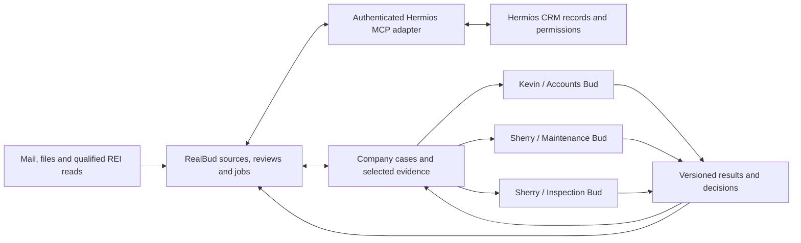

# RealBud workflow and integration completion plan

1 October 2026 · Australia/Brisbane · Planning and evidence audit; no new workflow run or live integration is claimed.

Later implementation and rehearsal evidence: [W2/W3 readiness checkpoint](W2-W3-READINESS-2026-10-01.md). It records the invoice identity and financial-state changes, installed Hermes interpretation, source UI/restart acceptance and package verification. The live REI and native Hermios acceptance gates below remain distinct.

**Later owner clarification:** [Gmail-first W2/W3 operating model](decisions/2026-10-01-gmail-w2-w3-operating-model.md). Weekly bill review and daily morning priorities both use connected Composio Gmail; the CSV is reference material. Close weekly collection/preparation, calendar/follow-up findings and notifications before treating these routines as operational. The live REI and CRM gates below are later integration work and do not block that Gmail-first milestone.

**W1 clarification:** [Every-two-days bank export → reviewed CSV → REI import/readback](decisions/2026-10-01-w1-bank-to-rei-workflow.md) is now the full target. Retain browser-managed sessions, preserve originals and separate export/preparation/import checkpoints. The installed native browser still lacks transfers; the two-day interval, overlapping-export reconciliation and REI handoff remain unimplemented. Final financial posting is a user action.

**The next milestone is Kevin completing one invoice journey in the installed RealBud app: source invoice → accepted property match → actual REI read → reviewed bill, calendar and exceptions → repeat/resume without duplicates.** Hermios account linking can proceed in parallel. Then prove one department handoff, followed by several Buds working concurrently.

The REI sitemap supplies the navigation and entity inventory for this work. Turn each required part into a scoped, versioned workflow with evidence and a verified result. A mapped page, working browser, enabled module or finished model answer does not establish a completed business workflow.

This plan consolidates the existing five workflows and integration gaps. It retains Kevin as the sole W2 invoice owner, Sherry as the W4/W5 reviewer, Composio for permitted mail, computer use for REI, and Zapier exclusively for Auston's Property Inspect connection. Hermes means the worker runtime; **Hermios means the CRM**. “MCP/plugin integration” below means the authenticated Hermios capability surface consumed by RealBud; no separate MCPo proxy dependency is selected by this plan.

## 1. What exists and what is still open

These are repository checkpoint findings, not fresh installed tests performed for this plan. Later checkpoint corrections take precedence over earlier failures or release-pending statements.

| Area | Evidence already recorded | Still needed to close it |
|---|---|---|
| Kevin W1: bank references and REI handoff | Local parsing, reference preparation, row reconciliation and history tests | Original/corrected ANZ examples, qualified transfers, anchored two-day runner, account/period binding, overlapping-export reconciliation and verified REI preview/posting/readback |
| Kevin W2: bills and calendar | Installed Bud inspected Property.csv; live test Gmail collection works; non-invoice evidence was correctly held | Positive invoice acceptance, accepted property mapping, actual REI comparison, separate payment evidence, saved arrival/calendar/exception state and Kevin's review |
| Kevin W3: morning priorities | Ten test-mail conversations reviewed and saved; repeat retained manual decisions with no additional model run | All ten were held for context/source review. Verify Kevin's intended mailbox/window, substantive reply handling, follow-ups, missed runs and his accepted priorities |
| REI | Structural map, fictional recipe tests, installed native work browser reaching ready | Execute the saved read plan after personal sign-in; verify account, page semantics, coverage, session continuity and record provenance |
| Sherry W4: maintenance | Separate instruction-only rehearsal pack, six fictional cases and local tests | Installed interpretation plus durable grouping, review/resolution state and returned decisions linked to bills |
| Sherry W5: inspections | Generic preparation and workflow design | Dedicated six-month planning/revision state and qualified Property Inspect actions through Zapier |
| Hermios native integration | Existing native MCP/plugin baseline; local v1 module contract; RealBud parser/adapter tests and visual prototype | RealBud authenticated transport, persisted identity binding, native UI wiring, scoped CRM record journey and deployment acceptance |
| Several department Buds | Existing company cases, assignments, revisions, execution leases/fences and outbox mechanisms | Department source connections, selected-evidence handoff, real multi-user concurrency/recovery and CRM result reconciliation |

The Hermios module adapter's 116 recorded passing tests establish source behavior with fixtures. The adapter is not mounted in RealBud, and the module slice is recorded as not deployed. Only `hermios.realbud` is a pilot in v1; collaboration and industry modules remain planned. Neither the prototype nor enabling that pilot supplies CRM execution authority.

Sources: [latest installed workflow checkpoint](AUSTON-MOCK-WORKFLOWS-2026-10-01.md), [Kevin/browser checkpoint](KEVIN-INVOICE-MOCK-2026-10-01.md), [department acceptance matrix](AUSTON-DEPARTMENT-ACCEPTANCE-2026-10-01.md), [Hermios integration status](HERMIOS-INTEGRATION-OWNER-STATUS-2026-10-01.md).

## 2. Convert the sitemap into operating workflows

Use the [structural REI map](REI-CLOUD-MAP-2026-09-24.md), [machine-readable map](../pack/workflows/austin-accounts/support/rei-cloud-navigation/site-map.json) and [task-first map](../pack/workflows/austin-accounts/support/rei-cloud-navigation/references/website-map.md). Their observed UI version is 26.0922.0 from 24 September; revalidate required controls against the actual session.

For each used route, keep a capability record with: workflow/stage ID; entity and stable identifier; account identity; map/UI revision; required input; exact operation; read/transfer/write classification; allowed fields; pagination and date coverage; evidence source/time; output schema; postcondition; failure/hold conditions; replay behavior; and evidence tier. Retain the existing C/H/S/U distinctions: observed by the original browser, observed by Hermes, simulated, or unobserved. Add installed/live acceptance separately rather than promoting simulation to live proof.

| Workflow | Sitemap routes and records | Planned result and qualification gap |
|---|---|---|
| **W1 bank → reviewed CSV → REI** | Tenants `/customers/tenant`, tenant account `/customers/tenant/account`, Rentals `/customers/property`; Bulk Receipting `/customers/importbanklink/index` | Match evidenced references and preserve every row. The target includes REI preview, user posting and verified readback; current delivery ends at reviewed CSV. File transfer and import behavior still need qualification. The bank export source is outside this REI sitemap. |
| **W2 invoice → bills/calendar** | Rentals and `/customers/property/details`; Suppliers `/customers/supplier`; linked owner account/invoices/documents and Tasks `/customers/task`; Reports `/report/reportlist` only if a qualified source is necessary | Establish property/supplier identity and locate the actual supplier payable/payment evidence. Supplier bill entry is still unverified. Tax invoices, tenant receipts, a payment form or a matching amount must not be treated as proof of a supplier bill being entered or paid. Record unknowns until the correct source is observed. |
| **W3 morning priorities** | Tasks, tenant views and `/customers/arrears/` where included in the reviewed source scope; mail remains Composio | Join permitted inbox/sent evidence with selected task/property context; show urgent work, waiting/follow-up, FYI and gaps. Retain each source's observation time and coverage. No notices or chases are sent by this preparation stage. |
| **W4 maintenance review** | Suppliers, Rentals → Tasks/Notes and Document Mgmt, linked work orders/maintenance history; relevant reports only after qualification | Compare invoice/service evidence for the same supplier/property within the agreed three-month window. Explain repeats and exclusions, save Sherry's decision and return it to the originating bill/case. Do not infer identical work from supplier identity alone. |
| **W5 inspection planning** | Rental inspection views, Tasks filtered to Inspections, Inspection Summary as available supporting evidence | Propose six-month cycles grouped by area/day/time. Auston's Property Inspect through Zapier supplies the inspection integration; REI Booking Calendar is not a substitute. Determine the authoritative last-completed date and reconcile conflicting sources. |

The source map is broader than the published pack. Its [provenance](../pack/workflows/austin-accounts/support/rei-cloud-navigation/provenance.json) says the pack carries `SKILL.md` and `LICENSE`, not `site-map.json` or references. Decide the supported delivery mechanism: package the necessary reviewed references, or expose them as versioned host-owned resources. Verify the installed Bud can actually retrieve the selected map and recipe revision. Do not assume files in the checkout are in the installed worker context.

Reuse the existing broker-backed [portal recipe task](../server/portal-recipe-task.ts) and [runner](../server/portal-recipe-runner.ts). Ask currently admits read recipes only; prepare/export/upload recipes are not an available shortcut. Any later downloaded report also needs account, period and content validation before it can count as financial readback.

REI operating qualification must cover:

1. Personal sign-in in RealBud's persistent private work profile, with no extension prerequisite. Check exact origin, URL `reicid` and visible business code before work and after navigation. Preserve browser-managed cookies in that profile.
2. Search/navigation/filtering, stable record targeting and complete bounded pagination. A record page may be a live edit form; navigation must not modify fields or toggles. Stop on account mismatch, conflicting edit lock, missing controls or unresolved identity.
3. Verify the real payable/history path needed by W2. Capture relevant filters, coverage, record reference and observation time; retain evidence privately. An unavailable report or unsupported transfer produces an explicit hold.
4. Qualify idle, restart, next-day and expired/MFA sessions. Preserve job progress and resume after personal reauthentication. Do not promise unattended persistence before it is observed.
5. Keep current REI writes, entries, imports, attachments, payments and sends simulated. The present native runtime does not support transfers; report exports and file uploads are later capability work, even when a recipe describes them. Existing Export Only controls apply if report download support is later qualified.

Direct REI API access remains an optional later route after entitlement and supported operations are verified. It does not block the bounded browser-read milestone.

## 3. Kevin's first complete installed run

Run this through normal RealBud controls with its configured Modelvia worker. The saved 11-step REI draft is a starting point to review against the current build and scope, not completed execution. A developer-prepared answer or a generic job report does not satisfy saved bill/calendar acceptance.

| Stage | Bud and reviewer behavior | Required completion evidence |
|---|---|---|
| 1. Start with known inputs | Record app/pack/runtime revisions, worker, selected mailbox/window, Property.csv and original invoice/PDF. Retain originals. | Job/source IDs, provenance and declared coverage; fixtures clearly separated from real evidence |
| 2. Resolve identities | Inspect invoice fields and CSV; verify the relevant real property/supplier records after REI login. Hold ambiguous matches for Kevin. | Accepted stable mappings with sources; unresolved rows remain visible |
| 3. Establish invoice identity | Link several messages/attachments to one business invoice; distinguish a corrected version from a separate repair invoice. | Supplier + invoice identity + property + version with multiple evidence references; conflicts never silently overwrite |
| 4. Read financial status | Locate actual entry/payment evidence in the correct REI context. Compare dates, references and coverage. | Independently sourced entry, payment, funding and advance-recovery status; unknown remains unknown |
| 5. Review and save | Kevin accepts/corrects the proposed bill through Bills and the normal review path. Bud proposes arrival windows only when history supports them. | Persisted bill/occurrence and evidence links; expected arrival separated from invoice due date and payment status |
| 6. Calendar and exceptions | Review a recurrence before activation; list missing expected bills, conflicts, unpaid/unknown statuses and outstanding advances according to evidence. | Calendar readback, pattern/history basis and saved exceptions with Kevin as accountable reviewer |
| 7. Rehearse intended REI entry | Show a proposed entry/attachment action and its simulated outcome where useful. | Explicit simulated receipt; no externally verified write or payment claim |
| 8. Repeat and recover | Repeat source, forward the invoice, supply a correction, stop/resume and restart. Review one genuine new invoice too. | Existing IDs/decisions survive; duplicate creates no second bill/calendar item/chase; correction holds; separate invoice remains separate |
| 9. Kevin reviews the outcome | Compare the saved workflow with the original evidence and expected office practice. | Named review, discrepancies resolved or held, timings/model usage and exact remaining scope |

Two product changes are needed alongside this run: broader business invoice identity beyond account/thread/message, and durable independent financial evidence. The source-only exact-text duplicate hold is useful but does not cover changed forwarding wrappers, PDF-only duplicates or invoice versions. Include it in a reviewed installation before relying on it.

Complete W1 and W3 next using the same evidence standard. W1 needs Kevin's original/corrected ANZ pair and an accepted reference-only output with all rows reconciled. W3 needs his selected source window, follow-up rules and timing preferences; verify a substantive reply updates the same work item, manual decisions survive, partial coverage stays visible and unchanged evidence avoids unnecessary model calls. Enable schedules only after timing, days, source scope and missed-run behavior are accepted.

## 4. Native Hermios integration and department Buds

The target experience is: connect the intended Hermios workspace in RealBud → open an authorized CRM record natively → ask Bud using selected context → review a proposed action or department handoff → see its durable result attached to the record.

RealBud owns work state, reviews, schedules, recovery and human handoffs. Hermios owns its CRM records, workspace/member identity, readable fields and record permissions. REI remains the source of any REI financial observations. Hermes executes bounded jobs; Modelvia retains model serving and accounting. Store external IDs/version references and selected evidence, rather than treating a copied CRM or REI value as permanently current.

### Integration delivery order

1. **Agree on immutable baselines and one contract.** Preserve current uncommitted RealBud work and the separate native/module Hermios history. Use the [Hermios v1 contract](/Users/yo-da/projects/hermios-realbud-modules/docs/contracts/hermios-modules-v1/README.md) and its generated fixtures. Resolve the recorded native release/module review-base mismatch before publishing an integration slice. Assign one owner per shared source area.
2. **Build RealBud's authenticated connection.** Supply the actual endpoint/client registration and supported authentication lifecycle. Keep token custody, refresh and disconnect host-owned. Verify `get_hermios_profile` and explicitly bind RealBud company/member to Hermios workspace/profile; email or display-name equality is insufficient. Pin requests to their connection generation and discard results after account switches, including A → B → A.
3. **Wire native connection/modules UI.** Mount the existing adapter through authenticated host routes and existing Apps/company controls. Read `read_hermios_modules`; distinguish access, enablement, actor permission and connectivity. Wire reviewed configuration using `configure_hermios_module`, expected profile/revision and preserved conflict drafts. Organization instructions remain data, not tool authority.
4. **Prove one CRM read journey.** Use the supported MCP record/resource operations, with Hermios's field/record filtering and bounded pagination. Choose one record, show freshness/source, and let Bud use only the selected permitted context. Verify a restricted member cannot recover hidden fields through Bud or cached data.
5. **Prove one handoff with selected evidence.** Link an invoice issue to a shared case and the selected CRM record. Select the evidence/version, audience, accountable owner and specialist. A department Bud prepares a draft from that case; Sherry reviews it; the returned decision links back to Kevin's original issue. Kevin retains invoice ownership.
6. **Add reviewed effects and concurrency.** Introduce scoped CRM writes only after their contract, authority and reconciliation path are verified. Reuse existing company execution/outbox machinery and backend record conflict checks. Qualify simultaneous independent work before allowing several workers to contend for the same record.

Installing the Codex plugin does not by itself connect the RealBud application. RealBud needs its own authenticated host adapter and lifecycle. Reuse the Hermios domain/MCP contract; do not route operational authority through a Codex chat or assume a Codex UI bridge is an embeddable RealBud backend.

The inspected upstream native source provides `get_hermios_workspace` and `get_hermios_record`. Its app-only `update_hermios_record` currently changes pipeline stage or task status with an expected-value conflict check. It is not a general invoice/property write API, and does not yet carry the department delegation, idempotency or fencing contract below. Verify the selected deployed tool schema, and extend the domain contract where necessary before offering additional actions in RealBud.

### Shared task and result contract

The following are required semantics, not invented upstream endpoint names. Map them to existing fields where possible; version any additions jointly with Hermios.

| Contract area | Required semantics |
|---|---|
| Identity | RealBud company/member, department, Bud instance, Hermios workspace/profile, captured connection generation and current membership |
| Work | Case/job/request IDs, workflow/pack revision, external record IDs, expected record/plan revisions, accountable reviewer |
| Context | Explicitly selected evidence IDs/versions, audience, purpose, observation time and coverage; references do not grant source access |
| Authority | Allowed operation/fields, source connection scope, limits, expiry, and exact reviewed intent when an effect needs approval |
| Execution | Claim/lease and fence, stable idempotency key, correlation ID, cancellation state and host-owned receipt |
| Result | Observed/prepared/held/attempted/confirmed/failed/unknown state, output/evidence, external readback/version and returned decision |

Keep Kevin's private mailbox and bill store separate from department membership. Either explicitly share selected evidence or establish a dedicated, permission-scoped department source connection. Do not remove the existing department executor's private-source restriction to make a workflow run.

### Concurrency rules and acceptance

- **Independent cases:** Accounts, Maintenance and Inspection Buds may work concurrently when their sources and grants permit it. Each has a separately attributable job, evidence scope and result.
- **Same case or record:** plan for one active RealBud effect owner per target; other Buds may prepare proposals against explicit versions. Existing leases/fences protect a RealBud case, not a Hermios record referenced by several cases or edited in native CRM. The current upstream expected-field-value check is not a full record revision or cross-system fence. Add shared-record ownership and effect-time conflict/reconciliation semantics on the Hermios side. External editors may still act concurrently; a conflict preserves the draft rather than replacing their work.
- **Browser sessions:** serialize operations within one work-browser session so two Buds cannot change each other's page/account context. Use separate authorized sessions only where supported; never share copied cookies between workers.
- **Lost response:** preserve the exact dispatched intent, inspect the external state/receipt, then determine whether another attempt is safe. Do not promise exactly-once external effects where the provider lacks idempotency or readback.
- **Revocation, Stop and expiry:** recheck membership, module/record access, source grant and current plan at dispatch. Fence late responses and preserve held work without widening access.
- **Returned decisions:** link the specialist's decision to the originating case/bill and evidence revision. A stale decision cannot silently resolve a changed invoice.

The proof run needs at least two real enrolled members/instances plus the relevant department roles. Exercise independent work, competing claims on one case, concurrent CRM edits, account switching, role revocation while queued/running, restart, Stop and a lost reply. Check retained receipts, provider/model call counts and the absence of duplicate cases/effects. Existing fictional or PostgreSQL fixture tests are prerequisites; installed multi-user acceptance is separate.

## 5. Finish the department workflows

**W4 maintenance:** import and run the isolated rehearsal pack through supported RealBud controls, then implement durable grouping and resolution state. Confirm the three-month boundary and service-date basis; test qualifying repeats, a different supplier/property, a genuine separate repair, disputed revisions and incomplete history. Sherry reviews the selected originals and saves a decision; Kevin receives the linked outcome. A resolved unchanged case must not raise another alert. A repeat flag alone does not order payment withholding or establish a warranty claim.

**W5 inspections:** define authoritative completion dates, six-month anchor, region/day grouping, visit duration, capacity, access restrictions, calendar and authorized notice handling. Add planning revisions, reschedule/cancel behavior and next-cycle calculation. Inventory the actions actually supported by the designated Zapier/Property Inspect connection before choosing implementation. Prove required read/create/update/cancel behavior and identify any notification side effects. Start with a draft plan; activate customer-facing actions only within their established authority.

Management receives an authorized queue of decisions, exceptions, owners and ageing work, with links to selected evidence. It does not receive every private mailbox or raw financial document by default. No new management reviewer is presumed until the real office membership and role are selected.

## 6. Delivery sequence and definition of done

| Gate | Workstream owner | Dependencies | Exit evidence |
|---|---|---|---|
| **G0: coherent candidate** | RealBud integration/release owner with Hermios contract owner | Existing shared changes and release histories | Reviewed file/commit manifests, installed-vs-source inventory, rollback path, compatible contract/pack revisions |
| **G1a: bounded REI comparison** | RealBud workflow/browser owner; Kevin reviews | G0; personal REI login; selected original invoice and property source | Installed Bud executes scoped property/supplier/history reads, records supported facts and explicit unknowns, and qualifies the payable evidence path where accessible; no live writes |
| **G1b: complete Kevin W2** | RealBud workflow/state owner; Kevin reviews | G1a; implemented and installed business invoice identity and durable financial evidence; sufficient history for any accepted recurrence | Complete section 3 with saved bill/calendar/exceptions and forwarding/version/restart proof; REI writes simulated. Insufficient history holds recurrence and cannot be relabeled as calendar acceptance |
| **G2: native CRM connection/read** | Hermios authentication/domain owner + RealBud adapter/UI owner | G0; supported endpoint/client and pilot workspace/member | Native account binding, filtered record read, selected Bud context, switching/revocation checks; module state alone insufficient |
| **G3: one then several Buds** | RealBud company execution owner + Hermios domain owner | G2; selected evidence and real department memberships; narrow CRM effect contract and authorized test action | Returned decision on one case; concurrent independent cases; one reviewed CRM effect on a selected test record with persisted intent, current authorization, external readback and lost-reply/conflict reconciliation |
| **G4: remaining workflow acceptance** | Workflow owner with Kevin/Sherry | W1/W3 can proceed alongside G2; W4 handoff uses G3; W5 needs Property Inspect qualification | Accepted W1 CSV, W3 morning brief, W4 repeat-review record and W5 inspection plan/change recovery |
| **G5: office operation** | Release owner + named office reviewers | Relevant workflow gates; customer device/account setup | Supported installed-device tests, source expiry/reconnect, missed-run handling, backup/restore, usage visibility, reviewed schedules and observed repeat daily operation |

G1a and G2 are the immediate parallel workstreams; G1b closes Kevin's full invoice journey after the missing product state is installed. G3 closes the multi-Bud CRM requirement for the accepted narrow action scope. G4/G5 turn those capabilities into the complete office workflow. Do not make Kevin's browser-read rehearsal wait for a finished CRM platform, and do not label the overall integration complete after only the Kevin milestones.

Measure correctness and recovery first: every accepted fact has a source; every held item explains the missing evidence; repeated unchanged input preserves decisions and creates no duplicate business object; every external effect has a confirmed or explicitly unknown result. Record latency, model usage, source counts/limits and partial coverage for each representative run. Agree performance targets after observing these runs rather than inventing an office SLA.

Open inputs to collect when each gate needs them: Kevin's accepted ANZ examples and morning preferences; the positive invoice/history sample; personal REI sign-in; actual Hermios pilot identities/client registration; real department members; Sherry's date-boundary and inspection-capacity choices; Property Inspect action availability; target customer devices and office acceptance. Existing owner/tool decisions do not need to be asked again.

This planning pass creates no schedules, customer messages, CRM writes or REI changes. The immediate handoff is the G0/G1a installed run sheet, G1b product-state work and G2 authenticated adapter work, with the evidence above as their completion criteria.

## Evidence references

- [Confirmed ownership and real-read/simulated-write direction](decisions/2026-10-01-kevin-invoice-rehearsal.md)
- [Five-workflow business plan](AUSTON-KEVIN-SHERRY-WORKFLOW-PLAN-2026-09-30.md)
- [Installed collection, model preparation and repeat receipt](AUSTON-MOCK-WORKFLOWS-2026-10-01.md)
- [Kevin source/browser and saved draft checkpoint](KEVIN-INVOICE-MOCK-2026-10-01.md)
- [Department scenarios and cross-workflow product gaps](AUSTON-DEPARTMENT-ACCEPTANCE-2026-10-01.md)
- [Core source foundation and remaining qualification](CORE-WORKFLOW-FOUNDATION-2026-10-01.md)
- [REI navigation map](REI-CLOUD-MAP-2026-09-24.md) and [browser/API sequence](decisions/2026-09-24-rei-browser-first-api-when-approved.md)
- [RealBud Hermios adapter status](HERMIOS-INTEGRATION-OWNER-STATUS-2026-10-01.md) and [native design handoff](HERMIOS-NATIVE-DESIGN-HANDOFF-2026-10-01.md)
- [Hermios native baseline/review history](/Users/yo-da/projects/hermios/docs/REALBUD-INTEGRATION-BASELINE-2026-10-01.md) and [module implementation handoff](/Users/yo-da/projects/hermios-realbud-modules/docs/REALBUD-MODULES-IMPLEMENTATION-2026-10-01.md)
